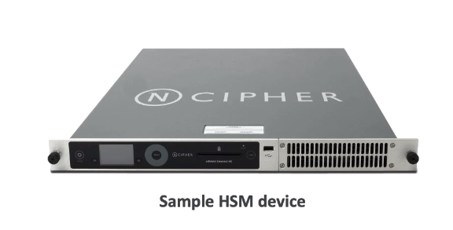

## 공동 책임 모델

<br>

- AWS의 책임은
    - 클라우드의 보안.
    - 제공하는 인프라,하드웨어,소프트웨어 기능 및 네트워크
    - S3나 다이나모 DB

<br>
<br>

- 고객책임
    - 어떻게 서비스를 사용하는지는 고객책임 
    - 서비스 내의 보안, EC2 경우, 운영체제를 패치,업그레이드 등 장비 운영은 고객책임
    - 방화벽구성이나 보안그룹 설정, IAM 권한 부여는 엄연히 고객 책임
    - 애플리케이션 데이터를 암호화 해야합니다?

- 공동 책임
    - 패치 관리나 구성 관리, AWS 서비스 교육
    - AWS는 만약 S3가 최신 패치로 서비스 내용이 업데이트 됬다면, - AWS에서 고객에서 서비스를 올바르게 사용하도록 교육해야됨

<br>
<br>
<br>
<br>

### `예 1) RDS 예시`
<br>

- AWS 책임
    - 기본 RDS에 들어가는 Ec2인스턴스를 관리하고, ssh를 비활성
    - DB 버전 패치
    - OS 버전 패치
    - DB의 기능이 잘 되도록, 인스턴스와 디스크를 감시

<br>
<br>

- 고객 책임
    - 데이터베이스의 보안그룹의 ip,인바운드 규칙등을 올바르게 설정했는지 확인하는것임
    - 또, DB의 사용자 생성 및 권한 관리
    - 디비 접근 권한 확인
    - 디비 데이터의 암호화는 내 책임


<br>
<br>
<br>
<br>
<br>


### `예 2) S3`

<br>

- AWS 책임
    - 무제한 스토리지 보장
    - 암호화 보장
    - AWS 계정 별 데이터 분리를 보장
    - 그리고 AWS 본사 직원이 내 데이터를 엑세스 하지 못하도록함
  
- 고객책임
    - 원하는 대로 설정한 S3에 대한 모든책임
    - 버킷정책, IAM 권한
    - 암호화를 설정화하고, 활성화는 내책임 -> 암호화 안쓰면 내책임이라는 소리고, 암호화 했는데 뚫리면 AWS 책임임


<br>
<br>
<br>


*`결론, AWS 서비스 자체에 문제가 있으면 AWS 책임, 그외에 서비스 설정,보안 이런것들은 모두 내책임`*


<br>
<br>
<br>


---------------------
## AWS shield

- Ddos 공격 막기용
- 제품 카탈로그는 아래와 같음

<br>
<br>

### AWS shield standard
- 추가 비용 없음
- 알아서 자동으로 활성화됨
- `레이어 3/4 공격을 방어`

<br>
<br>

### AWS shield advanced
- 비용 유료
- EC2, ELB, cloud front(CDN), AWS global accelerator 및 라우트 53에서 실행되는 애플리케이션임
- `조직당 매월 3000달러`
- 클라우드  front 및 라우트53은 글로벌 엣지 네트워크로 보호, 쉴드랑 결합
- 디도스 대응 팀 (DRP)이 따로 있음 `ddos response team`
- 디도스 공격으로 받아서 오토스케일링이나 자원이 증가하면 -> 이비용은 AWS에서 냄


<br>
<br>
<br>

### AWS WAF (웹 애플리케이션 파이어웰)
- IP 필터링 서비스
- 레이어 7에서 작동 (http)
- ALB나 api 게이트웨이, 클라우드 프론트에 배포됨 
- web ACL (웹 엑시스 컨트롤 리스트)에 정의할 수 있음
- ip 범위나` 특정 주소, http 헤더,보디 내용 필터링, 또한 sql 인젝션이나 XSS` 같은 공격을 막을수잇음
- geo-match로 `특정 국가 블럭`
- `이벤트 횟수를 계산해서 ddos 막음` (사용자는 1초당 5개 이상의 이벤트를 발생시킬수 없음 등)

<br>
<br>

`*웹공격은 무조건 WAF임, 쉴드는 디도스만임*`

<br>
<br>


---------------
## 침투 테스트

<br>

- 침투테스트는 자체 인프라를 공격해 보안을 테스트 하는것
- `AWS 고객은 사전승인없이, 8개 서비스의 자체인프라에 관해 보안 평가 및 침투 테스트를 할 수 있다`
  - ec2,nat gateway, ELB, RDS 오로라, 람다 및 람다 에지 펑션, api 게이트웨이, 클라우드 프론트, 라이트쉐일, 엘리스틱 빈스텍
  - 리스트는 계속 늘어나고, 이걸 외울 필요는 없음 

<br>
<br>

### *AWS 침투테스트 금지된 작업*
- DNS인 라우트 53에 대해서는 공격 해서는 안됨 (DNS zone walking)
- AWS 자원으로 ddos 공격
- port flooding
- protocol flooding
- request flooding

<br>
<br>


```
`DNS zone walking`은 DNS 서버에서 사용 가능한 모든 레코드를 열람하는 기술 또는 공격입니다. 일반적으로 DNS 서버는 도메인 이름에 대한 쿼리에 대해 해당 도메인의 레코드를 반환합니다. 그러나 DNS 쿼리에서 특정 도메인 이름이나 서브도메인을 지정하지 않는 경우, 일부 DNS 서버는 레코드를 순차적으로 반환하도록 설정되어 있습니다. 이를 통해 공격자는 DNS 존 워킹을 이용하여 해당 도메인의 모든 레코드를 가져올 수 있습니다.


`포트 플러딩`, 프로토콜 플러딩 및 요청 플러딩은 모두 고객 시스템이나 네트워크를 고도로 과부하로 만들어서 정상적인 작동을 방해하는 네트워크 공격의 종류입니다.


`프로토콜 플러딩`: 이 공격에서는 인터넷 제어 메시지 프로토콜 (ICMP)이나 전송 제어 프로토콜 (TCP)과 같은 특정 네트워크 프로토콜을 대상으로 합니다. 대량의 프로토콜 특정 패킷이나 요청을 대상에게 보내어 시스템의 자원을 고갈시켜 정상 작동을 방해하는 것이 목표입니다.


`요청 플러딩`: 이 공격은 HTTP 플러드 또는 웹 응용 프로그램 플러드로도 알려져 있습니다. 웹 서버나 애플리케이션을 대상으로 하며, 대량의 HTTP 요청을 보내어 서버의 처리 능력을 초과하게 만듭니다. 요청의 플러드로 인해 네트워크 대역폭과 서버 자원이 고갈되며 때로는 웹 애플리케이션의 취약점을 악용하여 서비스 장애나 다운타임을 유발할 수 있습니다.
```

<br>
<br>
<br>
<br>

*`다른 침투테스트는 꼭 aws 보안팀에 연락해 승인 받아야함`*

<br>
<br>

-----------------------------------
## 암호화

<br>

### AWS에서는 암호화 유형이 2개 있음 <br>

`저장데이터 암호화`는 물리적 장치에 저장 또는 `보관하는 암호화`
- RDS에서 하드나, s3 글리셔 딥아카이브 등

<br><br>

`전송중 암호화`는 `네트워크를 통해 전송되는 데이터를 암호화`
- 온프라미스 장비 -> ec2 나 다이나모 DB

<br>

### `두 유형 모두다, 암호화 키를 사용함`

<br><br><br>

--------------------
## AWS KMS (aws key management service)

- `시험문제에서 서비스에 관한 대부분 암호화는 KMS임`
- KMS는 AWS에서 키를 관리함, -> 고객이 kms키를 어떻게 할 수 없음
- AWS KMS는 주로 데이터 암호화 키 및 기타 AWS 리소스의 관리에 사용됩니다.

<br>
<br>

- `암호화 대상 (선택적)`
    - ebs
    - s3
    - redshift
    - rds
    - efs
 
- `자동 암호화`
    - 클라우드트레일 logs
    - s3 glacier
    - storage gateway

<br>
<br>


------------------
## AWS CloudHSM (hardware security module)

- AWS KMS는 완전 관리형 서비스로, `고객은 편리하게 키를 생성, 관리 및 사용할 `수 있습니다.

-  CloudHSM은 AWS 클라우드 내에서 `물리적 HSM을 제공`하여 `고객이 암호화 키를 완전히 제어`하고 안전하게 보관할 수 있는 서비스입니다

- 높은 보안 요구 사항이 있는 경우 또는 완전한 키 제어가 필요한 경우, CloudHSM은 추가적인 옵션이 될 수 있습니다. 

- 키는 고객이 관리함
- 



<br>
<br>


-----------------
## AWS CMK (Type of Customer Master Key)

- 고객 관리형 마스터키 종류는 4가지 유형이 있음

<br>
<br>

- `Customer CMK` (customer master keys) 고객 마스터 키
  - 지금까지 사용하는 AWS키와 혼동 하면 안되고, 내가 만들고 내가 비활성화 할수있는키임
  - 내가 키에 관한 정책을 적용하고 내가 알아서 마음대로 할수잇는 키
  - KMS사용해서 만든거

- `aws managed cmk`
  - AWS 관리형 cmk는 엑세스가 불가능하고, 오직 AWS 서비스로만 특별히 사용할 수 있음
  - 예 -> s3, ebs, redshift

- `aws owned cmk`
  - AWS 서비스가 소유하고,여러 계정에서 사용하도록 관리하는 CMK 집합
  - AWS는 이 키로 AWS 리소스를 보호한다( 고객은 키를 볼수없다 )

- `cloud HSM (custom keystore)`
  - 사용자 지정 키 스토어이며, 자체 클라우드HSM 하드웨어 장치에서, 바로 키가 생성됨
  - 암호화 작업도 HSM 클러스터에서 실행됨 -> 어떤기업이 AWS 못믿겟다!!!라고 해서 만듬, 기업의 보안 요구사항임


<br>
<br>

`CMK는 비용 발생함`

<br>
<br>


----------------------------------------

## AWS Certificate manager -  ACM


- SSL이나 TLS 인성서를 쉽게 관리, 프로비저닝 및 배포 할 수 있는 서비스

- 인증서는 어디에 쓰여? -> 인증서는 http 엔드포인트를 제공하며(https로) 웹사이트에 전송 중 암호화를 지원함

- 예시) ACM과 ALB가 연결되면 https 사용이 가능함

- ACM은 공용 및 사설 TLS 인증서를 모두 지원하며,공용 TLS 인증서는 무료로 이용 가능

- `자동 TLS 인증서 갱신 기능도 있음`

- TLS 인증서를 다른 서비스에 로드할 수 도 있음
  - ELB
  - 클라우드 프론트
  - api 게이트웨이

<br>
<br>

---------------------------------------------
## AWS Secrets manager

- RDS에 암호 저장하는 서비스 -> KMS를 사용해 암호화함
- 내계정에서 암호를 90일마다 바꾸고 싶으면 이서비스 이 용하면됨
- 시험에서 '`RDS에서 관리되고, 교체되는 암호`'라는 내용이 잇으면 시크릿 매니져임
- 파이썬, 이런것들을 통해 암호를 생성할수 있음 (걍 JWT 클라우드 버젼이라고 생각하면 될듯)
- 

<br>
<br>


<br>
<br>


------------------------------------

## AWS artifact

- 콘솔에서만 서비스로 제공됨
- AWS 규정 준수 보고서와 AWS 계약에 대해 온디맨드 엑세스를 제공하는 포털임
-  외부감사인이 보안이나 규정 준수 문서를 볼수있도록 지원하는 서비스, 
- AWS 계약 상태를 검토,승인 및 추적할 수 있음
- 사내 내부 감사에 사용되거나 AWS 클라우드를 사용해서 규정준수를 증명할 떄 사용

<br>
<br>

---------------------------------------
## AWS Guard duty

- `AWS 계정을 보호하는 지능형 위협탐지 서비스`

- 백엔드에서 머신러닝 알고리즘이 이상탐지를 수행하고, 타사 데이터를 이용해서 `AWS 계정에 대한 공격을 감지`
- `소스 데이터`는
    - 클라우드 트레일
    - s3 데이터 이벤트
    - vpc flow 
    - dns logs
    - 쿠버네티스 audit logs (EKS)
    - 클라우드 워치룰과 연동해서 이벤트 발생시 알람 받을수잇음
  - 이서비스로 암호화폐 공격(`공격 이름이 암호화폐 공격임`)을 보호할 수 있음 (관련된 전용 탐지기가 있음)

<br>
<br>

---------------------------------------
## AWS inspector

- AWS 인프라의 자동 보안 평가에 사용함

- 지원 유형은 
    - EC2
        - SSM 에이전트를 통해(ssm이 설치되어있어야함) os,네트워크 접근성 분석해줌
    - ECR - 푸쉬되는 컨테이너를 분석, 이때 모든 리포트는 aws security hub에 전달됨

<br>

`무엇을 평가하나?`
- 무조건 `Ec2` 인스턴스와 `컨테이너만` 검사함
- 이 둘의 `네트워크 패킷`을 검사도 해줌
- 또한 ec2에서 네트워크 접근성을 평가함
- 평가가 끝나면 `risk score` 점수를 얻게 됨

<br>
<br>

------------------------------------------

## AWS config

- AWS 리소스 규정 준수를 감사하고 기록함 -> `AWS 리소스를 수동으로 변경할때마다 모든 변경사항이 기록됨`
- 예)보안 그룹에 무제한 ssh가 엑세스 되어있는지, 버킷에 공용 액세스가 있는지 검사 할 수 있음
- SNS와 연동해서 인프라 구성사항이 바뀔떄마다 알림할수잇음
기본적으로 region 서비스임
- cloud trail의 `AWS 리소스 log` 버젼임

<br>
<br>


-----------------------------------------

## AWS Macie 

- 완전 관리형 데이터 개인 정보 보호 서비스
- 머신러닝과 패턴매칭을 이용해서 aws내에서 민감한 정보를 발견 및 보호
- `민감한 데이터에 대해 경고를 보냄`
- 예) 만약 내 계좌번호.txt 파일이 s3버킷에 저장되면, macie가 개인정보인지 분석해서 cw 이벤트 브릿지로 보냄->알람!
- `s3 버켓에서 일어남`


<br>
<br>

-------------------------------------------------
## AWS security hub

- 여러 AWS 계정 전반에 대한 보안을 관리
- `보안검사도 자동화` 할 수 잇음, 통합 대시보드도 제공
- 가드듀티,인스펙터,메시 자동화 검사 시작도 됨
- `여러 AWS 계정에 걸친 모든 경보 정보를 한눈에 확인 가능함`

<br>
<br>

---------------------------------------------------

## AWS detective

- AWS 메시,시큐리트 허브, 가드듀티로 보안 문제를 파악했고, (데이터 떨굼)
- AWS 디텍티브로 분석함, 근본적인 원인을 찾기 위함
- `걍 데이터 분석도구 (머신러닝을 이용해서)`
- 시각화 제공

<br>
<br>

----------------------------
## AWS abuse

- 걍 신고함임
- ip나 ec2등 불법적인 목적으로 사용이 의심되는 경우 (디도스 공격 선봉장이라던지...) AWS에 신고할수있음
- 스팸, 이메일, 포트 스캐닝 등

<br>
<br>

--------------------------------------------
## AWS 계정의 Root 사용자의 권한

- 루트사용자는 == 계정 소유자를 뜻함
- AWS 서비스와 리소스 전체에 `완전한 엑세스 권한`을 가짐
- 루트 계정은 일상적인 작업이나... `관리 작업용으로도 사용하면 안된다.`..

<br>
<br>

- `하지만 이작업은 예외임`
  - 계정 설정 (이메일 주소, 사용자 이름 패스 워드등 -> 계정 이전할때 작업은 해야지. )
  - `세금 계산서를 열람`
  - 계정을 삭제
  - IAM 권한 복구
  - `aws 서포트 플랜 변경 또는 취소`
  - 예약형 인스턴스를 마켓플레이스에서 판매자로 등록 가능 (이건 루트만 가능)
  - s3 버킷을 구성해서 MFA 활성화
  - vpc id또는 엔드포인트가 들어있는 정책을 s3에서 삭제가능
  - govcloud 가입가능


