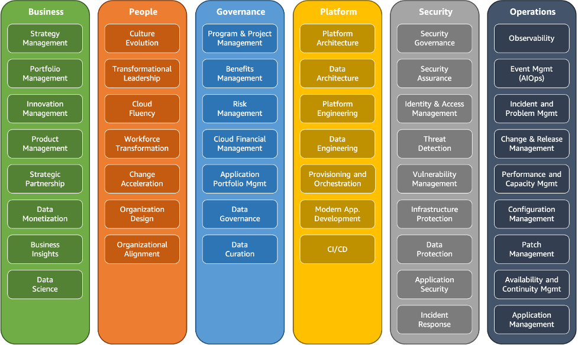

## 좋은 아키텍쳐 원칙
- `수용량을 추축하는걸 그만 둬야함` (어자피 오토스케일링 쓸거임)
- 시스템 테스트를 프`로덕션 규모로 수행`해야됨
- 아키텍쳐에 대해 실험/배포를 쉽게 하려면 `자동화` 해야됨 (인프라 코드화나 뭐 CICD 적용이라던지)
- `진화하는 아키텍쳐 형태로 만들어야함` (예로, 온프레미스에서 클라우드로 마이그레이션 할때, `서버리스 형태`로 많이 쓴다던지)
- game days 를 만들어라 (게임데이는 부하테스트 하는날임)

디자인 원칙
- scalability 확장성, 수평 수직
- disposable resources 일회용 자원 (서버의 생성 및 삭제가 쉬워야함) (만약 서버구성이 어려워 설정잡는데 3일이 걸린다면? 안좋은 디자인임)
    - 전체 인프라 구성요소는 아주 빠르게 재구성 할수있도록 구성해야됨
- automation 자동화 서버리스나 laas사용해서 자동화를 염두해둬야함
- loose coupling 느슨한 결합 어플과 어플사이에는  느슨한 결합을 추구해야됨
- 서버가 아니라 서비스를 생각해라 

-------------------------------

## 좋은 아키텍쳐 프레임워크의 6(pillars)원칙

- 운영의 우수성
- 보안
- 안정성
- 성능 효율성
- 비용 최적화
- 지속 가능성

저 6가지 원칙을 꼭 맞춰서 `타협하고 절충하고 균형을 맞추는게 `아니라.... `서로 시너지 효과를 내야 진짜 좋은 아키텍쳐임`

----------------------------------------------------
## operational excellence - 운영 우수성

 

운영 우수성 원칙에는` 효과적인 개발 및 워크로드 실행을 지원하고`, `작업에 대한 인사이트를 얻고`, `지원 프로세스 및 절차를 지속적으로 개선`하여 비즈니스 가치를 제공할 수 있는 능력입니다

 

`디자인 원칙` 
  - 코드를 통해 운영해야됨
  - 주석 문서
  - 롤백가능한 시스템 -> 장애시 되돌릴수있어야함
  - 운영 절차를 수시로 개선
  - 발생하는 실패를 예측해야하며, 이런 실패에서 배워야함

 
 

AWS 서비스 측면에서의 -  운영 우수성  
- 클라우드 포메이션 코드 (미리 준비를 해야됨)
- 운영은 클라우드 포메이션으로
- `클라우드 와치로 로그확인, aws trail이나 config로 구성사항들 보고, 마지막으로 x-ray를 통해 올바르게 작동하는지 봐야함`
- 개선 클라우드포메이션 코드빌더, 코드커밋 디플로이 파이프라인으로 `cicd 로 개선`하는거임

 

---------------------------------------------------------

## Security - 보안

보안 원칙에는 클라우드 기술을 활용하여 보안을 강화하고 데이터, 시스템 및 자산을 보호하는 기능이 포함됩니다.이(가) 포함됩니다.

 
 

`디자인 원칙`
- 강력한 자격 증명 기반을 구현 (IAM) `권한 최소화`, `중앙집중식 계정관리` 등
- `추적 기능 활성화` (보안관련된 `모든 로그를 수집`해야됨)
- `모든 계층&서비스에 보안을 적용`해야됨 (vpc,ec2,로벨 등)
- 보안 모범사례를 참고해서 `자동화` -> `보안은 수동으로 하는것이 아님`
- `전송 및 저장 중 데이터를 보호`해야됨 (`암호화를 활성화`하고 늘 SSL를 보안 소켓 계층(Secure Sockets Layer)
 사용해야됨)
- `사람들이 언제나 데이터에 접근하지 못하도록 막아야됨`
- 보안관련 이벤트를 준비해야된다 -> 조직의 요구 사항에 부합하는 인시던트 관리 및 조사 정책과 프로세스를 마련하여 인`시던트에 대비`합니다. 인시던트 대응 시뮬레이션을 실행하고 자동화된 도구를 사용하여 감지, 조사 및 복구 속도를 높입니다.

 
 

AWS 서비스 측면에서의 -  보안
- 자격증명 -> IAM,STS,MFA organizations로 관리
- 탐지 제어  -> aws config, cloudtrail, 클라우드 와치
- 인프라 보호 -> cloud front 디도스 공격에 관한 훌륭한 1차 방어선임, vpc shield ,waf ,inspector 등
- 데이터 보호 -> kms, s3, elb, ebs ,rds
- incident 대응 -> iam , 클라우드포메이션(다른iam삭제한거 되돌릴수 잇음)

 
 
 

----------------------------------
## Reliabilty - 안정성

안정성 원칙에는 필요할 때 의도한 기능을 정확하고 일관되게 수행하는 워크로드의 기능입니다. 여기에는 전체 수명 주기에 걸쳐 워크로드를 운영 및 테스트할 수 있는 기능이 포함됩니다.
`즉 어떠한 상황에서도 애플리케이션이 실행되도록 하는것`

  

`디자인 원칙`
- 복구 시스템 테스트
- `장애 자동` 복구
- `시스템을 확장 가능하게 만들어야함(수평적으로)`
- `용량 추측을 하지말자`
- 모든것을 `자동화로 변경`

  

-------------------------
## performance Efficiency - 성능 효율성

성능 효율성 원칙에는 `컴퓨팅 리소스를 시스템 요구 사항에 맞게 효율적으로 사용`하고, 수요 변화 및 기술 진화에 발맞춰 그러한 효율성을 유지하는 능력이 포함됩니다.이(가) 포함됩니다.

디자인 원칙
- `고급기술의 대중화`
- `몇 분안에 전세계에 배포해야됨`
- `서버리스 아키텍쳐를 사용해야됨`
- 애플리케이션의 실험 횟수도 늘려야함
- `AWS 모든 서비스를 알아야함` (또는 내가 알고있는 지식이 많아야됨 테라폼이나 엔서블)

  

---------------------------
## Cost Optimization - 비용 최적화

비용 최적화 원칙에는 시스템을 실행하여 `최저 가격으로 비즈니스 가치를 제공할 수 있는 기능`이 포함됩니다.이(가) 포함됩니다.

디자인 원칙
- 클라우드 재무 관리 구현
- `소비모델을 도입` (사용한 만큼 지불) 람다같은건 소비한만큼 지불임
- `전반적인 효율성을 계속 측정`해야된다
- `자체 데이터 센터 운영으로 소비한 돈을 클라우드로 이전`해야된다 ㅋㅋㅋ
- `비용을 분석하고 특징`을 파악해야됨
- 관리형이자 애플리케이션 수준의 서비스를 사용해 소유 비용을 줄여야함

  

-------------------------------
## Sustainability - 지속가능성

클라우드 워크로드를 구축할 때 지속 가능성의 실천은 `사용된 서비스의 영향을 이해하고, 전체 워크로드 수명 주기 동안 영향을 정량화하고, 이러한 영향을 줄이기 위한 설계 원칙과 모범 사례를 적용하는 것`입니다.

디자인 원칙
- 성과지표를 설정하고, 개선점을 평가
- 장기목표를 세워 지속가능성 목표를 달성
- 활용률 극대화
- 

 

`이건 나중에 추가되서 더 봐야할듯`

  

-----------------------------
## AWS well-architected tool

- ㅋㅋ 아키텍쳐를 만들기 위해 설문조사 임
- 답변하면  모자란 내용들 보여주고 피드백 해줌

  

-------------------------------------------
## AWS right sizeing - 올바른 크기조정

- 오토스케일링은 무조건 작은 크기로 시작해야됨!!!!

  

------------------
## AWS 생태계

  

`공짜 resource`
- `aws 블로그`
- `aws 포럼(커뮤니티) `
  -  서로 도움을 주고 받음
- `aws 화이트페이퍼 & 가이드 (백서와 가이드) `
  -  well achitected 를 하기 위함 각 서비스에 대해 긴 분량의 문서 및 가이드 라인 제공 
- `aws 퀵스타터 `
  -  솔루션을 공유해서 빠르게 시작 , 클라우드 표준 배포를 제공, 템플릿 제공 예-> 워드프레스, 클라우드 포메이션 제공
- `aws solutions`
  - 클라우드에서 검증된 기술을 배포 가능, 예로 aws landing zone 이있음

  

`마켓플레이스`
- AMI, 클라우드포메이션 템플릿 만들어서 팔수잇음
- Saas
- 컨테이너 구매 가능
- 사면 빌링에 청구됨
- 내가 판매도 할 수 있음

  

`AWS training (훈련기관) 종류`
- digital (온라인) 클래스룸
- private training (기업의 교육 섹션)
- US 국가 전용의 자격증 프로그램
- 기업 전용 자격증 프로그램
- aws academy -> 대학교 aws교육

  

`AWS 파트너`
- APN = aws 파트너 네트워크
- 대한민국 베스트 파트너(AWS Premier Consulting Partner) Bespin Global, MegazoneCloud, 키존네트웍스
  
 

- APN technology 파트너 
  - 기술파트너라서, 하드웨어 프로비저닝, 소프트웨어 제공,인프라측면에서 도움을 줌
  
 

- APN consulting 파트너 
  - 전문 서비스 회사로, 모든 유형과 규모의 고객이 AWS에서 워크로드와 애플리케이션을 설계, 설계, 구축, 마이그레이션 및 관리하도록 지원하여 AWS 클라우드로의 마이그레이션을 가속화하는 전문 서비스 회사입니다.

 

- APN 교육 파트너 
  -AWS 훈련

 

- APN 관리 파트너
  - AWS 인프라 및 서비스를 관리하고 모니터링하는 서비스를 제공하는 회사입니다. 
 

- APN 마켓 플레이스 파트너
  - AWS Marketplace에서 소프트웨어, 애플리케이션, 데이터 등을 판매하는 회사입니다.

 

- AWS Competency Program (aws 능력 프로그램?)
  - AWS 파트너 네트워크(APN)의 우수한 전문성을 갖춘 파트너를 인증하는 프로그램입니다. 
    - Machine Learning: 기계 학습 기술과 솔루션에 전문화된 파트너들을 인증합니다.
    - Security: 보안 및 규정 준수에 대한 전문성을 갖춘 파트너들을 인증합니다.
    - DevOps: 개발과 운영을 통합하는 DevOps 전략과 도구에 대한 전문성을 인증합니다.
    - Data & Analytics: 데이터 분석 및 비즈니스 인텔리전스 솔루션에 전문화된 파트너들을 인증합니다.

 

- AWS Navigate Program
  - 파트너가 AWS 클라우드에 적응하고 성공하기 위해 돕는 프로그램입니다. 
  - `파트너가 더나은 파트너가 되도록 교육하는것`

  
  

AWS Professional Services  

- AWS Professional Services 팀은 고객의 요구 사항과 프로젝트 규모에 따라 `컨설팅 서비스를 제공`하며, 해당 서비스에 대한 비용은 합의된 계약에 따라 책정됩니다.
- AWS 고객은 AWS Sales 팀과 연락하여 요청하고 원하는 `서비스에 대한 계약 및 비용에 대한 협상을 진행`해야 합니다.
- 
-----------------------------
## AWS 지식센터

- AWS 서비스관련해서 FAQ 자주묻는 질문들 모은곳

-------------------------------

## AWS Cloud Adoption Framework (AWS CAF)

AWS CAF는 기업이 클라우드 컴퓨팅으로의 전환을 계획, 설계, 구축 및 운영하는 데 도움이 되는 구조적인 접근 방식입니다. 이 프레임워크는 AWS의 클라우드 서비스를 효과적으로 활용하여 비즈니스 목표를 달성하는 방법에 대한 `지침과 모범 사례를 제공`합니다.

 
 

 
 

`AWS CAF 관점 및 기본 기능`
- `비즈니스 관점`은 클라우드 투자가 디지털 혁신 목표와 비즈니스 결과를 가속화하도록 도와줍니다. 일반적인 이해 관계자에는 최고 경영자(CEO), 최고 재무 책임자(CFO), 최고 운영 책임자(COO), 최고 정보 책임자(CIO) 및 최고 기술 책임자(CTO)가 포함됩니다.

 

- `사람의 관점`은 기술과 비즈니스 사이의 가교 역할을 하여 조직이 문화, 조직 구조, 리더십, 그리고 노동력. 일반적인 이해 관계자에는 CIO, COO, CTO, 클라우드 디렉터, 교차 기능 및 전사적 리더가 포함됩니다.

 

- `거버넌스 관점`은 클라우드 이니셔티브를 오케스트레이션하는 동시에 조직의 이점을 극대화하고 혁신 관련 위험을 최소화하는 데 도움이 됩니다. 일반적인 이해 관계자에는 최고 혁신 책임자, CIO, CTO, CFO, 최고 데이터 책임자(CDO) 및 최고 위험 책임자(CRO)가 포함됩니다.

 

- `플랫폼 관점`은 확장 가능한 엔터프라이즈급 하이브리드 클라우드 플랫폼을 구축하고 기존 워크로드를 현대화하며 새로운 클라우드 네이티브 솔루션을 구현하는 데 도움이 됩니다. 일반적인 이해 관계자에는 CTO, 기술 리더, 설계자 및 엔지니어가 포함됩니다.

 

- `보안 관점`은 데이터 및 클라우드 워크로드의 기밀성, 무결성 및 가용성을 달성하는 데 도움이 됩니다. 일반적인 이해 관계자에는 최고 정보 보안 책임자(CISO), 최고 규정 준수 책임자(CCO), 내부 감사 책임자, 보안 설계자 및 엔지니어가 포함됩니다.

 

- `운영 관점`은 클라우드 서비스가 비즈니스 요구 사항을 충족하는 수준으로 제공되도록 보장합니다. 일반적인 이해 관계자에는 인프라 및 운영 리더, 사이트 안정성 엔지니어 및 정보 기술 서비스 관리자가 포함됩니다.
  
 
