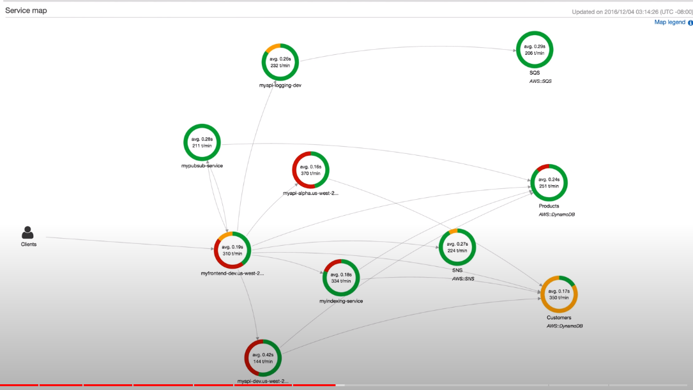

## AWS Cloudwatch

- aws cloudwatch log는 기본 5분마다 제공 -> 유료화는 1분마다 제공
서비스 리밋
- 클라우드 와치 알람 -> 특정한 것들 트리거
- 클라우드 와치와 연동해서 알람 설정 가능
- AWS 빌링 알람은 `us-east-1`에서 설정할 수 있다.

 
 

---------------------------

##  AWS cloudwatch logs

- 온프라 미스 서버, ec2 라우트 dns 등 실시간 로그 수집 가능

 

`작동 방식`  
- 기본적으로 ec2를 동작하면 로그를 보내지 않음, ec2에 클라우드 와치 로그 에이전트를 설치해줘야함

- Ec2에 로그서버에 보낼 IAM 역활이 설정 되어있어야함

 
 
 

-----------------------
## AWS cloudwatch Event

- AWS cloudwatch Event는 진짜 클라우드 와치 이벤트임
- 1 시간 마다 특정 람다함수 호출, 루트 유저 접속할때마다 이메일 보내기 등...

 
 
 

--------------------
 ## Event Bridge

- cloudwatch Event에서 발전된 `동일한 제품`이다.
- 이벤트 버스를 생성해 운영 하는 방식
- `AWS말고, 외부 제품 이벤트랑 연동` 
- 서버리스 크론잡 시스템임

 
 

이벤트 버스 종류
- default event 버스 
  - 다른 이벤트 버스들 안쓰면, 클라우드 와치 이벤트와 똑같다
- 파트너 이벤트 버스 
  - `datadoc`, zendsk 등 이벤트를 받을 수 있다
- 사용자 이벤트 버스 
  -  사용자의 애플리케이션 이벤트용
- 스키마 레지스트리
  - 스키마 모델을 설정 가능

 
 
 

----------------------------------------------

## AWS CloudTrail

- AWs 계정에 대한, 거버넌스, 규정 준수 , 감사를 수행하는 방법
- AWs 계정내 `API 호출에 대한 과거 기록`, 콘솔 sdk cli 등 모든 로그를 s3나 저장소에 입력 하능함
- 90일 이상 보관하고싶은경우, s3에 저장해야됨

 
 

### CloudTrail의 이벤트 유형은 아래와 같음

 

`이벤트 매니져`
- 이벤트중, `읽기만 가능한 이벤트와 수정할 수 있는 이벤트가 따로 있음`
- 예시) iam 정책 사용, 서브넷 생성 등

 

`데이터 이벤트`
- 기본적으로 데이터 이벤트는 기록되지 않음 (설정 해줘야함)
- 예) 람다함수 호출 수, s3 버킷에 객체 넣었다 뺏다 등

 

`cloudTrail insights 이벤트`
- 무수한 이벤트 중, 인사이트를 찾기위해 또는 비정상적인 활동 탐지
- 예) 서비스 제한 초과, iam 초과 액션 부여
- 평소에 trail 인사이트가 내 활동내역들을 분석하고, 이상탐지를 보여줌

 
 
 
 

----------------------------------------
## AWS X-Ray

- x-레이를 사용해 애플리케이션의 추적하고 시각적 분석을 할 수 있음
- MSA 종속성을 이해 할 수 있고, 병목현상 파악 가능
- 분산 추적 및 문제해결과 서비스 그래프에 유용함
- `이스티오 칼리`같은거 일듯

 

 
 

---------------------------------------
## AWS CodeGuru - 코드 전문가

- 머신러닝 기반 서비스로, 자동화된 코드 검토, 애플리케이션 성능 권장 추천

 
 

`2가지 서비스`  
codeguru-reviewer -> 코드 리뷰 해줌  
codeguru-profiler -> 코드 심으면, cpu,램 사용량 분석해줌  

 
 

------------------------------------
## Service health dashborad
- AWS 전체 리전의 전체 서비스에 관한 상태 확인
- ㅋㅋ 이건 AWS 자체 상태 체크임

----------------------------------
## AWS personal helth dashboard

- AWS 에서 장애가 일어날 경우 내 계정 상태 대쉬보드임
- AWS 장애 사전 알리미? 정도

