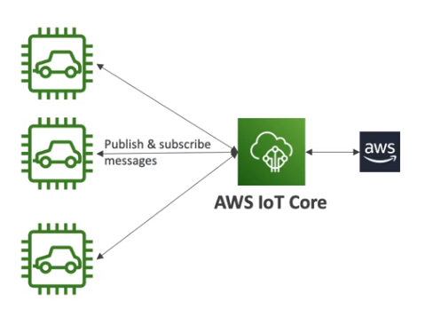
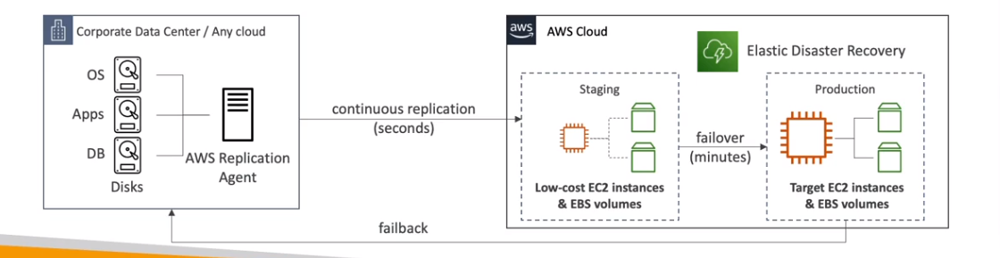

## 기타 서비스
- 시험에 거의 안나옴...
- 걍 알아만 둬....

 
 

--------------
## AWS workspaces

- 서비스형 테스크탑 (걍 데탑)
- daas(desktop as a service)임
- 리눅스, 윈도우 지원
- `프로비저닝 해야됨`

 
 

----------------------
## AWS appstream 2.0

- 데스크톱 애플리케이션 스트리밍 서비스
- 워크스페이스와는 다름... 
- 인프라를 획득하거나 프로비저닝 하지 않고 웹페이지에서 어플실행 - `오피스 365` 같은 거임
- 하지만 포토샵 시퓨 3개 랩 16기가 등 `자원 설정이 가능함`
- 
 
 

------------------------------
## AWS sumerian - 사마리안

- vr / ar 어플리케이션임
- `걍 블렌더`, 3d 작업할때 쓰임
- 웹 url로 실행가능

 
 

---------------------------
## AWS IoT core

- AWs 클라우드에 Iot 기기를 쉽게 연결하는 서비스
- 서버 리스
- 수 조개의 log나 메세지를 확장 가능한 방식으로 교환 할 수 있음 (iot 기기간에, 키네시스랑은 다름)

 
 

----------------------------

## AWS Elastic transcoder

- s3에 저장된 미디어 파일을 재생할수 있게 변환시켜줌 ( nas 미디어 서버처럼)

 
 

-------------------------
## AWS device farm

웹과 모바일 애플리케이션을 데스크톱 브라우저로 테스트 가능
걍 이클립스 가상 머신임

 
 

-----------
## AWS backup

- 중앙에서 관리하는 AWS 서비스 전반에 걸쳐 자동으로 백업
- 걍 개별 서비스들의 백업의 상위 버젼
- 백업 플랜을 짜서 각 서비스로 전달하는 방식임
- `사용한 백업 스토리지 양과 해당 월에 복원한 백업 데이터 양`에 대해서만 비용을 지불합니다
 
 

----------------
## 재해 복구 전략

`시험에서는 가장 저렴한 것이 뭔지 물어봄` 
-> `백업과 복원이 가장` 저렴함 (뭐 이원화 이딴거 보다는 백업이 훨씬쌈)

 
 

----------------------
## elastic disaster recovery (DRS) - 엘라스틱 장애복구

- 이걸 사용하면 물리,가상, 클라우드 기반 서버를 쉽고 빠르게 복구 가능
- 서버를 기업 데이터 센터에서 -> 클라우드로 복제함
- AWS `복제 에이전트`를 통해 블록수준에서 지속적으로 복제함....
 
 

 
 

---------------------
## AWS datasync

- 이걸 통해 온프레미스에서 AWS로 많은양의 데이터를 이동가능
- 복제 작업은 incremental(`증분 백업`) `변경된 데이터만 백업됨`, (전체 백업과는 다름)
- 데이터 싱크 에이전트로 AWS로 전송

 
 

----------------

## AWS fault injection simulator - FIS

- AWS 결함 주입 실험
- 엄청나게 파괴적인 이벤트를 발생시켜 애플리케이션에 스트레스를 가하는 서비스
- 인프라에 혼란을 일으키는 엔지니어링 - > 카오스 엔지니어링
- 지원 서비스
  - `ec2 ecs eks rds`
  - 워크로드에서 ec2가 멈춘다던지, eks가 내려간다던지...

 

- 실험은, 템플릿 파일을 작성하고 해당 리소스를 정하면 됨
이떄 `x-ray나 클라우드 워치 알람등 보면됨`
- 고급 모니터링 및 디버깅 기술에 속함

