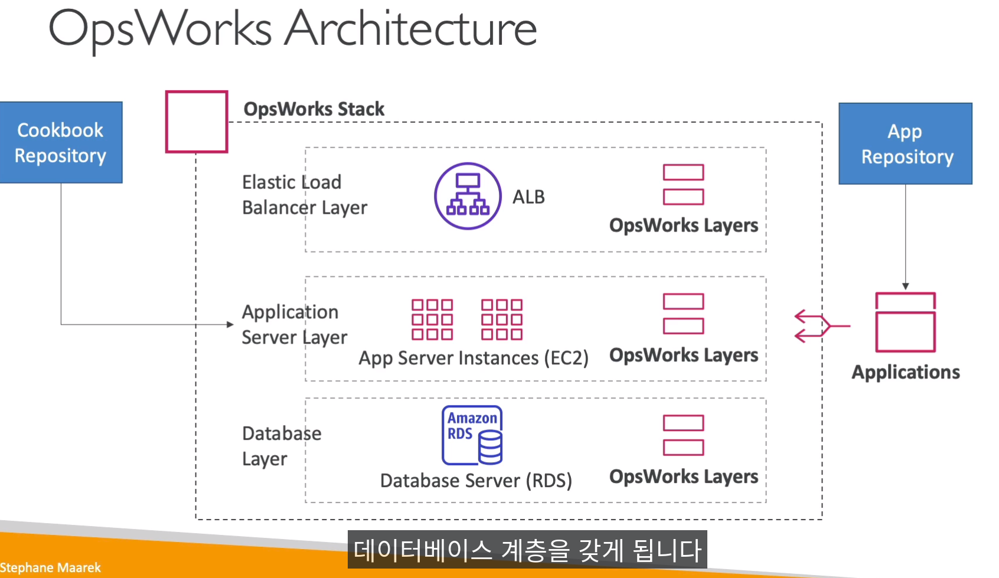

## AWS cloudFormation - 클라우드 포메이션

- 인프라가 코드로 되어 있고, 변경할때마다 적용됨
- 리소스 비용을 대략적으로 알 수 있음
- 선언적 프로그래밍
- 다이어 그램도 볼수잇음
- 템플릿파일 -> 테라폼 state파일처럼 s3나 개인 파일로도 작성되고 보관도됨

 
 
 

-------------------------
## AWS cloud development kit - CDK

- cdk cli로 -> `클라우드 포메이션 템플릿이 만들어지고`, 클라우드 포메이션으로 전달하면됨

- boto3처럼 (AWS 컨트롤 sdk처럼) 클라우드 포메이션 템플릿을 작성하기 위한 sdk? 정도라고 하면됨
- 파이썬, 자바스크립트 등 다양한 언어 지원함

 
 
 

-------------------------

## AWS Beanstalk

- 대부분 웹 애플리케이션은 로드밸런서 + 오토스케일링 그룹( EC2 서버)만 있으면됨
- 빈스텍은 애플리케이션을 배포하는 개발자 중심 관점으로 개발하기 쉽게 해주는 서비스

- ec2, elb rds등 이런것만 관리하면 됨, vpc니.... iam이니 이딴거 필요 없는듯

- 빈스텍은 Paas임
- 빈스택은 무료지만 기본 인스턴스 비용이 존재
- 빈스택을 생성하면 클라우드 포메이션으로 관리되어 확인가능함

 
 
 

`AWS Beanstalk` 공동 책임 모델
- AWS
  - 관리되는것은 인스턴스 구성, os는 aws에서 관리
  배포 전략, 로드밸런서, 오토스케일링 그룹, 앱 상태 모니터링 등

- 고객 책임
  - 오로지!!! `어플리케이션 코드만`

`지원되는 플랫폼은`  

- go, 자바 , 닷넷, 노드js , php, python , ruby, packer builder, 도커, 멀티 도커
- 그리고 내가 작성하면 커스텀 플랫폼으로도 가능함

 

`클라우드 포메이션과 빈스택 차이는?`
- 코드중심의 서비스형 플랫폼으로 코드만 업로드 하면, 모니터링부터 다해줌

- 클라우드 포메이션은 인프라 중심의 서비스임

 
 
 

------------------------------------------

## AWS Codedeploy

- 코드디플로이는 ec2,온프라미스 서버 등 하이브리드로 진행 가능하다

- 미리 서버에 코드디플로이 에이전트를 설치해야 된다....

- gitlab runner와 같은 기능 cicd.yaml 파일 같은 파일작성하고,

- 버전1 애플 -> 버전2 애플로 배포가능한 서비스임

 
 

------------------------------------------
## AWS Codecommit

- 걍 깃임 ㅋㅋㅋㅋ

 
 

----------------------------
## AWS codebuild

- 젠키스의 자바 빌더와 비슷

 
 

-------------------------
## AWS Codepipeline

- 코드 파이프라인이 다 관리함
- 코드 커밋->코드빌더->코드디플로이->엘라스틱빈스텍

`aws cicd 핵심 서비스임`

 
 

---------------------------
## AWS Codeartifact

- 개발자가 생성한 소프트웨어 패키지는 대게 의존적으로 설계되는데...
- 걍 `python 패키지 저장소`라고 생각하면됨

 
 

----------------------
## AWS Codestar
- 소프트웨어 개발 작업을 한곳에서 쉽게 관리
- 깃랩 한 프로젝트 대시보드라고 보면됨
- `code star에서 모두 통합적으로 할 수 있음` (코드 커밋, 코드 파이프라인 등) 
 
 

---------------------
## AWS cloud 9 

- aws의 `vscode`임

 
 

-------------------------
## AWS Systems Manager (SSM)

- 하이브리드이며, 시스템 매니저임
- 제일 중요한 점은 서버와 인스턴스에 패치를 자동으로 적용할 수 있음
- 이 서비스에서 전체 서버에 명령어를 실행 할 수 있음
- `윈도우와 리눅스`에서만 실행됨
- 그리고 SSM `에이전트를 설치`해야됨

 
 

---------------------------------

## AWS Systems Manager -> Session Manager (SSM 세션 매니져)

 
 

- 웹기반 쉘접속?
   
- ec2 나 온프레미스 서버에서 ssh 엑세스하거나, 바스티안 호스트나 엑세스 키없이!!!!!!! 시큐어 셸을 이용해 접속 할 수 있는 서비스!!!

- 시스템 매니져만 깔면 다 접속 가능

- 윈도우,맥os 리눅스 지원 가능하고, 로그는 s3나 클라우드 워치에서 보면됨

 
 

--------------------

## AWS opsworks

- 이 두 도구는 자동으로 서버 컨피규를 구성하고 실행함 = `앤서블`
- AWs opswork는 관리형 chef랑 puppet임
- 쿡북을 통해 실행됨

 
 

----------------------
## AWS Service Catalog

- AWS의 `서비스 자판기`

- 승인된 사용자가 지정된 구성을 선택해서 배포
서비스 구성은 클라우드포메이션으로 제공

- AWS의 인프라 구성을 관리된 환경에서 배포해주는 서비스
- 제품을(클라우드포메이션기반의 코드들) 만들어서 유저에게 제공

 
 

참고:  
https://www.youtube.com/watch?v=PErOenZXjjY

