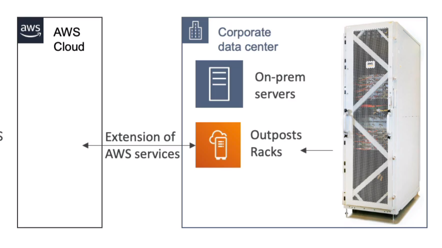

## 글로벌 서비스 왜만들엇슴?

- 레이턴시 감소, 재해 복구, ddos 공격에 대비하기 위해

<br>
<br>

`참조 웹사이트`: <br>
infrastructure.aws

<br>
<br>


<br>


아래 사진에는 버지니아 리전에 6개 AZ가 있음


<br>
<br>


points of presence = `엣지 로케이션` <br>
`엣지 로케이션` <br>
전송 지점, 사용자에 최대한 가깝게 콘텐츠를 전송하는데 사용


<br>
<br>
-----------

## AWS Route 53

- 라우트 53은 DNS 서비스임
- 규칙과 레코드 모음으로 되어잇음

```
12.13.56.78 == A record ipv4기반

2001:2392398:19232913ㅑ:123a823:19823 == AAAA ipv6기반

www.google.com == CNAME 

aws resource == alias (ex: elb, cloudfront,s3,rds 등)
```

- 시험에 `라우팅 정책만 알면됨`

`라우팅 정책 (4가지)`
- 단순 라우팅 정책: 그냥 내가 알고있는 그 플로우임 (애플리케이션들 상태 체크 X)
- 가중치 기반 정책 : 로드밸런서 처럼 여러 멀티플하게 웨이팅 할 수있음
- 지연시간 라우팅: 사용자의 위치를 보고 적절하게 접속할 곳을 분배
- 장애정책 라우팅: 라우터에서 헬스체크를 하고 불량난곳에는 안보냄


<br>
<br>
<br>

------------


## AWS Cloudfront

- CDN( global content delivery network ) 서비스임
- `여러 엣지 로케이션에 있는 웹사이트의 콘텐츠를 캐싱(이미지나 동영상)하여 읽기 능력을 향상`
- 사용자를 최소한의 지연시간으로 가장 가깝게 배포 리전에 라우팅 하도록 함
- 엣지 로케이션에 데이터들을 복제해 일반요청을 캐시해서 레이턴시를 낮춤
- 전 세계, 216개의 엣지 로케이션이 존재 (계속 추가중임)
- DDos 공격 대비
- `캐싱 대상`
  - s3 버킷
  - 웹사이트 (ec2인스턴스,s3웹페이지, 로드벨런스)
- 동작방식 -> 에지로케이션 캐시에 없다면 원본에서 자료를 가져옴 (하루정도 로케이션에 캐싱됨)


<br><br>

---------------------------
## AWS S3 transfer acceleration 
- s3의 전세계적인 업로드와 다운로드를 가속화
- `엣지 로케이션`을 통해 가속
- 전세계 퍼져있는 데이터를 어느 한 리전의 s3에 넣고싶어!!! 이걸 이용해서 전송 속도를 올 릴수있음

<br>
<br>

`동작방식` <br>
사용자는 엣지로케이션에 데이터가 업로드 되고, 내부 AWS 회선을 통해 타겟 S3에 저장되는 동작, 결국 S3에 객체를 다운로드,업로드할때 유용하게 쓰는 기술임


<br><br>

-------------

## AWS Global Accelerator
- 글로벌 사용자에게 제공하는 애플리케이션의 가용성과 성능을 개선하는 데 도움이 되는 네트워킹 서비스입니다
- 하나 이상의 AWS 리전에서 실행되는 애플리케이션에 대해 에지의 패킷을 프록시하여 TCP 또는 UDP를 통해 광범위한 애플리케이션의 성능을 개선합니다.
- `에지 로케이션`을 통해 트래픽을 전달 받음 
- 결국, AWS 내부회선써서 빠르다는 이야기임
- 애플리케이션에 대한 고정 진입점을 제공하고 다양한 AWS 리전 및 가용 영역(AZ)에 대한 특정 IP 주소를 관리하는 복잡성을 제거하는 `정적 IP 주소를 제공`
-  게임(UDP), IoT(MQTT) 또는 VoIP와 같은 비HTTP 사용 사례와 특히 정적 IP 주소 또는 결정적이며 빠른 지역 장애 조치가 필요한 HTTP 사용 사례에 적합합니다.
- 단!!! `CDN처럼 캐싱`은 하지 않음
- ELB 로드 밸런서는 AWS Global Accelerator의 `이상적인 대상`

<br>
<br>


<br><br>


-------------------
## AWS outposts

- 하이브리드 클라우드를 위한것
- 기업의 IDC에 `AWS outposts` 랙을 적재해서 온프레미스 장비로 AWS 서비스를 이용할 수 있음
- 완전관리형이고 AWS가 서비스를 관리해 준다
- 단 물리적 랙장비의 보안은 고객이 책임
- 사용 가능 서비스는 : ec2, ebs, s3, eks, ecs, rds emr 등 




<br>
<br>


-----------------------
## AWS wavelenght (외부 AWS 망)

- 통신 제공업체의 데이터 센터내에 내장된 인프라 배포 -> 5g 네트워크 전용

- 울트라 로우 레이턴시를 자랑함

- 사용처 : ar vr 등 적은 시간을 요구하는 모든것

<br>
<br>

-----------------------------
## AWS Local zone - 로컬 존

- AWS 리전의 확장으로서, 지역적으로 제한된 지역에 배치된 로컬 인프라스트럭처입니다
- 사용자가 AWS자원과 가깝게 연결하여 레이턴시를 줄이기 위해
- 즉, 리젼이 되지는 못하고, AZ가 된 경우임


<br>
<br>

참고: <br>
https://www.youtube.com/watch?v=6WXVxMd6cF4&t=292s

<br>
<br>

--------------------------------------------------

## Global applications Architecture


