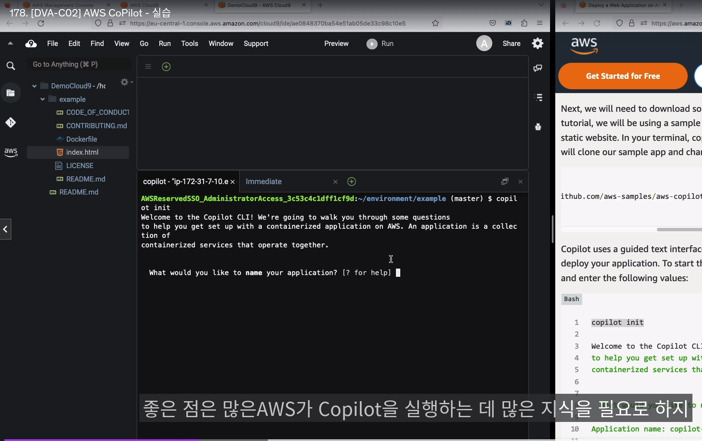

## AWS ECS

- ECS 서비스에서 보통 `EFS를` 활용해서 공유 저장소로 많이쓴다
- 타입은 Ec2기반, Fargate 기반 2가지 존재
  - Ec2 기반
    - 각 EC2 `인스턴스에 ECS 에이전트를 실행 해야됨` 
      - 오토 스케일을 ECS에 등록하면, 생성된 Ec2에서 에이전트 자동 설치됨
    - ECS에이전트가 ->  ECS,ECR,CW log, SSM 파라미터 스토어 등 IAM 역할을 받음 
  - 파게이트
    - CPU와 RAM 요구사항대로 태스크 실행함

- ECS Task Role
  - 아래 그림과 같이 Task role를 다양하게 하는 이유
    - 각 서비스별 역할 할당 (최소 권한)

------------------

- ECS에서 `TASK 정의` -> 쿠버네티스에서 `deployment + service와 비슷함`
- 

- ECS ASG는 오직 `컨테이너 관점임, CA(클러스터 오토스케일링) 되진` 않음

- ECS Ec2 Cluster cappacity provider는 -> ECS에서 새 태스크를 실행할 용량이 부족하면, `자동으로 EC2 ASG를 확장해줌`

- ECS 태스크 업데이트가 있을때는, 롤링 업데이트 됨
  - maximum percent는 v2를 배포할때 여분 컨테이너 갯수임

- ECS 태스크 제한 및 생성/삭제 방식
  - 오직 ec2 타입에만 유효
  - 1. 가장먼저 태스크 정의 내의 CPU,메모리,Port 조건 만족하는 인스턴스 선정
  - 2. 태스크 `배치 제한` 확인
  - 3. 태스크` 배치 전략` 확인후, 최적의 인스턴스 식별 시도
  - 4. 인스턴스에 태스크를 배치

- 태스크 배치 전략이란?
  - Binpack 전략
    - 현재, 가장 많이 쓰는 CPU 혹은 메모리 인스턴스에 컨테이너 배치 (`사용중인 인스턴스 수 최소화`)
    - 해당 인스턴스에 더 이상의 컨테이너 배치를 할 수 없을때까지 채움
  - Random 전략
    - 그냥 랜덤 컨테이너 배치
  - spread 전략
    - 특정값 (AZ존, 리전 등)을 기반으로 분산배치
    - AZ로 값을 설정하면 `고가용성 보장`
  - 섞어서 사용도 가능 (메모리는 binpack, AZ는 스프레드)

- 태스크 배치 제한이란?
  - 말그대로, 컨테이너 배포에 대한 제한임
  - Distinctinstance
    - 한 인스턴스에, 똑같은 2개 컨테이너 탑재 X 
  - memberof
    - 일종의 EKS에서 노드 그룹 셀렉터와 같음, `조건에 만족하는 인스턴스에` 배치 

--------------------------
## AWS Copilot

- copilot은 서비스가 아님, `CLI 툴`
- AppRunner나 ECS, 파게이트를 쉽게 쓰기 위함 
  - VPC, ELB, ECR 등을 알아서 프로비저닝 해줌
- 일종의 AWS 컨테이너서비스를 구축하기위한 자동화된 테라폼 정도?

