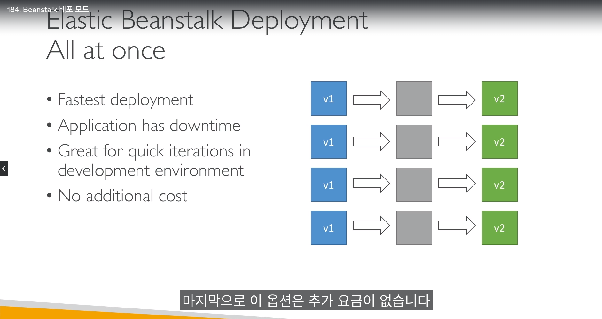
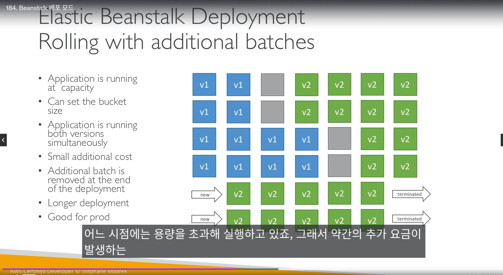
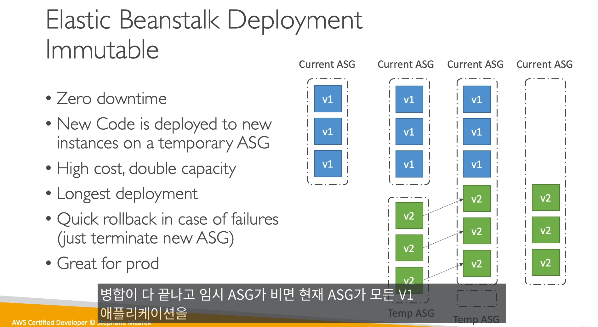
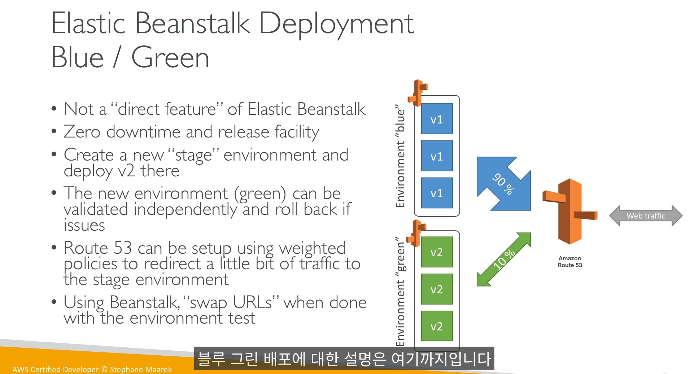
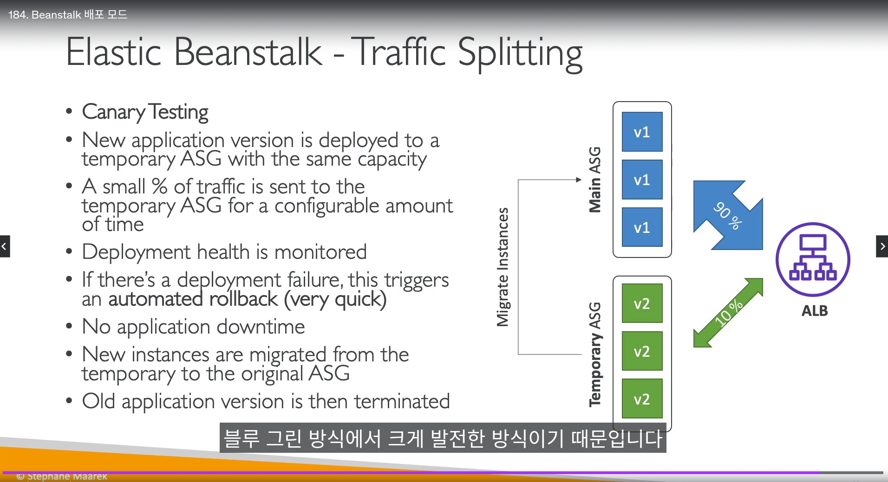

## AWS Elastic Beanstalk

- 개발자 중심의 관리형 서비스

- 배포모드는 2가지
  - 단일 배포(ec2 인스턴스)모드는 `Eip와 함께 프로비저닝` 됨
  - 고가용성 배포모드는 `ELB를 통해` 배포
  - ASG 그룹은 두 환경 모두 생성됨

(보강할것)
- 애플리케이션 배포/업데이트 옵션
  - All at once 
    - 1. v1 모든 인스턴스 중지
    - 2. v2 인스턴스 배포
    - 애플리케이션에 `다운 타임` 발생
    - 추가 요금 없음, `빠른` 배포 시간

  - rolling
    - 업데이트 인스턴스용량 내에서 조금씩 바꿈
    - 추가 요금 없음, `느린` 배포 시간, 다운 타임 0

  - rolling with additional batches
    - 업데이트할 인스턴스용량을 추가해서 프로비저닝
    - 약간의 요금 발생, 다운타임 0

  - Immutable (변경 불가능)
    - 배포에 필요한 임시 ASG를 만들어 v2 배포 (`원래 인스턴스 용량 2배`)
    - 새 인스턴스가 상태 확인을 통과할 때까지` 새 버전과 기존 버전이 함께 트래픽을 처리`
    - 다운타임 0, 배포시간이 가장 김
    - 빠른 롤백 제공

  - blue green
    - `Beanstalk에서 직접 제공하는 기능이 아님`
    - Route53과 함께 사용하고, `수동 배포` 해야됨
    - v2 환경 완성되면 통째로 바꿈

  - Traffic splitting (카이나리 배포)
    - ALB를 통해 트래픽 분산
    - 트래픽 조금씩 배포
    - 블루 그린에서 발전한 방식

- `Elastic Beanstalk CLI`라는 툴도 제공해줌 (쉽게 커멘드라인으로 빈스텍 구축가능)

- 애플리케이션 배포 프로세스
  - 1. 종속성 파일 작성 (python의 requirements.txt 같은)
  - 2. 패키지를 zip으로 압축
  - 3. 새버젼을 파일로 올림

----------------------------

- Elastic Beanstalk 수명주기 정책
  - 애플리케이션에서 최대 1000개 버젼 제어 가능
    - 1000개 넘을 경우, 이전 버젼들을 지워야 함
  - 이전 버전 파일들을 S3 수명주기 정책처럼 단계적으로 삭제/관리 해줘야함
  - 단! `현재 배포된 버젼`은 아무리 오래되고, 공간을 많이차지해도 삭제되지 않음
  - `S3에 소스 번들을 저장`하고 삭제되지 않는 `옵션도 있음`

