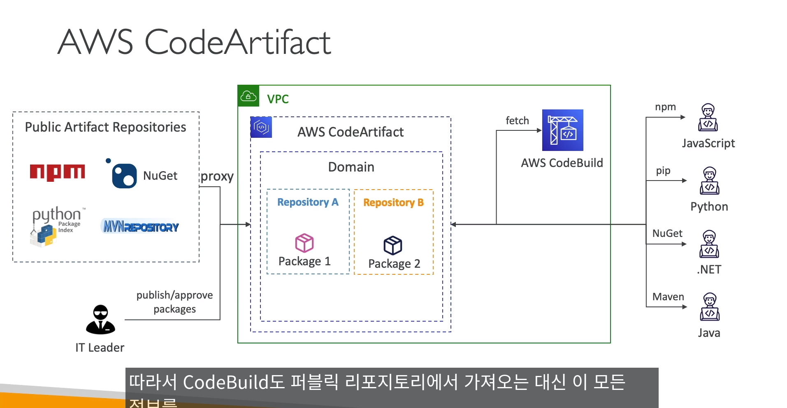
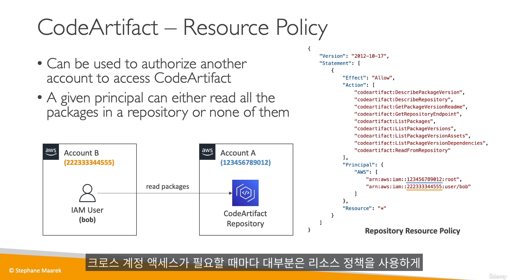
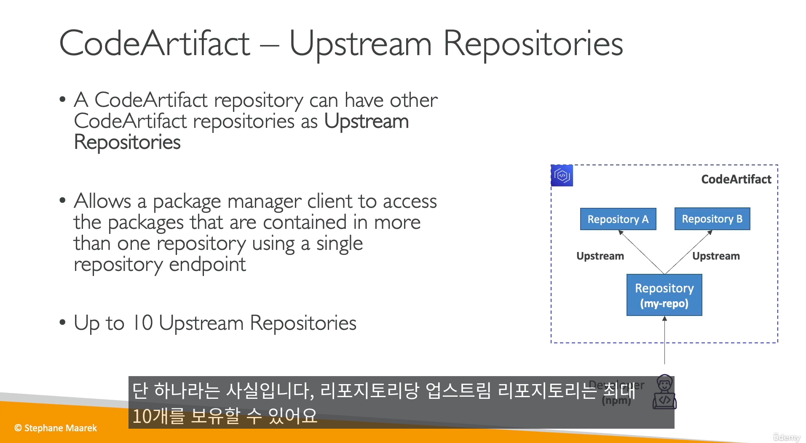
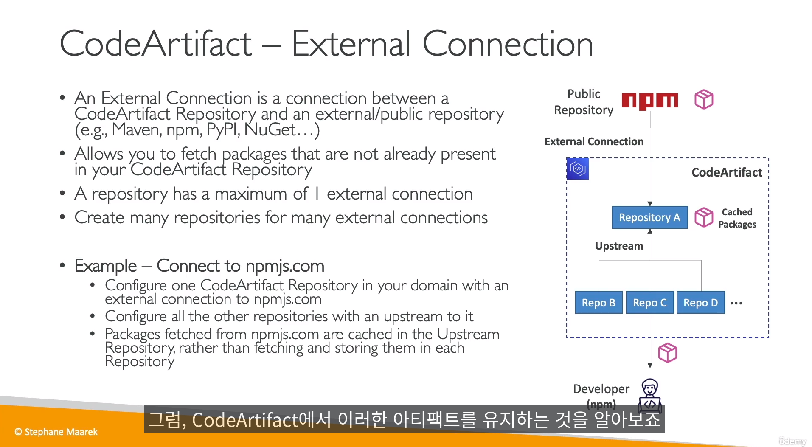
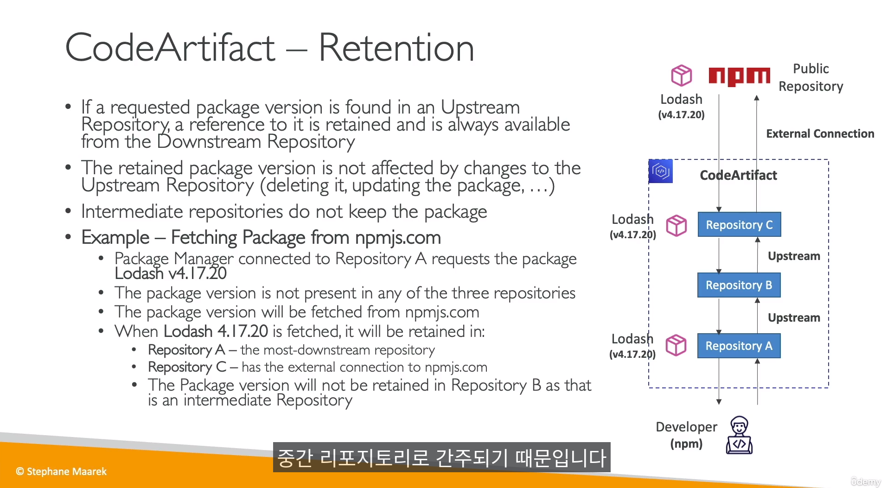
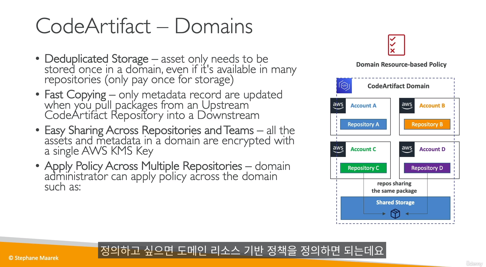
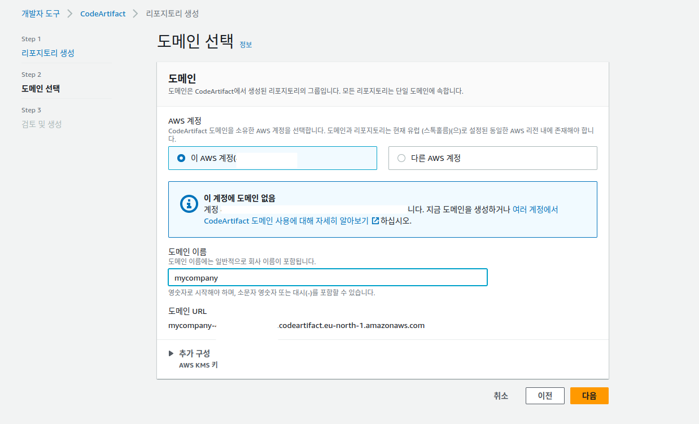

## AWS와 CICD

- CodeCommit : 소스 저장소
- CodePipeline : 코드에서 빈스택등의 파이프라인 자동화  (전과정 컨트롤)
- CodeBuild : 코드를 구축 및 테스트 자동화
- CodeDeploy : 코드를 `Ec2,온프라미스 장비, 람다, ECS 등` 자동 배포(`빈스택 배포 아님!`) 
- CodeStar : 개발을 위한 소프트웨어 위에 명시한 소프트웨어를 하나로 관리/그룹화 가능
- CodeArtifact : 소프트웨어 패키지를 저장,게시,공유
- CodeGuru : 머신러닝을 써서, 코드 리뷰 해주고 성능 체크

----------------------------------

## AWS CodeCommit

- 이거 왜씀?
  - 완전관리, 고가용성, 보안, 프로젝트 `사이즈에 제한 없음`
  - IAM을 이용한 엑세스 제어
  - 저장된 코드는 `KMS를 이용해서 암호화됨`
  - 저장소를 공유할때, 절대 SSH 키를 공유해서는 안되고, IAM역할을 생성 & STS를 통해 다른계정과 공유해야됨
  - `저장소 인증 관련 2가지`
    - SSH Key 사용
    - HTTPS 사용 (AWS 인증서)

- 코드커밋을 쓰려면, IAM > 유저 > 자격증명에서 comdecommit 키를 발급 받아야한다

----------------------------
## AWS CodePipeline

- CICD를 위한 비주얼 워크플로 도구
- 소스는 Codecommit, ECR, S3, bitbucket, github 등 있음
- 빌드는 CodeBuild, jenkins,CloudBase, Teamcity 등을 선택 가능
- 테스트는 CodeBuild, AWS Device Farm 등 서드파티 지원
- 배포는 Codedeploy, Elastic Beanstalk, CloudFormation, ECS, S3 등 가능
- 파이프라인의 `결과물 -> 아티팩트는 s3에 저장`되고, 다음단계로 전달됨
- `CW이벤트 브릿지로` 파이프라인 실패, 스테이지 실패등에 대한 알림을 받을 수 있음
- 불편한점...  `IAM 역할을 필요에 맞게 셋팅 해야됨 (S3 통신, 빈스텍, 코드 커밋 등) `

- 파이프라인 시각화

- 파이프라인 추가를 할 수 있다. (깃랩 CICD처럼 스테이지 매니징 가능)
- `Stage에 여러 액션 그룹이 있을 수 있다`.

- 파이프라인 콜 하는 방법 (3가지)
  - event 방식 `(기본값)`
    - 이벤트가 발생하면, 바로 실행하기 때문에 매우 빠름
  - webhook
    - 이벤트 방법의 이전 버젼, 코드파이프라인의 엔드포인트를 노출 시켜야함

  - polling
    - 코드파이프라인이 정기적으로 저장소를 체크함 (비추함)

- 또한 파이프라인 중간에 `수동 승인`기능이 있다
  - `수동 승인의 소유자는 aws`
  - 수동 승인을 하기위해서, 사용자의 수동승인 권한이 2개 필요하다
    - getpipeline (파이프라인 확인)
    - putApprovalresult (수동 승인버튼 권한)
  - 그림에서 보다 시피 SNS로 사용자에게 알림 가능

- 클라우드 포메이션과 통합해서 테스트 서버를 올려서 테스트 할 수도 있음

-----------------------------------

## AWS CodeBuild

- 소스는 코드커밋, s3, 빗버킷, 깃랩등
- `buildspec.yml` 파일을 통해 빌드 실행 (루트에 위치해야됨)
  - buildspec.yml의 모든 명령을 실행 (`일종의 Dockerfile`)
- 빌드에 관련된 로그는 s3, cw logs에 저장됨
- 빌드환경은 `파이썬, 자바, docker 등` 지원
- 소스코드 + docker 이미지를 활용해 빌드 시작

- buildspec.yml파일 내용
  - `AWS ssm 파라미터 스토어` 변수도 끌어오기 가능
  - `AWS 시크릿 매니저` 연동도 가능
  - 전체적으로 깃랩 CICD처럼 생겻음
  - 4가지 페이즈로 나누어져 있음
    - install : 환경/패키지 설치
    - pre_build : 빌드직전 실행되는 명령어
    - build : 빌드 명령어
    - post_build : 빌드 다된후 마무리 작업
  - `캐시는 어떤 파일의 종속성을 S3에 캐시 저장하면, 빌드할때 불러와 빌드 속도를 높임`

- code 빌드를 `로컬`에서도 실행 가능
  - 단, `코드빌드 에이전트를 깔아야됨`

- 기본적으로 CodeBuild는 VPC 밖에서 실행됨
  - VPC 밖에서 실행되면, VPC안의 애플리케이션과 통신 할 수 없음
  - VPC id,서브넷 ID, 보안 그룹 ID를 설정해서 VPC안에서 빌드 가능

- CodeBuild 컨테이너는 실행이 끝나면 삭제됩니다(성공 또는 실패). 실행 중이더라도 SSH로 연결할 수 없습니다.

---------------------
## AWS CodeDeploy
- 코드를 `Ec2, 온프라미스 장비, 람다, ECS 등` 자동 배포
  - 모든 Ec2 인스턴스가 빈스택처럼 관리되지 않음
- 대상이 되는 장비에 `CodeDeploy Agent`를 설치
- 애플리케이션을 배포하는 법을 설명하는 `appspec.yml`을 사용 
- 에이전트는 CodeDeploy에 poll을 하고있고, 무슨 작업을 해야되는지 대기상태에 있음

- CodeDeploy 구성 요소
  - Application 
    - 유니크한 이름의 컨테이너
  - Compute Platform
    - ec2나 온프레미스,람다 등 배포 대상의 플랫폼
  - Deployment configuration
    - `배포 성공/실패`에 대비한 `배포 규칙`
  - Deployment Group 
    -  배포할 대상 그룹 (`DEV, TEST 등 여러가지 그룹 구성 가능`)
    -  AWS 리소스 `Tag, ASG` 등 설정가능
  - Deployment Type
    - 애플리케이션을 배포그룹에 어떤 방법으로 배포
      - In-place 배포
        - `Ec2`와 `온 프레미스` 지원
        - 롤링과 차이점이라면, `기존 인프라를 그대로 두고`, 소프트웨어만 점진적 & 한꺼번에 업데이트
        - `롤링은 새로운 인프라에서 점진적 배포하는것임`
        - https://docs.aws.amazon.com/ko_kr/whitepapers/latest/overview-deployment-options/in-place-deployments.html
      - 블루그린 배포
        - Ec2와 `람다, ECS 지원` 
  - IAM Instance Profil
    - Ec2에 s3나 github등의 배포 코드에 접근하기위한 권한?
  - Application Revision (개정)
    - `어플리케이션 코드 + appspec.yml 파일`
  - Service Role
    - CodeDeploy가 Ec2나 ASG, ELB 등 접근 할 수 있는 권한
  - Target Revision (개정)
    - 특정 (배포)그룹에게 타겟을 정하는것

- appspec.yml 파일 내용
  - files
    - 파일 블록, `S3나 github에서` 파일시스템으로 소싱
    - 파일들의 위치를 지정
  - hooks
    - 애플리케이션을 배포하는 모든 단계가 포함
    - 단계
      - ApplicationStop 
        - 애플리케이션이 멈췄을때 실행
      - DownLoadBundle
      - beforeInstall
      - install
      - Afterinstall
      - ApplicationStart
      - validateService (`중요!`) 
        - `실행중인 서비스가 잘 돌아가는지 확인하는 용도`
        - 특별한 코드나 지침을 실행하기 위한 블럭

- CodeDeploy 배포전략에 롤백을 활성화 & 배포 실패를 하면, 마지막으로 `성공한 버전을 새롭게 배포한다` (`버젼 복구가 아님`)

- InvalidSignatureException 오류는, AWs 시간과, Ec2 시간이 동기화 안되서 나오는 오류이다
  - `Ec2 인스턴스의 시간을 AWS 시간으로 동기화 시켜야함`
- 또한 배포가 실패한 로그는, 에이전트가 깔린 Ec2의 `opt/codedeploy-agent` 폴더에서 `로그가 남는다`

---------------------------
## AWS CodeStar

- CodeCommit, CodeBuild,CodeDeploy,CodePipeline,`CloudWatch,CloudFormation` 등을 통합하는 서비스

---------------------
## AWS CodeArtifact

- 코드에 종속성을 가진 패키지/파일을 보관하는  시스템
  - 마빈,npm,yarn,pip 등 패키지를 매니지 먼트 할 수 있음
- 주로 `Codebuild`와 연동함
- `VPC 내에 저장소 존재함`
- 사용자가 인스톨 명령어를 치면, CodeArtifact로 프록시됨

- 이벤트 브릿지와 연동하여, 여러 서비스와 통합가능

- CodeArtifact도 저장소이기 때문에, 저장소에 접근하여 패키지를 다운받으려면 S3처럼 `접근 권한이 필요 하다`
  - 교차 계정에도 리소스 경로로 접근권한 부여할 수 있음

- 일종의 저장소 `상속 개념인`, upstream repository를 구성 가능하다.
  - 상위 저장소 my-repo가 있고, 저장소에서 공통적으로 쓰이는 패키지를 담아둔다 
  - 최대 10개까지 업스트림 레포를 보유할 수 있음
  - 상위 레포에 퍼블릭 패키지 저장소랑 연결해놓고, 나머지 하위 저장소에서 복사해서 사용

- 하지만 아래 그림처럼 저장소가 구성되어있다면
  - 1. 먼저, A패키지에 패키지가 캐시됨
  - 2. 그다음 최상위 레포인 C에 패키지가 캐시됨
  - 3. 중간 레포인 B는 패키지를 가지지 않음

- CodeArtifact 저장소를 도메인 노출을 할 수 있다
  - 맨처음 저장소를 생성하면, 아래 처럼 도메인 부터 만들어지고, 사용자 지정 저장소가 만들어짐
  - 처음 저장소를 만들면 `2개의 저장소`가 만들어짐(도메인-업스트림용,사용자 지정)

---------------------

## AWS CodeGuru

- 머신러닝 기반 서비스, 코드리뷰 + 애플리케이션 성능 모니터링

- `CodeGuru 프로파일러는 에이전트를 설치해야 작동`
  - 에이전트 구성
    - MaxStackDepth
      - `매서드 깊이`
      - 파라미터를 2로 설정하면, 깊이 2까지만 프로파일링함
    - MemoryUsageLimitPercent
      - 프로파일러가 사용할수 있는 메모리 양
    - MinimumTimeForReportingInMilliseconds
      - 에이전트가 애플리케이션에 대한 보고서 작성 최소 시간 
    - ReportingIntervallnMilliseconds
      - 에이전트에 프로파일링 보고서 전송 빈도
    - SamplingIntervallInmilliseconds
      - 에이전트가 애플리케이션에 대한 보고서 샘플링 간격
      - 값을 낮게 설정하면 샘플링 비율이 높아짐

-----------------------------
## AWS Cloud9

- 클라우드상에서 애플리케이션을 개발할 수 있는 IDE
- 장비를(Ec2) 프로비저닝 해야됨

