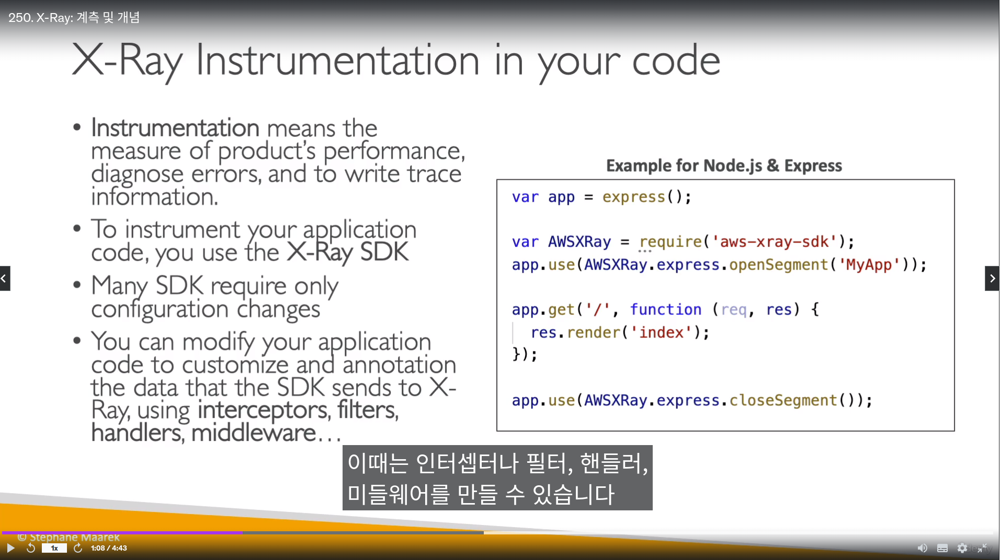

 ## AWS CloudWatch 메트릭

 - Ec2에 대한 기본 모니터링은 `5분 간격`, detailed(세부) monitoring 활성화 하면 `1분 간격`

- 사용자 지정 매트릭
  - `PutMetricData` API를 이용해서 사용자 메트릭을 푸시
  - StorageResolution API를 사용해 메트릭 캡쳐 간격을 조절
    - 캡쳐 기본값은 `1분`,  `1/5/10/30 초의 값 조절을 통해 수정 가능`
  - 고해상도 매트릭에 알람을 설정하는 경우, 고해상도 알람을 `10초` 또는 30초로 지정하거나 `정기 알람을 60초의 배수`로 설정할 수 있습니다.
  - 푸시하는 방향이 `과거,미래 상관없음(중요!)`
    - 2시간 앞으로 푸시 해도, 2시간 뒤 자료로 볼 수있고, 클라우드와치에는 아무런 오류가 없음

------------------------

## AWS CloudWatch 로그

- 기본적으로 CloudWatch Logs에 저장된 `모든 로그 만료 되지 않음`
- 클라우드 와치 로그에이전트(`구식`), 클라우드와치 통합 에이전트(`최신`)을 이용해서 로그를 수집 할 수 있다. 
  - 단, `Ec2가 클라우드와치에 대한 IAM 역할이 있어야함`

- `ECS 와 Beanstalk은 기본적으로 로그 수집`을 한다

- 로그 필터를 통해, 특정 문구(예 ERROR)같은 로그만 볼 수 있다
- `logs insights를 통해 로그를 쿼리`하고 대시보디에 추가 가능

- 클라우드 워치 로그 `데이터 내보내기`
  - S3
    - 내보내기에 최대 12시간 까지 소요
    - `CreateExportTask API`를 사용함
    - `데이터 스트리밍이 불가능함`
  - CW 구독 필터(`Subscription Filter`)
    - S3와는 다르게 돈이 들지만, 빠르게 로그 스트리밍 가능

- 로그 다계정 통합도 가능함

- 클라우드와치 알람
  - AWS CLI `set-alarm-state`를 사용해서 강제로 알람을 울리게 할 수 있음
  - 소스는 메트릭이다.
    - 로그기반 알람을 생성하려면 `로그 -> 매트릭으로 변환` 한다음 알람
  - 알람 상태 3가지
    - OK (아무이상없음)
    - INSUFFICIENT_DATA (판단 데이터 부족)
    - ALARM (알람)

- 클라우드와치 `복합 알람`
  - 다수의 알람상태를 통합해 최종 결정을 내림
    - 알람의 노이즈를 줄일때 사용
  - `AND`와 `OR`를 조건사용 가능

-------------------

## AWS CloudWatch Synthetics Canary

- python, Node.js으로 작성되는 스크립트
- 일종의 `애플리케이션의 전반적인 상태확인 스크립트`
  - 사이트 제목 클릭, 장바구니 물건 추가 등
- Synthetics Canary 블루 프린트 제공 종류는 다음과 같다
  - HeartBeat Monitor 
    - URL 상태확인
  - API Canary
    - REST API 상태 확인
  - Broken Link checker
    - 인터넷 사이트 링크 테스트
  - Visual Monitoring
    - 베이스 스크린샷과 다른지 비교
  - `Canary Recoder`
    - 웹사이트에서의 동작을 기록하고, 스크립트를 자동으로 짜줌
  - `GUI Workflow Build`
    - 웹페이지에서 GUI기반으로 직접 액션함

----------------

## AWS EventBridge

- 이벤트 버스를 만들어야함 
- 아카이빙을 통해서, `이벤트 재현이 가능함`
- 서비스 자체에서 버스내 `이벤트를 분석하고, 스키마를 추론함`?

- 다중 계정 통합은 아래 그림과 같이 이루어진다

----------

## AWS X-Ray

- 마이크로서비스에 대한 분석을 시각적으로 보여줌
  - 애플리케이션의 병목현상을 식별 가능
  - 마이크로서비스끼리의 의존관계 파악
- X-Ray는 `트레이싱`을 활용해 작동함
  - 웹이나 REST API에 직접 요청(패킷)을 주입하여 추적
  - `요청을 통해 얻은 모든 정보를 모아` 분석 및 시각화 해줌

- X-ray 호환
  - 람다
  - Elastic Beanstalk` (옵션 버튼 하나로 바로 활성화)`
  - ECS
  - ELB
  - API Gateway
  - Ec2 인스턴스 및 온프레미스 장비

- X-Ray 활성화 방법 순서
  - 1. AWS X-Ray `SDK`를 사용(자바,파이썬,고,노드js,닷넷 지원)해 코드 작성/수정
  - 2. `X-Ray 데몬`을 설치 (Low level UDP 패킷 기반)
    - 이미 `AWS 통합된` `람다,` 같은 서비스는 미리 데몬이 깔려있음
    - 데몬을 Ec2에 설치했다면, Ec2에 X-ray에 정보를 쏠수 있게, `Iam 역할을 줘야함`

- x-ray 컨셉
  - Segments
    - 각 애플리케이션/서비스 마다 보내는 정보
  - SubSegments
    - 세그먼트의 세부사항을 남길때 유용
  - Trace
    - 세그먼트를 모아 end-to-end 추적
  - `Annotations` (중요)
    - 키,벨류로 구성되있고, `인덱싱`이 되어 `검색 가능`
    - 필요한 정보를 키,벨류값으로 필터해서 `필요한 정보만 캡쳐`
  - Metadata
    - 키,벨류로 되잇지만, 인덱스는 없음 -> 진짜 메타 데이터임
    - 인덱스가 없기때문에 `검색 불가`
  - Sampling
    - 샘플링 규칙을 `수정`하더라도 `서비스를 재시작 할 필요가 없음`
      - 데몬이 자동으로 샘플링 규칙을 획득함
    - X-ray로 보내지는 데이터 양을 제어 할 수 있음
      - reservoir
        - 초당 샘플링활 최대 요청수
      - Rate
        - 리저버 크기가 한도에 도달한 후 나머지 요청을 샘플링할 고정 비율을 설정할 수도 있습니다. 예를 들어 리저버 크기를 50으로 설정하고, 고정 비율을 10%로 설정하는 경우, 초당 100개의 요청이 규칙과 일치한다면 총 샘플링 수는 초당 55개 요청입니다.
      - priority 
        - 샘플링 규칙의 우선 순위 (낮을수록 우선순위)

- X-ray API의 종류
  - X-Ray Write API (`x-ray 데몬 전용`)
    - 데몬 -> x-ray 서비스에 데이터를 보낼 때 사용
    - PutTraceSegment
      - 세그먼트 문서`(실제 정보)`를 X-ray에 업로드
    - PutTelemetryRecords
      - 데몬이 수신/거절 세그먼트가 몇개인지지, `백엔드 연결 관련 정보를 업로드`
    - 나머지는 샘플링 규칙 정보 받아오기

  - X-ray Read API (콘솔전용)
    - 아래 그림 참조

- ECS와 x-ray 데몬 통합
  - 3가지 방법이 있음

-----------------------

## AWS Distro for OpenTelemetry

- Cloud Native Computing Foundation(CNCF)의 일부인 OpenTelemetry는 애플리케이션 및 인프라 모니터링을 위해 분산된 트레이스 및 지표를 수집하는 오픈 소스 API, 라이브러리 및 에이전트를 제공합니다. 
  - `걍 X-Ray랑 비슷한거임`
  - AWS Distro for OpenTelemetry는 서비스는 아니고, 프로젝트임
  - OpenTelemetry 자체는 범용성이 더 뛰어나다? (내 생각)

- AWS Distro for OpenTelemetry -> X-ray 로 마이그레이션 가능

