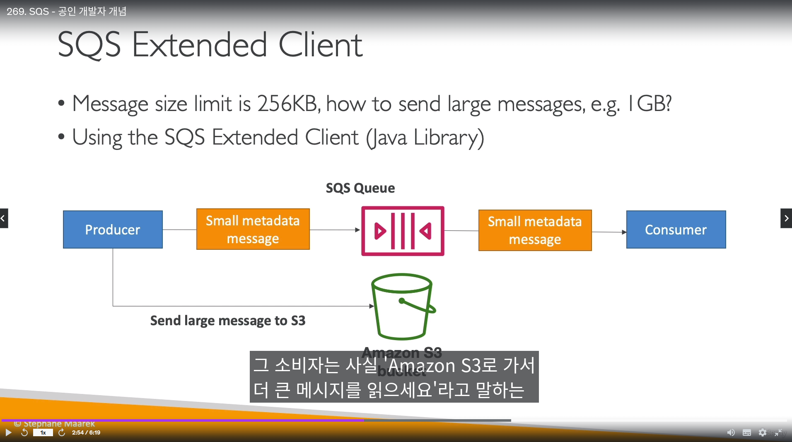
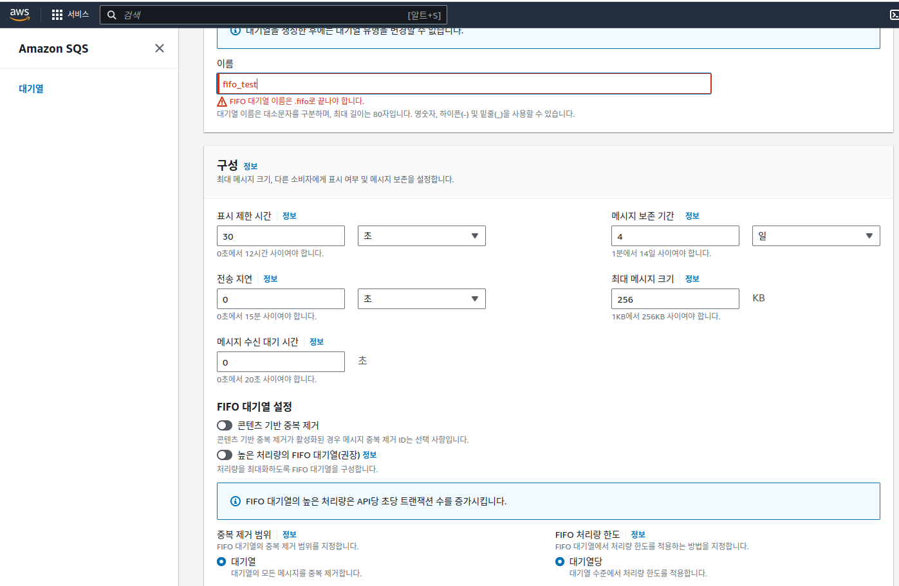
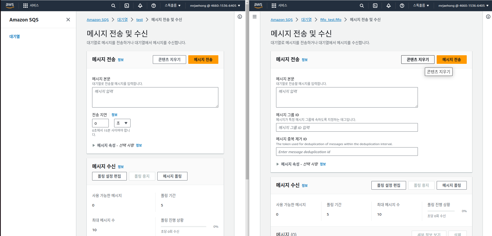

## AWS SQS 표준 대기열

- 메세지는 큐에 기본값으로 `4~14일` 동안 대기열에 있음
- 메세지는 `256KB 미만`
- `SendMessageAPI`(AWS SDK)를 통해 메세지큐에 전달 가능
- 표준대기열은 처리량 `무제한임`
- 소비자는 메세지를 처리하고 꼭, `DeleteMessage API`를 해줘야함
- 메세지큐 대기열 길이는, `ApproxmimateNumberOfMessages` CW 메트릭으로 확인 가능하다.
- SQS 보안
  - HTTPS를 이용한 전송중 암호화 보장
  - KMS Key를 이용한 컨텐츠 암호화 
  - SQS에 데이터를 전송/송신 하려면, SNS 엑세스 컨트롤 권한을 설정 해줘야함

- S3와 비슷한 `SQS 엑세스 정책도 설정 가능함`
- 교차 계정 엑세스도 가능함

- SQS 배달 못한 편지 - Dead Letter Queue (DLQ)
  - 오류 디버깅 용도
  - 컨슈머가 처리 못한 횟수를 기반으로 메세지를 -> `DLQ 로 보낼 수 있음` (새로운 SQS 대기열임)
  - DLQ를 구성할 때, `SQS 유형은 같아야함`
    - 메인 표준 대기열 -> DLQ 표준 대기열
    - 메인 FIFO 대기열 -> DLQ FIFO 대기열 
  - DLQ에 있는 메세지를 `다시 메인 SQS에 리드라이브 할 수 있음`

- SQS 메세지 지연 - Delay Queue
  - 0~15분까지 메세지를 컨슈머가 가져가지 못하게 지연 시킴
  - 딜레이 설정은 `SQS 큐 자체 설정, 메세지 보낼때 설정`  => `2가지` 존재한다

- SQS Long Polling
  - 폴링 시간은 `1~20초` 설정
  - 폴링 시간은 딜레이와 마찬가지로, `SQS 큐 자체 설정`, 컨슈머의 `WaitTimeSeconds` API => 2가지로 설정 가능하다
  - 롱 폴링 목적은, SQS 대기열로 보내는 `컨슈머의 API 횟수를 줄일 수 있음`

- SQS Extended Client
  - 기본 256KB 메세지 보다 더 큰 용량의 메세지를 보내고 싶을때, `Java 라이브러리인 Extended Client` 사용
  - `S3와 연동`해서 일종의 DB <-> 키값으로 응용하는 기법임
  - 주로 비디오 파일을 처리할때 사용

- SQS 알아야할 API
  - PurgeQueue
    - 큐에서 모든 메세지 비움
  - SendMessage,ReceiveMessage,`DeleteMessage`
    - 큐에 메세지 보내고,큐에서 메세지를 받고, 받은 메세지 삭제
  - MaxNumberOfMessage
    - 한번 폴링할때 한꺼번에 메세지 받을 수 `기본값 1, 최대값 10`(ReceiveMessage에서 사용)
  - ReceiveMessageWaitTimeSeconds
    - 폴링 시간 설정 1~20초
  - ChangeMessageVisibility
    - 메세지 가시성 시간, 메세지 처리에 타임아웃이 걸릴때 사용 (`큐 생성할때 설정 가능`)
    - `0초 ~ 12시간` 까지 설정 가능 (기본값은 30초)

-----------------------------------------------------

## AWS SQS FIFO 대기열

- 서비스 네임이 `.fifo로 끝나야됨`
- 묶음이 아닐경우(1개 메세지) `초당 300개 처리`, 10개씩 묶을경우 초당 `3000개 처리 가능`
- 메세지 그룹 ID에 따라 순서대로 정렬됨
- 컨슈머는 `그룹ID 별` 병렬 처리 가능해짐
- 큐 생성 때, `중복 제거 기능 선택 가능`
  - 메세지 보낼때, `그룹 ID라는 것을 지정해서 중복 방지`
  - 기본적으로 중복방지는 `5분 간격`으로 검사
    - 즉, 5분 간격으로 동일한 메세지를 2번 보내면 -> 나중에 보낸 메세지는 거부됨
  - `메세지 중복방지 2가지`
    - `본문 내용 기반 제거`
      - SQS는 메세지를 받으면, SHA-256으로 해쉬를 만들어냄, 이 값을 가지고 동일한 내용 있으면 중복이라 판단
    - 또는 `메시지 중복 제거 ID(시험에서는 옵션이지만, 현재 서비스는 강제임)`가 같으면 중복 (아래 그림 참조)

--------------------------------------------------

## AWS SNS

- SNS도 `FIFO 가능`
  - FIFO 관련해서는 SQS와 동일한 기능 제공 (중복제거,중복제거 ID ,그룹 ID별 정렬 등)
  - 묶음이 아닐경우(1개 메세지) `초당 300개 처리`
  - `SNS도 .fifo로 이름을 지어야함`

- 자체적으로 메세지 필터링 할 수 있음

- SNS 구독 프로토콜
  - 표준 SNS : SQS, Lambda, HTTP/S, `SMS`, 이메일, `이메일-json`, 모바일 애플리케이션 엔드포인트, Kinesis Data Firehose
  - `FIFO SNS : FIFO SQS`
    - `중요한점, SNS가 FIFO면, 받는 SQS도 FIFO여야함`

- SNS 보안
  - HTTPS를 이용한 전송중 암호화 보장
  - KMS Key를 이용한 컨텐츠 암호화 
  - SNS에 데이터를 전송/송신 하려면, SNS 엑세스 컨트롤 권한을 설정 해줘야함

-------------------------------------------------

## AWS Kinesis

- 데이터 스트림의 주 목적은 `데이터 수집,처리`이다
  - 저장은 부가적인 요소이다

- 파이어 호스의 주 목적은 `데이터 저장을 위한 전송`이다
  - 최종 목적지는 S3와 같은 `저장소이다`
  - 파이어 호스는 `실시간 데이터 전송 서비스 이다`

(https://whitesoil.tistory.com/79)

- Kinesis Data Streams
  - 키네시스 데이터 전송에는 `샤드/초 당 1MB 또는 1000개 메세지`
  - 케네시스 데이터 나갈때는 `모든샤드가 초당 2MB 또는 소비자당 2MB`

  - 데이터 스트림은 1~365일까지 TTL 설정 가능
  - 키네시스 데이터 스트림에 저장된 `데이터는 삭제 불가능 (데이터 불변성)`
  - 데이터를 보낼때 파티션키가 있는데, 같은 파티션키는 같은 샤드에 존재하게 됨
  - 키네시스 에이전트, 키네시스 프로듀서 라이브러리(`KPL`) 를 통해 전송 가능
  - 키네시스 클라이언트 라이브러리(`KCL`)로 소비자는 데이터 전달 받음

  - 키네시스 데이터 스트림의 2가지 용량 모드
    - `프로비저닝 모드`
      - 직접 구성
    - `온디멘드 모드`
      - 서버리스 처럼 알아서 조절됨 
      - 기본은 4MB/4000개 처리(초당)
      - 데이터스트림에 입력/출력된 데이터 양에 따라 요금 부과 (`요금모델이 프로비저닝 모드랑 다름`)

  - 보안은 SQS & SNS 와 같음
    - HTTPS를 이용한 전송중 암호화 보장
    - KMS Key를 이용한 컨텐츠 암호화 
    - 데이터 스트림에 데이터를 전송/송신 하려면, 엑세스 컨트롤 권한을 설정 해줘야함
  - VPC 엔드포인트로도 연동 가능

  - Kinesis Producers
    - `PutRecord API를 통해 데이터 전달 가능`
    - 아래 그림과 같이 Device 아이디를 파티션 키로 넣어, 해쉬 함수를 거쳐 샤드로 전달됨

    - 하나의 디바이스가 하나의 샤드에 과도하게 들어감 -> `hot partition`이라고 함
      - 데이터 전송이 과도하게 되면 `ProvisionedThroughputExceeded`라는 예외가 발생함
      - `해결방법 3가지`
        - 1.지수 백오프 사용
        - 2.파티션키 잘 분배
        - 3.샤드분할

  - Kinesis Data Streams Consumers
    - 람다, 키네시스 파이어호스/분석기, AWS SDK 응용, KCL 등이 될 수 있음
    - 데이터 소비 방식에는 `2가지 모드 존재`
    - `이때, 클래식은 GetRecords(), 향상된 팬아웃은 SubscribeToShard() 함수를 씀`
      - 클래식 Fan-out 모드 (pull 방식)
        - (모든 샤드)데이터 스트림 자체가 2MB 처리량을 가짐
      - 향상된 Fan-out 모드 (push 방식)
        - `소비자별 2MB 처리량`을 가짐
      - `아래 그림 참조해서 표만들자!!!!!!!!!!!!!!!!!!!!!!!!!!!!!!`

     

- 람다 소비자
  - 서버를 이용하지 않고, 키네시스 데이터 스트림 `데이터를 소비하는 방식`
  - 다이나모DB에 레코드를 저장
  - `GetBatch()`를 통해 데이터 전달받음
    - 샤드당 `최대 10개의 배치 처리 가능`

- Kinesis Client Library (KCL) 
  - Java 기반 소비자
  - 각 샤드당, 하나의 KCL 인스턴스를 이용해 데이터를 읽을 수 있다
    - 예) `4개 샤드 = 최대 4개 KCL 인스턴스`
  - 작동방식은, 샤드에서 `KCL이 어디까지 데이터를 읽었나 체크포인트를 다이나모DB에 저장함`

- Kinesis 운영 - 샤드 병합 및 분할
  - 분할
    - 분할 하면, 기존 샤드는 사라지고, `새로운 샤드 (2개)가 생겨남`
      - 기존샤드는, `데이터 보존기간이 끝나야 삭제됨` (데이터 보존기간 365일 하면.... 큰일날듯)
    - 프로비저닝 모드에서 `오토 스케일링 기능은 없음`
    - 한번에 3개이상 샤드를 분할 할 수 없음
      - 샤드를 3개이상 증설 하려면, 여러번(2번) 분할 해야됨

  - 병합
    - 분할과 똑같이, 기존샤드 2개 사라지고, `하나의 새로운 샤드가 나타남`
    - 기존샤드는, `데이터 보존기간이 끝나야 삭제됨` 
    - 한번에 3개 이상 샤드를 병합 할 수 없음
      - 샤드를 3개이상 병합 하려면, 여러번(2번) 병합 해야됨

