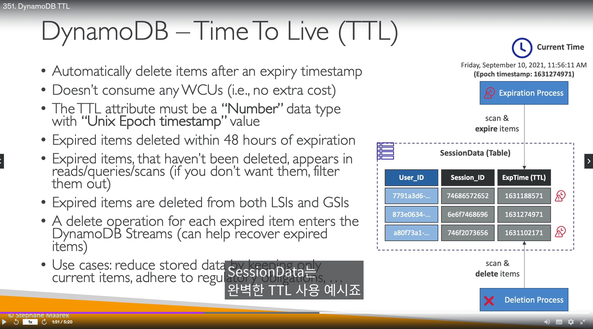

## AWS DynamoDB

- 완전관리형 서비스
- NoSQL 기반이기에 `SUM,AVG 등 집계 연산 불가능`
- 다이나모DB는 수평적 확장을 함
- 다이나모DB도 스탠다드, `Infreequent Access(IA)` `두 가지 테이블 클래스가 있음`
- 테이블에서 아이템의 최대값은 `400KB` (행 데이터)

- 파티션키 - 중요 (`해쉬 전략`)
  - 아이템(행 데이터)의 `유니크한 값`

- 정렬 키 - 옵션
  - 파티션키와 조합하여, primary key(기본키)를 생성

-------------------------------

## AWS DynamoDB 실습

- `DB를 만드는것이 아니라, 테이블을 만드는것임`

- AWS 한글버젼에서는 아이템 -> `항목`으로 행 데이터를 추가 가능

- 만약 같은 `파티션키만`를 이용해 생성하면 오류남

- `테이블에 정렬키가 있으면, 파티션키 데이터가 같아도 상관 없음`
  - 즉, 파티션키와 정렬키가 다르기만 하면 됨

----------------------------------------

## AWS DynamoDB WCU / RCU

- DynamoDB 읽기/쓰기 용량 모드가 있음
  - `24시간 마다 프로비저닝 <-> 온디맨드 바꿀 수 있음`

  - 프로비저닝 모드
    - 오토 스케일링 지원
    - 미리 자원을 지정, 지정해둔 용량보다 넘어서도 `burst capacity(버스팅 용량)`으로 일시적으로 사용가능함
      - 버스팅 용량이 다 소진되면, `ProvisionedThroughputExceededException` 에러 발생함 (프로비저닝 처리량 초과 예외)

  - 온디멘드 모드
    - 읽기 쓰기 모드가 `자동으로 업/다운`
    - 쓰는 만큼 나옴 (`프로비저닝보다 2.5배 비쌈`)

- WCU 계산방법 
  - 초당 1KB 쓰기 = 용량 1
  - 초당 0.5KB라면 올림 함
  - 예시
    - 만약 초당 여러 사람들이 총합 3KB를 쓰면 WCU = 3 예약해야됨
    - 초당 1.5KB 쓰면(`올림`해서), `2 WCU 사용`

- DynamoDB `읽기모드`는 2가지 모드가 있음
  - Eventually Consistent Read (최종적 일관된 읽기 모드) - `기본값`
    - 다이나모DB에서 `데이터`를 쓰기 후, 분산된 DB에 복제가 진행 안됬을 경우 데이터를 못 읽을 수도 있음 (`데이터를 쓰고 100ms내 읽기 상황`)

  - Strongly Consistent Read (강력한 읽관된 읽기 모드)
    - 방금 막 쓴 데이터를 읽을 경우 사용
    - 다이나모DB API에서 `ConsistentRead`라는 변수 = `True`로 둬야함
    - 방식은 `RCU를 2번 진행하기 떄문임`

- RCU 계산 방식
  - 4KB (강력한 읽기 기준)
  - `4KB 기준으로 올림함`

- DynamoDB 파티션 분배
  - 다이나모 DB를 검색전, `파티션키는 해시 함수를 통해 분산된다`
  - 그래서 파티션 분배에 관한 공식이 있지만, 굳이 외우지 않아도 됨
  - `RCU와 WCU는 파티션 수에 걸쳐 고르게 분배됨`

- 다이나모DB 처리량 에러
  - `ProvisionedThroughputExceededException`에러 발생함
  - 원인
    - 핫 키 (파티션키)
    - 핫 파티션
    - 아주 큰 아이템(항목) -> RCU와 WCU 보다 넘는 많은 아이템들을 쓰기/읽기 작업을 하려는 경우

  - 해결법
    - 지수 백오프 전략 사용
    - 파티션키를 최대한 많이 분산해서 구성
    - 읽기 작업일 경우, DAX (DynamoDB Accelerator) 사용

-----------------------------------------------
## AWS DynamoDB API

- 쓰기 API
  - putitem
    - 기본키가 같은 새 항목(아이템)을 만들거나, `완전히 교체/업데이트`

  - Updateitem
    - 기존 항목의 속성을 편집, 기존항목이 없으면 새항목 추가
    - 속성 몇가지만 편집할뿐, `모든 속성을 업데이트 하진 않음` => 변경된 사항만 저장
    - Atomic counters 와 함께 사용

  - Conditional Writes
    - 조건이 충족되엇을때만 쓰기/업데이트/삭제 가능
    - 아이템에 동시 접근시 사용하면 도움이 됨
    - 다이나모 성능에 아무런 영향이 없음

- 읽기 API
  - Getitem
    - 기본키를 기반으로 데이터 읽음
    - 기본키 + 정렬키로도 읽음
    - 읽기는 2가지 모드로 됨, 최종적 일관된 읽기, 강력한 일관된 읽기
    - API에 `ProjectionExpression` 적용 가능, `이값을 통해 아이템의 속성 몇가지만 받을 수도 있음`

  - DB 쿼리
    - KeyConditionExpression
      - 파티션 키 or 정렬키를 통해 데이터 쿼리 가능
    - FilterExpression
      - 쿼리 데이터가 반환되기전 필터링 수행
      - `파티션키 + 정렬키 사용 못함`
      - 오직 non-key 속성에 사용할 수 있음
    - 쿼리는 아이템(항목)을 반환 하는데, `Limit` 매개변수에 따라 가져올 수 있는 항목 수가 제한됨
    - 리턴하는 항목들의 `최대 크기는 1MB임`
      - 더 가져오고 싶으면, pagination(페이지형태)로 가져올 수는 있음
    - `로컬 보조인덱스, 글로벌 보조 인덱스 쿼리 가능`

  - DB Scan 
    - 쿼리가 특정한 파티션키, 정렬키로 데이터를 불러오는 것이라면, `Scan은 테이블 전체를 읽음`
    - 스캔도 최대 1MB 데이터를 반환함, 똑같이 페이지형태로 다 가져올 수는 있음
    - 병렬 Scan 지원
    - FilterExpression와 ProjectionExpression 함께 사용도 가능함

- 삭제 API
  - Deleteitem
    - 항목 삭제
    - 조건부 삭제도 가능함

  - DelteTable
    - 테이블에 있는 모든걸 삭제
    - 테이블 삭제가 아님!, `테이블에 있는 모든 항목 삭제임`

- 배치 작업
  - 배치작업 => 일괄작업이라, 어떤 작업은 실패할 수도 있지만, 실패한 작업 항목은 다시시도하면됨

  - BatchWriteItem
    - 호출 한번에 `최대 25번의 putitem 또는 deleteitem 실행 가능` (updateitem 실행 불가)
    - `최대 16MB 데이터를 기록`, 항목마다 400KB는 같음
    - 항목을 업데이트는 불가 => 데이터를 갈아치우는것 이지 업데이트가 아님 (따로 updateitem 써야함)
    - 쓰기 작업이 실패하면 `Unprocesseditems`라는 것을 사용해, 지수백오프 전략으로 쓰기 배치를 지속적으로 수행 가능

  - BatchGetitem
    - 하나이상의 테이블에서 항목이 반환되며, `최대 100개의 항목과 16MB 데이터만 가능`
      - 병렬로 읽기가 됨
    - 읽기 작업이 실패하면 `UnprocessedKeys`라는 것을 사용해, 지수백오프 전략으로 읽기 배치를 지속적으로 수행 가능

- partiQL
  - 다이나모 DB에서 SQL 쿼리를 실행하는 API
  - 파티QL로 `여러테이블의 항목 삽입/출력/삭제 가능` 
    - `단, Join은 안됨`

- DynamoDB 조건부 쓰기
  - 쓰기 조건들
    - attribute_exists : 속성 맞는거
    - attribute_not_exists : 속성 안 맞는거
    - attribute_type : 속성 타입
    - contains : 문자열 검사
    - begins_with : 문자열 사이에 있는거
    - in : (:cat1,:cat2)
    - between : (100만이하 1만이상)
    - size : 문자열 사이즈

- DynamoDB 조건부 삭제
  - 삭제 조건들
    - attribute_exists : 속성 맞는거
    - attribute_not_exists : 속성에 값이 없는 경우

-----------------------

## AWS DynamoDB 로컬 보조 인덱스 & 글로벌 인덱스

- 로컬 보조 인덱스 (Local secondary Index - LSI)
  - 정렬키를 LSI라고함
  - 테이블당 `최대 5개` 설정가능
  - 반드시 `테이블 생성 시점에 정의해야됨, 생성되고 나서는 수정 불가능`
  - 보조 테이블 개념이 아니기 떄문에, 성능상 문제 없음

- 글로벌 보조 인덱스 (Global Secondary Index - GSI)
  - 따로 이인덱스에 관해서 `RCU와 WCU를 프로비저닝 해줘야함`
  - 일종의 `인덱스 보조 테이블 새로 생성` 정도로 이해하면 될듯
  - `테이블 생성 후에도 추가나 생성이 가능`
  - 이 보조 테이블에 쓰로틀링 걸리면, `메인 테이블도 쓰로틀링 걸림`

- 낙관적 잠금 - (Optimistic Locking)
  - 항목이 업데이트/삭제 되기전, `변경되지 않게 하는 기법`
  - 조건부 쓰기의 `기술적 테크닉`

----------------------------

## AWS DynamoDB Accelerator (DAX)

- 완전 관리형, 고가용성, 인메모리 캐시
- 엘라스틱 캐시와 반대로, `애플리케이션단에서 코드 수정 안해도됨`
- DAX는 `프로비저닝을 해야됨`, `최대 10개 노드` 보유 가능, 읽기작업에 최적화 되는 방식
  - 최소 3개 노드, 멀티 AZ설정이 권장사항
- `TTL은 5분정도(기본값)`

- 앨라스틱 캐시 VS DAX
  - DAX
    - 간단한 쿼리 유형
    - 개별적으로 객체 접근, 쿼리, 스캔 할때 사용
  - 앨라스틱 캐시
    - 애플리케이션단에서 쿼리 집계 (SUM)할때 미리 저장

-----------------------------

## AWS DynamoDB Streams

- 스트림 테이블에 메인테이블의 항목 업데이트,삽입,삭제가 기록됨
- 데이터 보존기간은 `최대 24시간` 
- 샤드로 구성되고, 키네시스 데이터 스트림과 유사함
  - 하지만, 프로비저닝 안해도됨 -> AWS가 알아서 함
- 스트림 활성화하면, `테이블의 모든 데이터/항목 적용임 -> 특정 데이터/항목 소급적용 안됨!`
- 스트림 데이터 보낼 수 있는곳
  - 람다
  - 키네시스 데이터 스트림
  - KCL 어플리케이션(키네시스 클라이언트 라이브러리)

- 스트림 활성화 보기 옵션 (아래 그림 참조)
  - KEYS_ONLY
  - NEW_IMAGE
  - OLD_IMAGE
  - NEW_AND_OLD_IMAGES

---------------------------------

## AWS DynamoDB TTL

- 항목의 보존 기간
  - 자료는 바로 삭제가 아니라, `만료후 48시간 후`에 삭제됨
- `항목의 TTL이 지나 -> 삭제될때, WCU가 소비되지 않음`
- `유닉스 타임 스템프를 자료형`으로 TTL을 작성해야됨
  - 예) 163111854
- 작동방식 -> 다이나모 DB가 TTL로 지정된 테이블 속성값을 계속 보고 있음
- 삭제되면, `스트림에 있으므로 복원도 가능`

----------------------------------

## AWS DynamoDB CLI

- `--projection-expression` : 한개 이상의 속성을 지정해서 가져옴
- `--filter-expression` : 반환된 항목을 필터링함 (클라이언트측)
- `--page-size` : 기본값 1000, 항목을 나눠서 호출 (API 타임아웃을 방지)
  - 10만개 항목에 대해, 페이지 사이즈 100으로 호출하면, API가 1000번 돌며 데이터 반환
- `--max-items` : 최대 항목수
  - `NextToken,starting-token`과 같이쓰임, 토큰으로 다음 데이터에 대해 접근 가능, 일종의 페이지랑 비슷

-------------------------------------

## AWS DynamoDB 트랜잭션

- 하나의 테이블에 여러작업 가능함
- 쓰기와 읽기에 `트랜잭션 모드` 적용 가능

  - 백그라운드에서 트랜잭션을 준비, 커밋해야 되므로
- 사용예
  - 금융 거래와 주문관리
  - 멀티플레이어 게임

- 두가지 오퍼레이터 
  - 25개 항목 또는 4MB 데이터
    - TransactGetItems
      - 읽기, Get아이템 + 트랜잭선
    - TransactWriteItems
      - 삭제,입력,업데이트 + 트랜잭션

- 쓰기와 읽기 `용량단위를 2배씩 소모함`

---------------------------

## AWS DynamoDB 세션 상태 캐쉬

- 세션데이터를 저장할때도 쓸수있음

- vs 앨라스틱 캐시
  - 엘라스틱캐시는 `인메모리`, 다이나모DB는 서버리스
- 주로 데이터 접근, 데이터 위치에 따라 문제가 출제됨

------------------
## AWS DynamoDB 파티셔닝 전략

- 핫 파티션이 나지않게, `파티션키에 접두사/접미사를 붙여서` 잘 분배한다

--------------------

## AWS DynamoDB 작업

- 테이블 클린업
  - 1. scan + 딜리트 아이템
    - 느리고, 비쌈
  - 2. 테이블 삭제 + 다시 만들기
    - 빠르고 쌈

- 테이블 복제
  - 1. `AWS 데이터 파이프라인`
  - 2. 테이블 백업 및 새로운 테이블에 복원
  - 3. scan + 풋아이템 or 배치 쓰기
    - 비싸고 느림

---------------------------------------

## AWS DynamoDB 기타

- 글로벌 테이블이 있음
  - 단, 스트림을 활성화 시켜야함
- DynamoDB Local
  - 개발용, 인터넷 없이 접근가능

- 코그니토 & 3자 보안을 통해 접근할때, LeadingKeys를 이용해, 본인의 항목에 대해 데이터 접근 가능 (`fine-grained Access`)

