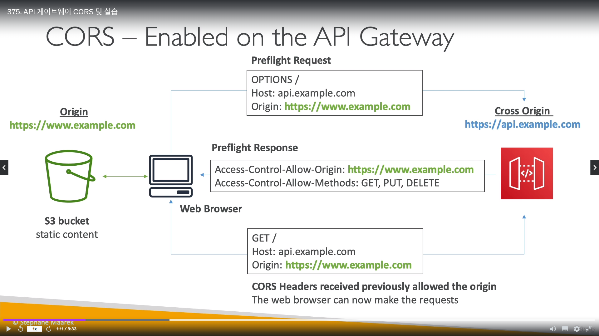
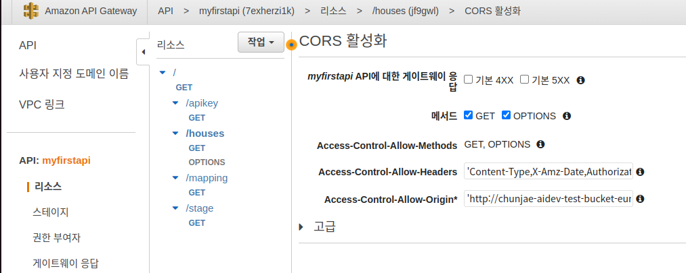

## AWS APIGateWay

- WebSocket 프로토콜을 이용해 실시간 통신 가능함
- `API 키를 생성해, 클라이언트 요청의 스로틀링을` 핸들링 할 수 있다.
- 응답에 대한 캐시 가능
- API게이트웨이 통합 대상
  - 람다 
  - HTTP
  - AWS 서비스 등
    - SQS, 스텝펑션, 키네시스 데이터스트림 등

- API GateWay는 `계정 제한`은 `초당 만번 콜`이다.
  - 서비스 쿼타로 늘릴 수 있음
  - `API중 하나가 과하게 사용되면, 다른 API도 스로틀링에 영향을 받음`
    - 예) 하나의 계정에서 A,B라는 API가 있을경우 A+B 합쳐서 초당 만번 콜 이상나면 오류남

- API 게이트웨이 배포 방식 (3가지)
  - Edge-optimized (기본값)
    - 글로벌 배포
    - `클라우드 프론트 엣지 위치를 통해 요청을 라우팅함`
    - 실질적 배포는 한리전에 배포한 소스가 엣지 로케이션에 다 복사되는 방식
    - ACM으로 HTTPS 인증을 사용하려면, `인증서는 us-east-1에 있어야함`
  - Regional
    - `클라우드 프론트 위치 사용 X`, 한 지역 배포
    - 클라우드 프론트를 붙이면 에지-옵티마이저랑 똑같지만, `캐싱전략과 클라우드 프론트를 더 많이 제어 가능해짐`
    - ACM으로 HTTPS 인증을 사용하려면, `인증서는 동일 리전에 있어야함`
  - Private
    - VPC 프라이빗 서브넷에 내부용으로 배포
    - ENI를 사용해 VPC 내부에서만 접근 가능 => 퍼블릭이 아님

- ACM으로 인증서를 사용할 경우, `반드시 Route 53에 CNAME이나 A-별칭으로 레코드를 설정해야됨`

- API게이트웨이 인증 방식
  - 유저 기반 인증
    - IAM 역할
      - 내부 어플리케이션 인증용
    - 코그니토
      - 웹,모바일 어플리케이션 외부 사용자 인증용
    - 커스텀
      - 사용자가 직접 인증방식 짤수도 있음

- APIGateWay를 `작동 시키려면, 배포를 무조건 해야됨`
  - `배포는 스테이지 타입으로 관리됨` (몇개든 상관없음)
  - 배포하지 않으면, 작동 안함

- API 게이트웨이 에러 종류
  - 400번대 (클라이언트 오류)
    - 400 : 잘못된 요청
    - 403 : Access Denied, `WAF 필터`
    - 429 : Quota exceeded, Throttle -> 클라이언트 할당량 초과
  
  
  - 500번대 (서버오류)
    - 502 : Bad Gateway -> 서버가 게이트웨이나 프록시 서버 역할을 하면서 업스트림 서버로부터 유효하지 않은 응답을 받았다는 것을 의미
      - 람다 프록시 통합이나, `백엔드에서 응답을 안함`
    - 503 : `서버가 요청을 처리할 준비가 되지 않은 것`을 의미
    - 504 : `통합 장애` 또는 타임아웃 (API 게이트웨이 `기본 타임아웃은 29초`)

---------------------------

## AWS APIGateWay 기본 실습

- API게이트웨이는 람다함수에 `29초 시간초과 자동으로 걸림(기본값)`

- API게이트웨이에서 `리소스`란 개념은 Path같은 개념이다

- 설정한 API게이트웨이를 `스테이지` 형식으로도 배포 가능하다
- `스테이지에별 콜 URL 생김`

---------------------------------------

## AWS APIGateWay Stage 배포 & 실습

- API게이트웨이 스테이지 배포에서 `스테이지 변수`값을 사용해, 배포를 바꾸지 않고도 환경 제어 가능
- 스테이지 변수 사용 예
  - 람다 ARN 
  - HTTP Endpoint 등
- 전달 받는 과정에서, APIGateWay -> 람다 주는 행위
  - `람다함수는 별칭마다 권한이 다름!!!`
`
- 스테이지 변수 포멧 => `${stageVariables.변수이름}`

- 기본 실습
  - 설정 메뉴
    - 리스폰 캐시 활성화, 메서드 초당 조절, WAF 설정 인증서 설정 가능

  - 로그 추적
    - 클라우드 와치, 커스텀, x-ray 추적 가능

  - sdk 생성
    - `스웨거처럼, SDK에서 API게이트웨이를 사용할 수 있는 예제 소스를 주는것`

  - 내보내기
    - API를 `문서로 내보내기 기능`

- 스테이지 변수 실습

  - 아래 그림처럼 람다는 아래와 같이 별칭을 가진다

- 빨간색 박스처럼, 람다함수 호출에  `람다이름:변수` => `apigateway1:${stageVariables.lambdaAlias}`를 선언하면 권한 추가해라고 나옴

- AWS CLI로 람다함수 별칭 중 하나인 `v2v`에 `API게이트웨이에서 람다호출에 대한 권한`을 추가해줌 (권한을 별칭마다 주면, API게이트웨이에서 별칭을 다 쓸수있음)

- API 테스트 할때 밑에 빨간 박스처럼 변수넣고 테스트 가능

- 스테이지 배포하고, 아래그림처럼 변수 선언해주면 -> 특정 람다 호출 가능

--------------------------

## AWS APIGateWay 카이나리 배포 & 실습

- API 변경사항에 관해 `소량의 트래픽으로 테스트`방법을 활성화
- 람다의 블루/그린 배포를 하는것과 같음

- 실습
  - 카이나리배포를 활성환

  - dev 스테이지 카이나리 배포

  - 절반확률로 카이나리 배포 들어감

  - 로그랑 모니터링 결과 이상없으면, 카이나리 승격

----------------

## AWS APIGateWay 통합 타입

- MOCK 타입
  - MOCK -> 실제품을 만들어 보기 전, 디자인 검토를 위해 실물과 비슷하게 시제품을 통칭
  - `백엔드로 요청을 전송하지 않고도, 응답이 반환됨`
  - 프로덕션보다는 `개발용 타입`

- HTTP / 람다 / AWS 서비스 타입
  - 요청과 응답을 모두 구성해야됨
  - 요청과 응답을, `맵핑 템플릿`을 이용해 `데이터를 조작/정제` 할 수있다
  - 아래그림은 SQS를 이용한 맵핑 템플릿 예제

- 맵핑 템플릿이란?
  - `요청/응답의 정보를 수정하는 템플릿`
  - VTL(Velocity Template Language)를 사용해서 `if,for 등 조건문 실행 가능`
  - 콘텐츠 유형을 `application/json` 또는 `application/xml`로 설정
    - `SOAP API와 REST API를 기반으로 한다는 말임`
    - SOAP API => XML 기반
    - REST API => JSON 기반
  - 예) 쿼리 파라미터의 이름 수정, body 수정, 헤더 추가 등
  - `아래 그림은 백엔드가 SOAP API이며, 들어오는 정보는 REST API(JSON)이다. 그래서 API Gateway에서 정보를 변환을 (JSON <-> SOAP) 맵핑 템플릿을 사용해서 변환해준다.`

- AWS_PROXY 타입 (람다 프록시)
  - 프록시라, 응답 요청 맵핑같은건 못함 (람다로 데이터를 다이렉트 전송/송신)
    - 예) 헤더,쿼리 문자열을 중간에 못바꾸고, 람다에 바로 전송

- HTTP_PROXY 타입 
  - 프록시라, 응답 요청 맵핑같은건 못함
  - `HTTP 헤더는 추가 가능`
  - `아래 예시는 헤더에 API key를 추가하는 예시`

- 맵핑테이블 실습

  - 람다함수 내용 -> 리턴값은 "test" : mapping test 이다.

  - 맵핑 적용전 APIGateWay 테스트 화면

  - 아래 그림과 같이 예시로, 응답을 클릭하고, 맵핑을 application/json으로 하고, 맵핑 템플릿을 다음과 같이 설정하고 저장한다

- `맵핑 적용후` APIGateWay 테스트 화면 -> 값도 변화 할 수있음

--------------------------------------

## AWS APIGateWay 캐시

- API게이트웨이에서 응답을 캐시로 줄 수 있다
  - `백엔드 호출의 수를 줄임 -> 과부하/스로틀링 에러에 효과적`
- 활성화/비활성화가 자유롭다
- 캐시의 `TTL은 0초 ~ 최대 1시간` (기본값 300초)
- 캐시 활성화는 `스테이지 > 메서드 별 적용 가능`
- 캐시는 암호화 가능하며, 0.5GB ~ 237GB까지 캐시용량이 정해진다
- 캐시는 비싸기 때문에, `프로덕션 환경에서 쓰는게 좋음`
- 클라우드프론트처럼 `캐시 무효화`도 가능
  - `header.Cache-Control:max-age=0`를 클라이언트에서 전달하면 됨
  - 단, IAM 정책이 있어야함 => `execute-api:InvalidateCache`

- 실습 화면

- 스테이지에서 캐시 활성화 및 캐시 용량 설정

- 메서드에서 캐시 활성화 컨트롤

------------------------

## AWS APIGateWay API 키 & 사용 계획
 

- API키 
  - 고객들에게 배포할 문자열(Key)
  - API gateway를 이용하기위한 인증 토큰
    - 클라이언트 헤더에 `X-API-Key`에 API 키를 집어 넣는다

- 사용 계획
  - API키를 이용해 누가 언제 무엇을 호출했는지 추적 가능
  - API 키별, 요청/조절 제한 설정 가능함
  - `API키, 스테이지&메서드, 사용량 조절을 연결해야 작동된다`

- 실습
  - `API Key, 사용계획은 API로 묶인다` -> 실습에서는 `myfirstapi`

  - 먼저 `메서드 요청`에서 `API키 활성화`를 True로 만들어 준다

  - API KEY를 알아서 만들어 준다 (`키 문자열 확인`)

  - `사용량 계획`으로 들어가 셋팅해 준다
    - `스테이지 연결, API KEY 연결 해준다`

  - 그리고 **`<중요>`**  `사용량 계획` -> 아래 빨간박스 `조절 구성`에서 `세부 리소스를 지정해 줘야 연결된다`

  - API key 인증을 위한 호출 주소

  - 포트스맨으로 API 키 안보낼때 -> `통신 실패`

  - 포트스맨으로 `X-API-Key` 헤더를 포함해 전달 -> `통신 성공(200코드)`

-------------------------------

## AWS APIGateWay 로깅, 모니터링, 추적

- 클라우드워치 Logs를 사용
  - APIGateWay 통과하는 요청/응답에 관한 내용을 로깅됨
  - 로그 레벨 설정 가능 ( ERROR, DEBUG, INFO )
  - `API별 설정 가능`
  - `민감한 정보도 로깅되므로... 조심해야됨`

- X-Ray 사용
  -  `요청에 관한 추적 정보를 얻음`

- 클라우드워치 메트릭 연동
  - 주요 메트릭
    - `CacheHitCount`
      - API 게이트웨이 캐시 히트 수
    - `CacheMissCount`
      - API 게이트웨이 캐시 미스 수
    - `Count`
      - 일정한 기간의 API 호출 수
    - `IntergrationLatency`
      - API게이트웨이가 `백엔드로부터 응답을 기다리는 시간`
    - `Latency`
      - 처음부터 ~ 클라이언트에게 응답하는 시간

---------------------------------------------------------------

## AWS APIGateWay - CORS

- API게이트웨이서 CORS (cross origin resource sharing)를 사용하려면, `먼저 CORS 활성화를 해야된다`

- header에 다음과 같은 내용이 포함 된다
  - Access-Control-Allow-Methods
  - Access-Control-Allow-Headers
  - Access-Control-Allow-Origin

- 실습은 S3 정적 웹페이지에서 -> API게이트웨이 텍스트를 긁어왔음

------------------------------------------

## AWS APIGateWay 인증 및 권한 부여

1. IAM을 통한 인증 & 권한 부여
   - `IAM 권한 및 정책으로` API게이트웨이 콜
     - IAM 자격 증명은, 헤더에 있는 `sig v4` 기능을 활용합니다
     - `authentication(인증)은 IAM` , `authorization(권한부여)는 IAM 정책`
     - 아래그림은 클라이언트에서 먼저 API 게이트웨이로 인증 -> API 게이트웨이는 IAM 정책을 체크하고 맞으면 람다 호출

   

   - API게이트웨이 리소스 정책을 통한 `교차 계정 엑세스`
     - 아래그림은 API게이트웨이 교차계정 엑세스 정책 예시

   

2. Cognito 이용
   - 코그니토는 `사용자의 수명주기를 관리` (토큰 관리, 수명주기, 자동교체 등)
   - API 게이트웨이는 코그니토를 통해, 사용자의 신분을 검사함
   - 인증은 `Cognito User Pools`, 권한부여는 `API게이트웨이 매소드`
   - 아래 그림 기준으로, 클라이언트는 코그니토에 인증 및 `토큰을 리턴`받고, 토큰을 API 게이트웨이로 전송, `API 게이트웨이는 코그니토와 통신해서 토큰 유효성 검사` -> 통과하면 백엔드 호출

3. 람다 Authorizer(권한 부여자) - `커스텀 권한부여를 위함`
   - 가장 유연한 방식

   - 인증 방식
     - `베어러 토큰(JWT같은 인증방식)`을 이용해 권한을 부여함
     - 특정 파라미터 값을 기반으로 인증
  - 인증에 성공하면, `람다는 유저에게 IAM 정책을 반환하고, 정책은 캐시됨`
  - 인증은 외부? `커스텀` , 권한부여는 `람다`

- 실습 
  - 권한 부여자 설정모습

  - 리소스 정책 예시

---------------------------------

## AWS APIGateWay HTTP, REST, WebSocket 유형

- HTTP 유형
  - 저렴함
  - 전부 프록시로 통합됨 (람다 프록시, HTTP 프록시)
  - OIDC & Oauth2.0 인증, CORS 지원
  - `사용량 계획 및 API키` 사용못함

- REST 유형
  - 다 됨

- WebSorcket 유형
  - 브라우저와 서버의 양방향 상호통신 유형
  - `클라이언트가 요청하지 않아도, 서버가 클라이언트에게 정보를 보냄`
  - `상태 유지 OR 실시간` 애플리케이션 유형
  - URL은 `wss://유니크-id.execute-api.리전.amazonaws.com/[스테이지 이름]`
  - 클라이언트와 API게이트웨이가 통신을 할 수 있는 이유는 => `커넥션 URL을 콜백으로 계속 호출`

- 커넥션 URL 오퍼레이션
  - `POST` = 메세지를 보냄, `GET` = 최신 연결상태를 가져옴, `DELETE` = 커넥션 끊음

- 웹소켓 라우팅
  - json 데이터를 기반으로 특정 벡엔드로 라우팅 가능함

