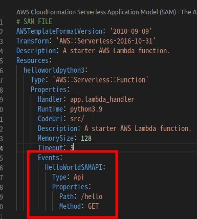
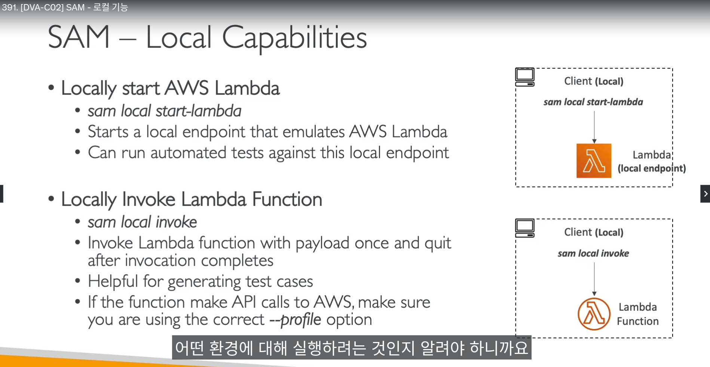
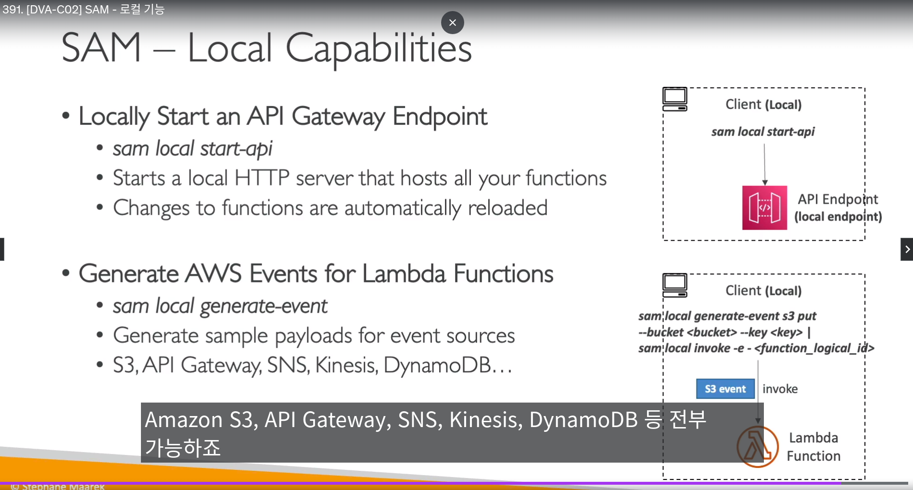
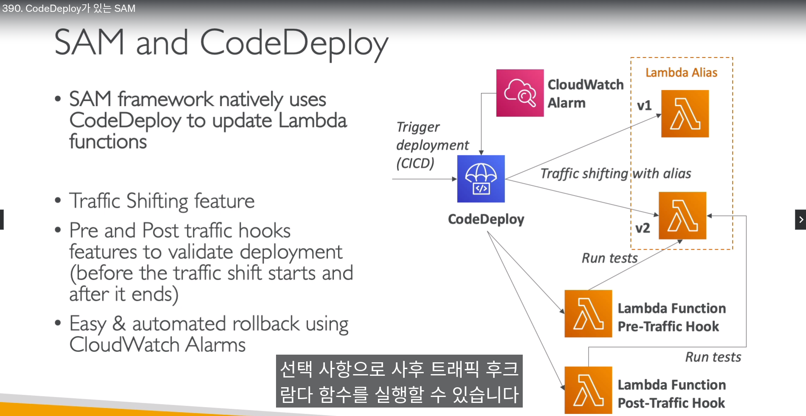

## AWS Serverless Application model (SAM)

- CloudFormation을 `더 간단하게 쓰기 위한 SAM 서비스`
  - `SAM CLI를 설치해야됨`
- `람다를 자동으로 유일하게 배포 가능`


- `YAML 파일` 기반으로, 서버리스 애플리케이션 배포 가능
  - 동작방식은 SAM yaml파일 -> `클라우드포메이션 템플릿 생성` 
  - 클라우드포메이션과 `맵핑 가능`
- `AWS에 배포하지 않고, 로컬 컴퓨터에서 서버리스 애플리케이션 개발을 끝낼 수 있음`


- SAM 배포 방식
  - 1. `sam build`로 클라우드포메이션으로 바꿈
  - 2. `sam package` 또는 `aws cloudformation package`로 패키징함
  - 3. `sam deploy` 또는 `aws cloudformation deploy`로 배포


- SAM 디버그
  - 서버리스 디버깅을 위해, `람다함수를 로컬에서 실행 할 수 있음`


-------------------------

## AWS SAM - 람다 실습


  - 먼저 SAM 템플릿파일 `template.yaml`을 아래 내용으로 만들어 준다

```
# SAM FILE
AWSTemplateFormatVersion: '2010-09-09'
Transform: 'AWS::Serverless-2016-10-31'
Description: A starter AWS Lambda function.
Resources:
  helloworldpython3:
    Type: 'AWS::Serverless::Function'
    Properties:
      Handler: app.lambda_handler
      Runtime: python3.9
      CodeUri: src/
      Description: A starter AWS Lambda function.
      MemorySize: 128
      Timeout: 3


```


  - 아래 명령어로 패키징 해준다

```
## AWS CLI 설명
# aws cloudformation package  --s3-bucket 클라우드포메이션 변환된 파일 저장할 버킷 이름 --template-file SAM 템플릿파일 이름 --output-template-file 클라우드포메이션 변환파일 로컬 저장 경로


## AWS CLI 명령어 예시 
aws cloudformation package  --s3-bucket chunjae-aidev-test-bucket-eun1 --template-file template.yaml --output-template-file gen/template-generated.yaml


## sam 버젼
sam package  --s3-bucket chunjae-aidev-test-bucket-eun1 --template-file template.yaml --output-template-file template-generated.yaml

```


  - 클라우드 포메이션으로 변환된 코드와 자동으로 소스파일이 S3에 맵핑 모습


  - deploy 명령어를 통해 stack을 배포해준다

```
# 명령어 설명
# aws cloudformation deploy --template-file 클라우드포메이션 파일 --stack-name 스택이름 --capabilities CAPABILITY_IAM


## 예시 코드
aws cloudformation deploy --template-file gen/template-generated.yaml --stack-name hello-world-sam --capabilities CAPABILITY_IAM


```


-------------------------

## AWS SAM - API게이트웨이 실습


- API게이트웨이 연결은 아래 빨간 박스와 같다





--------------------------------------

## AWS SAM - API게이트웨이 실습

- API게이트웨이 연결은 아래 빨간 박스와 같다


----------------------------


## AWS SAM 정책 템플릿

- 프로비저닝할 `람다에 권한을 설정하는 영역`

- 예)
  - `S3ReadPolicy`
    - 람다가 S3읽는 권한
  - `SQSPollerPolicy`
    - 람다가 SQS 폴링하는 권한
  - `DynamoDBCrudPolicy`
    - 다이나모 DB에 CRUD하는 권한


-------------
 
## AWS SAM 로컬 람다


- `sam local start-lambda`
  - 람다함수를 `로컬 엔드포인트로 사용가능` 해짐


- `sam local invoke`
  - 페이로드를 람다함수에 실어서 호출함
  - 한번 호출, 완료하면 중단
  - 람다 함수에 알맞은 `--profile` 옵션을 줘야함





- `sam local generate-event`
  - 람다함수 이벤트 생성
  - s3같은 이벤트를 임의로 줄 수 있음


- `sam local start-api`
  - api게이트웨이 로컬시작 엔드포인트를 얻음





-----------------------------


## AWS SAM CodeDeploy 통합 (실습내용 보충 필요할듯)

- SAM을 CodeDeploy와 통합하여 배포 관리 가능함





--------------------------------

## AWS Serverless Application Repository (SAR)

- SAM을 관리하기 위한 리포지토리


