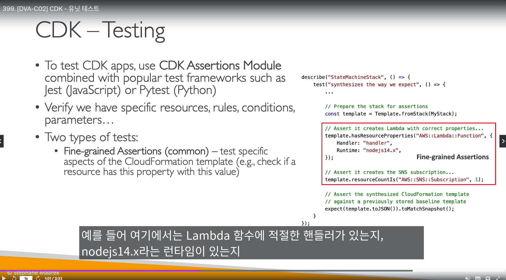
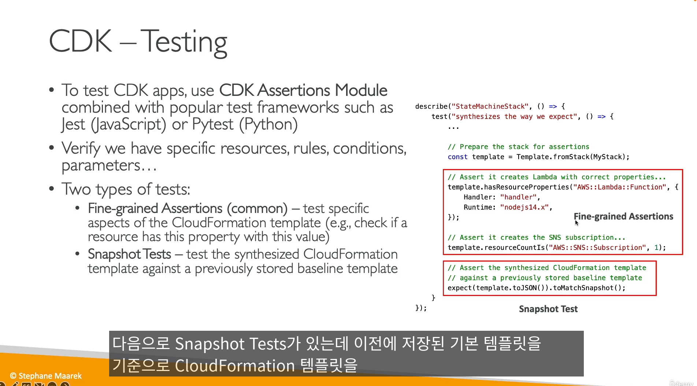
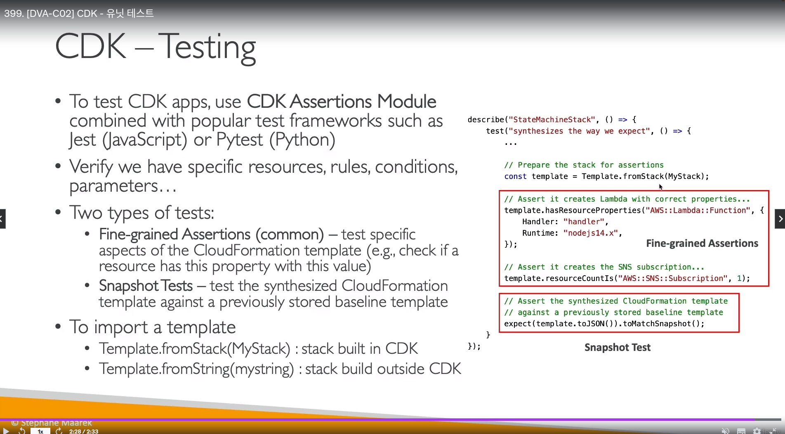

## AWS Cloud Development Kit (CDK)

- 자바, 파이썬, 닷넷 등 `프로그래밍 언어를 이용해 클라우드 인프라 정의하도록 해주는 개발 툴`
  - 클라우드 포메이션과 `다름`
- 프로그래밍 언어로 개발 -> `클라우드포메이션 템플릿 생성` ( YAML, JSON )
- SAM는 서버리스서비스만 관리하는 반면, `CDK는 모든 서비스 지원`

- CDK 구조 1~3단계 레이어
  - 레이어 1 (CFN - 클라우드포메이션 리소스)
    - AWS 리소스에 선언&생성한, 필요한 모든 속성을 지정해줘야함
  - 레이어 2 (intent-based API)
    - 레이어 1보다 높은 수준의 언어로 리소스 컨트롤
    - 리소스에 대한 모든 속성을 지정할 필요도 없고, 알 필요도 없다
  - 레이어 3 (패턴)
    - 간단한 명령어로, API 게이트웨이에 매소드 추가 등을 할 수 있음

|명령어|설명|
|------|---|
|cdk init app|지정된 템플릿에서 현재 디렉터리에 새 CDK 프로젝트를 만듭니다.|
|cdk synth|하나 이상의 지정된 스택에 대한 CloudFormation 템플릿을 합성하고 인쇄합니다|
|cdk bootstrap|CDK 툴킷 스테이징 스택을 배포합니다. |
|cdk deploy|스택 배포|
|cdk diff|CDK에 맞게 리소스를 미리 프로비저닝 하는 과정. ( 클라우드포메이션으로 변환하기전, CDK로 미리 확인해봄 )|
|cdk destroy|스택 파괴|

- https://docs.aws.amazon.com/ko_kr/cdk/v2/guide/cli.html

- CDK 명령어를 사용하는 배포 단계
  - `cdk bootstrap` 명령어로 부트스트랩을 하고, `cdk synth`로 CloudFormation 템플릿으로 변환, `cdk deploy`로 cdk스택 배포
- 클라우드포메이션으로 프로비저닝할때, `CDKToolkit에서 알아서 필요한 정책,IAM 권한을 셋팅해줌`

- CDK 테스팅을 위해, `CDK Assertions 모듈을 이용할 수 있다`
  - pytest 비슷한 프레임워크
  - 두가지 테스트 타입이 있음
    - Fine-grained Assertions (일반적인 테스트)
      - 특정 속성을 갖추고 있는지 테스트
    - Snapshot 테스트
      - 원하는것이 갖추고 있는지 확인

  - 테스트할 스택을 불러오기 위해 아래 명령어를 사용
    - Template.fromStack = CDK로 `스택을 불러옴`
    - Template.fromString = CDK `외부에서` 스택을 불러옴

