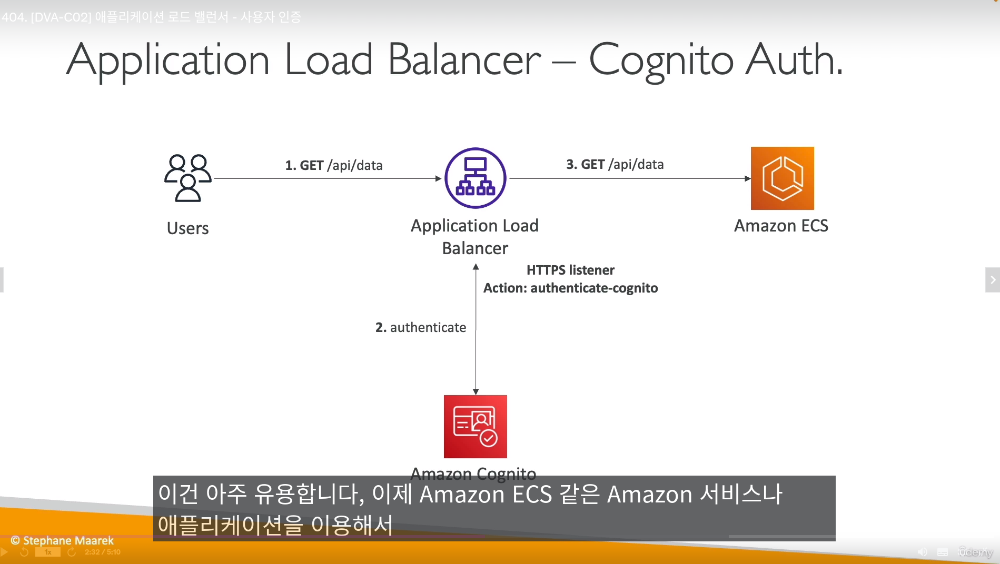
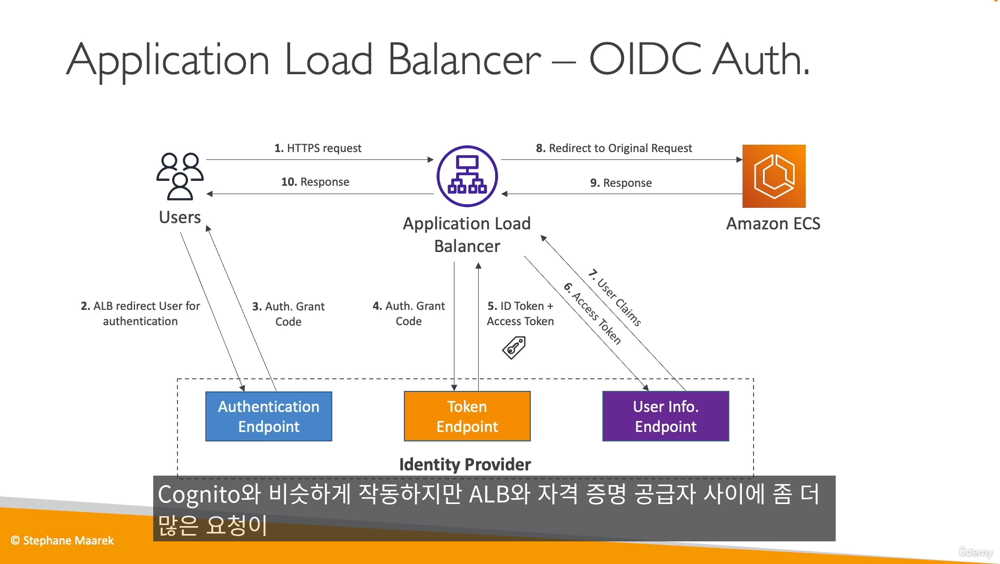

## AWS Cognito

- 권한을 부여하고, 유저를 관리하는 측면에서는 `IAM과 기능적으로 다를바 없다`
  - 하지만 적용되는 환경에서 차이가 난다 => `IAM은 AWS 내부, Cognito는 AWS 외부인 웹,모바일` 

- Pool 종류
  - Cognito User Pool (유저 풀)
    - 사용자 정보를 저장하는곳 -> `서버리스 데이터베이스`
    - 유저이름/패스워드로 접속 가능, `MFA 지원`
      - 특정유저 유저 `VAN`도 가능
    - `구글, SAML, 페이스북으로도 로그인 가능`
    - 유저풀에 인증되면, `JWT(토큰)을 받음`

  - Cognito Identity Pool (자격 증명 풀)
    - AWS 리소스에 바로 엑세스 할 수 있도록 `임시 자격증명을 제공` 

- 유저풀은 유저정보 `저장`이고, 자격증명 풀은 `제공`이다.
- 자격증명풀을 사용하려면, 유저풀과 대부분 연동해서 사용해야된다. (잘 통합됨=잘 합쳐짐)

- `코그니토 인증/가입을 위한 서버 (UI)가 제공됨 (옵션 활성화해야됨)`
  - 가입/인증 페이지를 CSS로 꾸밀수 있음
  - `커스텀 도메인을 사용할 경우`,  HTTPS를 위한 ACM 인증서는 `us-east-1`에 저장되어있어야함
  - 예) 사용자풀을 서울에 만들었다고 해도, 커스텀 도메인 ACM 인증서는 `us-east-1`저장

- 사용자들이 성공적으로 로그인하면, `콜백 URL로 감`

- 코그니토는 `adaptive 인증`을 제공
  - 사용자가 `비정상 로그인 경우(뷰트포스, 다른국가 ip에서 로그인), MFA를 활성화 해서 2차인증 받는 기능`

--------------------------

## AWS Cognito - 유저풀 실습

- 생성 구성요소

- 코그니토 유저풀 상태창

- 코그니토 유저풀 UI

- 코그니토에 람다 트리거를 이용해 다양한 작업 가능

---------------------------

## AWS Cognito - ALB 통합

- ALB에서 코그니토와, OIDC 인증을 설정 할 수 있다.

- ALB와 코그니토 인증방식

- ALB와 OIDC 인증 방식

-------------------------------------

## AWS Cognito - 자격증명 풀 (Identity pools)

- 자격 증명풀은 `AWS 리소스에 대한 임시 자격증명을 부여하는 기능`
- 자격증명 풀을 이용하려면, `먼저 로그인 해야된다`
  - 로그인 후, 자격증명 풀이 로그인쪽 소스(AWS 유저풀,구글 등)에 `맞는지 검증함`
  - AWS 코그니토 유저풀, `서드파티인 페이스북,구글,애플도 지원`, 커스텀 서버도 됨
- `게스트(인증되지않은 사용자)에게 AWS 자격 증명을 주는것도 가능`
- 최종적으로 `클라이언트는 STS를 얻음`(Security Token Service)
- 자격증명에 대한 `IAM 역할 설정` 가능
  - 예시
    - 비로그인 사용자한테는 S3 읽기 역할만 부여
    - 로그인 사용자한테는 S3 읽기/쓰기 역할 부여

- S3에 적용된 자격증명풀 정책 설정 예시

