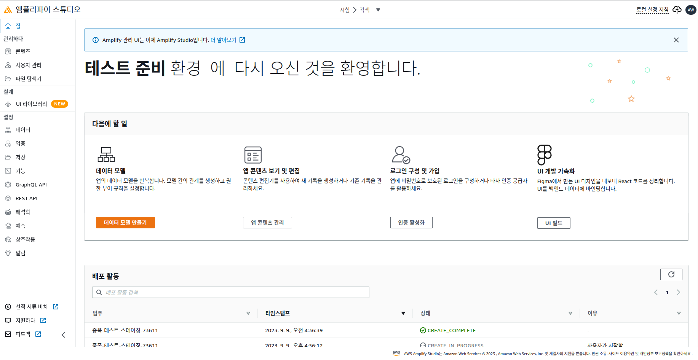

## AWS Step Funtions

- 서버리스 `함수 오케스트레이터`입니다 
- Json으로 작성함
- `AWS SWF(Simple Workflow Service)`와 동작 방식이 비슷함
- `상태머신`이 프로젝트 개념, 하나의 네모박스를 `Task`라 한다

- 스탭펑션 UI

- 스텝펑션 - 상태
  - choice State
    - 조건에 따라 브런치 선택 (테스트,개발 등)
  - fail or Succeed State
    - 테스크 실패 또는 성공
  - pass State
    - 테스크 패스
  - wait State
    - 지연시간에 따라 대기 상태
  - Map State
    - 스탭을 동적으로 반복
  - parallel State
    - 병렬 수행

- 스텝펑션 에러 처리
  - 에러 종류에 따라 다르게 처리 가능하다
  - `RETRY(다시시도),catch(다른곳으로 보내기)`
  
  - 에러 종류
    - States.ALL
      - 모든에러
    - States.Timeout
      - 타임아웃 에러
    - States.TaskFailed
      - 테스크 실행 실패
    - States.Permissions
      - 테스크 실행에 필요한 권한 없음

- 오류 리트라이 코드

- 오류 캐치 코드
  - `ResultPath`를 사용하여, 오류 지점을 디버깅 가능하다 

- wait for TaskToken
  - SQS를 이용해서 `테스크 대기를 기능을 제공`
  - 외부 작업, AWS말고 다른리소스가 메세지를 읽고, Success를 전달해야 테스크 진행

- Activity Task (활성화 테스크)
  - SQS처럼 작동함, Ec2나, 람다, 모바일 디바이스가 `스텝펑션 테스크를 폴링함`
  - Activity Worker(테스크 연산을 진행하는 장비)가 진행하고 다시 `스텝펑션에 Success/Failure` 메세지를 줌
  - 통신 주요 변수
    - TimeOutSeconds
      - 테스크 타임아웃
      - 타임아웃은 `최대 1년`
    - HeartBeatSeconds
      - 연산을 진행할 Activity Worker가 스텝펑션에 보내는 주기적인 신호 ( 신호안가면, 통신이 끊어진것이므로 실패)

- 스텝 펑션 2가지 모드 / (Standard , Express)
  - 일반적으로 스탠다드 모드로 사용할 수 있고, 빠른 모드도 지원 가능함
  - 빠른모드에는 동기, 비동기 방식이 있음 아래 그림참조

----------------------------------

## AWS AppSync

- GraphQL API 구축
- 웹소켓 or MQTT로 실시간 데이터 통신 제공

-----------------------------------------

## AWS Amplify

- 모바일과 웹 애플리케이션을 만들어주는 서비스
- `ammplify cli` 로, 호스팅 ,앱 배포, 테스트를 진행 할 수 있음
- 구글 앱매니져? 형식인듯

