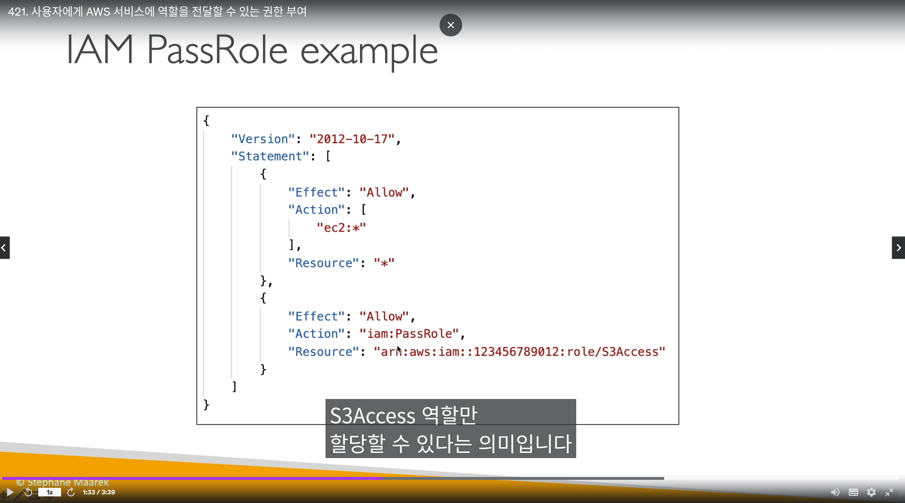

## AWS STS (Security Token Service)

- 15분에서 `최대 1시간`까지의 임시보안 자격증명을 얻음
  - AWS 리소스에 접근할 수 있음


- STS API
  - `AssumeRole`
    - 계정 & 교차계정에 대해 역할 획득
  - AssumeRoleWithSAML
    - SAML을 이용한 역할 획득
  - AssumeRoleWithWebIdentity
    - 페이스북, 구글, OIDC를 이용해서 역할 획득
    - 그러나 `코그니토 유저풀로 대부분 대체됨`
  - `GetSessionToken`
    - AWS root계정에 MFA가 있는경우, MFA를 위해 사용
  - GetFederationToken
    - 임시 사용자의 임시자격 증명
  - `GetCallerIdentity`
    - API콜 할대, IAM 사용자 또는 IAM 역할의 `세부 사항 정보를 반환`
    - AWS를 사용하는 동안, 신원을 모르는 경우 -> 신원과 계정 번호 정보를 얻을 수 있음
  - `DecodeAuthorizationMessage`
    - AWS API가 거부됐을 때, `오류 메세지를 디코딩함`


-------------------

## AWS 고급 자격증명
 
- 허용과 거부 고급
- IAM `인라인 정책 최대 크기는 2048킬로바이임`
  - 인라인은 감사가 불가능?함


- `iam:PassRole`로 내가 가진 권한을 전달 가능하다
  - `모든 역할을 pass할 수는 없음`



- 예시 
  - IAM 역할이 `RDS`로 시작하는 경우, EC2에 대한 모든 역할을 가질 수 있다.


```
{

    "Version": "2012-10-17",

    "Id": "Secret Policy",

    "Statement": [

        {

            "Sid": "EC2",

            "Effect": "Allow",

            "Action": "ec2:*",

            "Resource": "*"

        },

        {

            "Sid": "Passrole",

            "Effect": "Allow",

            "Action": [ "iam:PassRole" ],

            "Resource": "arn:aws:iam:::role/RDS-*"

        }

    ]

}
```


