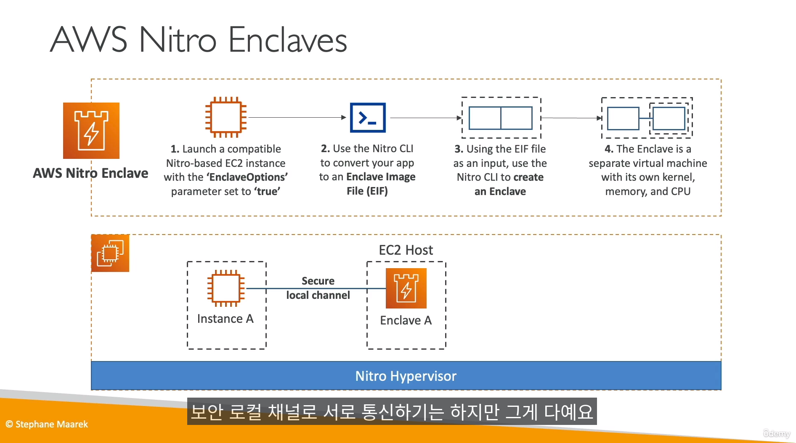

## AWS KMS (Key Management service)

- 클라우드트레일을 통해 키사용 API 호출 다 볼 수 있음
- KMS도 교차계정 접근 지원함

- KMS는 키 캐싱이 되므로, 자주 암호화 하면... 같은키를 사용한다
  - LocalCryptoMaterialsCache를 사용하여, 캐싱 시간을 정할 수 있다.
- `대칭, 비대칭키 모두 지원`

- 람다 `환경변수를 KMS로 암호화하여 사용 할 수 있다`
  - `복호화는 람다함수 안(코드)에서 해야 한다`
  - 복호화 프로세스가 코드안에서 이뤄지기 때문에, `람다는 KMS 키에대한 권한이 있어야함` 
- MFA 미지원

-----------

## AWS KMS 봉투 암호화

- 왜씀? -> KMS 암호화는 데이터를 암호화 하는데 `4KB 용량 제한이 있음` 
- `GeneratedataKey API를 씀`
- `데이터 키, 암호화된 데이터 키 2가지를 받고`, 클라이언트 측에서 큰 데이터 암호화를 함
- 복호화는 암호화된 데이터를 먼저하고, 클라이언트에서 데이터키로 컨텐츠 복호화 함

-------------------------

## AWS KMS 제한

- `SSE-S3`는 무한, `SSE-KMS`부터 할당량 제한 걸림 
- AWS 소유 & 관리키를 사용하지 않으면 KMS 초당 API 콜 제한이 있음
- 할당량은 `리전마다 다름`
  - API콜 초과를 하면 `ThrottlingExption` 에러 발생
    - 지수 백오프 전략을 사용해서 완하 할 수 있음
    - `GenerateDataKey`를 쓴다면, `DEK 캐싱`을 쓴다
      - `로컬에서 데이터 암호화키`를 캐시해서 쓰는 방식
    - 서비스 quota를 이용해 콜수 제한량을 늘리는 방법도 있음

- `암호화 / 복호화 API콜 횟수 할당량을 함께 씀`

------------------
## AWS KMS - S3 버킷 키

- KMS API 콜수를 99% 감소 시킬 수 있음
- 버킷내에 키를 저장해서, 봉투 암호화 하는 기법인듯

---------------------

## AWS HSM

- 물리적 하드웨어에 키 생성,  `KMS 사용자 지정 키스토어 > CloudHSM` 선택 하면 사용 가능해짐
- `FIPS 140-2` 레벨 3 표준을 따름
- 대칭키/비대칭키 모두 지원
- `SSE-C를 구현하고자 할때 아주 좋은 선택지`
- 멀티 AZ가 기본으로 구성됨 (복제본이 여러곳에 존재함)
- `HSM은 VPC에 배포되기 때문에, VPC 피어링으로도 접근 가능`
- MFA 지원 

-------------------------

## AWS SSM 파라미터 스토어 (Systems Manager)

- 매개변수 저장
- CloudFormation과 완벽한 통합 지원
- 누군가 사용할 경우, IAM 권한확인 -> 매개변수 KMS 암호화 / 복호화
  - KMS 키에대한 엑세스 권한을 갖고 있어야함
  - `KMS 암호화는 옵션임 (사용 안해도 됨)`
- 파라미터에 TTL을 설정 할 수 있음
  - Expiration
    - 파라미터 삭제
  - NoChangeNotification
    - ~일동안 갱신되지 않으면, 알림 날림
  - ExpirationNotification
    - 파라미터 변수 만료 ~일전에 알림

- 매개 변수의 버저닝, 히스토리 및 태그 확인도 가능함

- 파라미터 스토어에는 스탠다드 / 어드반스 모드가 있음

- 파라미터를 계층 형태로도 관리 가능함

- AWS CLI, SDK로 파라미터 가져오기 가능함

---------------

## AWS Secrets Manager

- 유일한 목적은 `암호의 저장`, X일마다 암호가 순환하도록 할 수 있음
- 암호 자동생성도 가능 (`람다 이용 - 자동생성 알고리즘을 넣어야함`)
- 시험에 `RDS 암호와 통합`은 무조건 시크릿 매니져임
- CloudFormation과 통합하는 방법은 2가지이다.
- `평문 암호화에 KMS를 사용함` (파라미터 스토어와 다르게 `KMS는 필수임`)
  - RDS 자동생성
    - `Managemasteruserpassword : true` 를 하면 자동으로 시크릿메니져에 비번을 등록하고, 관리된다.
  - 시크릿매니져 만들고 후,RDS에 변수 동적 참조

----------------------------------

## AWS CloudWatch 로그 암호화

- KMS를 이용해 클라우드워치 로그를 암호화 할 수 있음
- 단, 콘솔에서는 이용할 수 없고, `AWS CLI, SDK 사용해야됨`
  - `associate-kms-key`를 이용해 로그그룹에 설정해줌

----------------

## AWS CloudBuild 환경변수 암호화

- 클라우빌드에서 환경변수들을 암호화 하기 위해서는 시크릿매니져,SSM 파라미터 스토어와 연동 해야된다

------------------

## AWS Nitro Enclasve

- AWS Nitro 엔클레이브를 통해 고객은 Amazon `EC2 인스턴스 내` PII(개인 식별 정보), 의료, 금융 및 지적 재산권 데이터와 같은 매우 민감한 데이터를 추가로 보호하고 안전하게 처리하도록 격리된 컴퓨팅 환경을 생성할 수 있습니다.

- 외부 접근(SSH)안됨
-  특정한 EC2 정보를 보호하기 위해 사용

