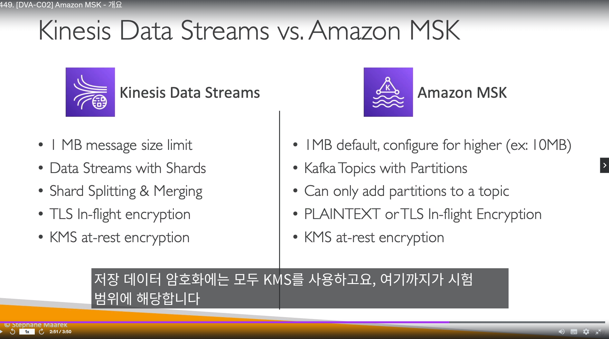

## AWS OpenSearch 

- `서버리스가 아님!` (클러스터를 구성해야함)
- SQL 지원하지 않음

-------------------------

## AWS Athena

- `서버리스`
- S3에서 간단한 쿼리 실행할때 사용
- CSV,Json,ORC,Parquet,avro 파일 지원
- 퀵사이트랑 같이 사용하고는 함
- `128MB 보다 큰파일을 사용`해서 오버헤드를 최소화

-------------------------------------

## AWS MSK

- 완전 관리형 Kafka 서비스
- `서버리스, 클러스터 버젼 배포 가능`
  - 클러스터는 최대 3개 AZ에 배포 가능
- 키네시스와 다르게, 메세지 사이즈 `10MB`까지 지원

--------------------------------------

## AWS ACM

- private CA를 만들면 `AWS 리소스 내에서 인증 가능함`

------------------------

## AWS SSM - AppConfig

- 시스템 매니져 앱 설정파일
- 파라미터 스토어, ec2 설정등 되어있는 파일 

