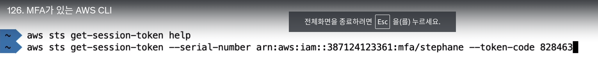
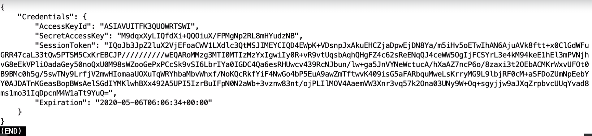

## AWS CLI

- `기본적으로 AWS CLI에는 python 런타임`으로 실행됨
- EC2 인스턴스에 `IAM 역할이` 연결되어 있고 이 인스턴스 내에서 `AWS CLI 명령을 실행`하면 AWS CLI는 인스턴스 메타데이터를 사용하여 `임시자격 증명`을 얻습니다.
- 인스턴스 메타데이터 서비스를 사용하여 EC2 인스턴스에 연결된 IAM 역할 이름을 검색할 수 있지만 IAM 정책 자체는 검색할 수 없습니다.

------------------

## MFA with CLI

- MFA를 사용해서 AWS CLI를 사용하려면, `sts getsessiontoken`을 발급받아야한다.
  - 엑세스키, 비밀키, 토큰을 발급 받을 수 있음
  - 임시 자격 증명이라, `토큰 기한이 존재함`

--------------------------

## AWS SDK

- 리전을 지정하지 않으면, SDK에서는 `us-east-1`을 기본값으로 한다

-------------------------
## AWS 제한

- AWS API는 기본적으로 호출 제한량이 있다.
  - 애플리케이션이 잘되거나 규모가 커져서 API를 많이 사용하는데, 이건 `AWS에 요청해서 콜 횟수를 늘릴 수도 있다`
  - 예
    - Ec2의 `DescribeInstances API`는 초당 100회 호출의 제한이 있음
    - S3 GetObject는 초당 5500콜 제한

- AWS 서비스 할당량
  - 예
    - 기본값으로, 온디맨드 Ec2 인스턴스 `최대 CPU 갯수는 1152개다.` (당연히 AWS 서비스 쿼타로 조정 가능)

- `Exponential Backoff 전략 - 지수 백오프 전략`
  - 지수 백오프(Exponential Backoff) 전략은 네트워크 통신이나 리소스 접근과 같은 작업에서 일시적인 오류나 혼잡 상황에 대처하는 데 사용되는 전략입니다. `이전의 요청이 실패한 경우, 다음 요청을 보내기 전에 일정한 시간 동안 기다린 다음 요청을 시도`하는 방식을 말합니다.
  - ThrottlingException 스로틀링 오류가 발생했을때 사용
  - `500 에러 (서버 에러)가 발생할 경우에 사용`
  - 400 에러는 클라이언트 오류라, 기다려서 다시 보내봤자 동일 오류 발생함

------------------------

## AWS CLI 자격증명 우선 순위

1. AWS CLI 명령줄 옵션
2. OS 환경변수
3. AWS CLI 증명서 파일
4. AWS CLI 구성 파일
5. 컨테이너 증명서
6. 인스턴스 프로파일 증명서

- 예) 어떤 Ec2인스턴스에 환경변수로 S3에 대한 풀 엑세스 권한 AWS CLI 연결해놓음, 그리고 EC2에 S3에 접근할 수 있는 최소권한의 IAM 역할을 부여
  - `이 EC2는 S3에 대해 풀 권한을 가짐 -> IAM 최소권한은 적용되지 않음`

https://docs.aws.amazon.com/cli/latest/userguide/cli-chap-configure.html#config-settings-and-precedence

--------------------------
## AWS 서명

- AWS CLI나 SDK를 사용할때 어떻게 서명이 되나?
  - Sigv4를 이용해, AWS로 보내는 요청을 서명하고 인증받음
- sigV4를 전달 해야함 (2가지 방법 존재)

