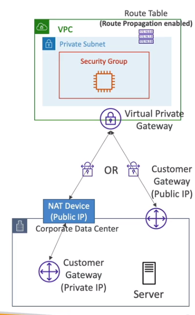

## CIDR - IPv4 (Classless inter-domain routing)

- CIDR는 Ip주소를 할당하는 방법
  - `베이스 IP / 서브넷 마스크`  -> 10.2.3.4/32
  - /8이면, 255.0.0.0 
  - /16, 255.255.0.0

------------------------------------
## AWS VPC
- VPC는 기본적으로 `리전`에 생성됨
- 한 리전에 여러 VPC 생성 가능 (`리전당 5개` -> 서비스 요청으로 늘릴 수 있음)
  - vpc에서 최소 서브넷마스크 크기는 28 => `IP 16개 할당 가능`
  - vpc에서 최대 서브넷마스크 크기는 16 => `IP 65536개 할당 가능`
- `사설 IP 대역만 개설 가능`
  - 10.0.0.0 ~ 10.255.255.255 (10.0.0.0/8) -> 
  - 172.16.0.0 ~ 172.31.255.255 (10.0.0.0/12)
  - 192.168.0.0 ~ 192.168.255.255 (10.0.0.0/16)

- VPC에서 수정도 가능 (`CIDR 추가 5개 까지 가능`)

--------------------

## AWS SubNet
- 공용, 사설 서브넷 존재
- 각 서브넷마다 `AWS 공식적으로 주소를 5개` 예약함
  - 서브넷에서 CIDR 블럭을 10.0.0.0/24를 예약했다면
    - 10.0.0.0 - Network address 네트워크 주소
    - 10.0.0.1 - VPC router 주소
    - 10.0.0.2 - DNS 주소
    - 10.0.0.3 - AWS 미정 (예약은 했지만, 아직 안씀)
    - 10.0.0.255 - VPC 브로드캐스트 주소 (AWS에서 브로드 캐스트를 지원하진않음 -> `예약은 되지만, 사용은 못함`)

- CIDR은 IP/`32` 일때 1개 선택
  - 32비트를 잘 생각해야됨

----------------------------------------------
## AWS Internet Gateway

- VPC에 붙여 인터넷을 가능하게 하는 문
- VPC는 `하나의 IGW에만 연결 가능`
- IGW는 인터넷 자체를 허용하지 않음 -> 라우팅 테이블이 담당함

---------------------------------------------------
## AWS Bastion Host

- 퍼블릭 서브넷에서 프라이빗 서브넷 Ec2에 접속하기 위한 `Ec2 인스턴스`
  - 베스쳔 호스트 `AWS 서비스 이름이 아님!!!` -> ec2 인스턴스의 사용방법/기법임
- `베스쳔 보안그룹`을 따로 지정해줌
- 기업의 CIDR 엑세스 허용, `SSH로만 통신 (22포트)`

---------------------------------------------
## AWS NAT (Network address Translation 네트워크 주소 변환)

- 프라이빗 서브넷에 있는 Ec2인스턴스 인터넷 연결 통로
  - 왜씀? -> 베스쳔 호스트는 SSH연결만 해주기 위함이고, 프라이빗 Ec2는 인터넷 여전히 안됨

- NAT에는 2종류가 있다
  - NAT Instance (구식)
    - 프라이빗과 퍼블릭의 중계용 Ec2 인스턴스
    - EIP로 연결 되어있어야함
    - 베스쳔 호스트처럼 Ec2 생성하고, 라우팅 테이블 설정, 보안그룹 , 일일이 해줘야함
    - 프라이빗 Ec2가 요청한 패킷을 `대신 받아서 전달 해줌`
    - `NAT 인스턴스용 AMI 지원은 20년에` 종료됬음 (생성은 할 수있지만, 업데이트 안됨)
    - 저가용성, ASG설정등 관리가 복잡함
      - 저사양 인스턴스는 네트워크 대역폭이 작아, 감당 못함
    - Nat 인스턴스 설정을 네트워크->`소스/목적지 체크`를 중단 해야됨
  - NAT Gateway
    - `AWS 관리형 Nat인스턴스`
    - Eip필요하고, Az에 생성됨
    - 고가용성을 지향하려면, 멀티 AZ에 생성하는것이 좋음

----------------------------------
## AWS NACL & 보안그룹

- NACL은 서브넷에 적용,보안그룹은 인스턴스에 적용
- NACL은 stateless, 보안그룹은 stateful 이다 (기록을 남기냐, 안남기냐 차이)
- NACL은 규칙이 있고, 번호는 1~32766까지 있다, `번호가 낮을수록 규칙 검사 우선순위가 높음`
  - 예)
    - NACL 규칙 100번 10.0.0.10/32 거부
    - NACL 규칙 200번 규칙 10.0.0.10/32 허용
    - `NACL 규칙 100번 규칙이 숫자가 낮으므로, 10.0.0.10은 거부당함`
  - 규칙을 100씩 증가시키는것을 추천 -> 그사이에 규칙을 작성하기 좋음
  - 번호에 `*`인 것이 있는데, 일치하지 않으면, 거부를 위한것 (조건에 안맞으면, 거부 기본값이라고 생각)
  - NACL은 `기본적으로 모두 거부함`

- 서버와 클라이언트가 통신할때, 클라이언트는 `Ephemeral Port(임시포트)`를 만들어서 통신한다. 통신이 유지되는 동안 열려있음
  - 윈도우는 49152 - 65535
  - 리눅스는 32768 - 60999

- Stateful(상태 보존):
  - 보안그룹은 상태 보존(stateful) 기능을 가지고 있습니다. 이는 허용한 트래픽에 대한 응답 트래픽을 자동으로 허용한다는 의미입니다. 즉, `보안그룹에 허용 규칙을 추가하면 해당 트래픽의 응답은 자동으로 허용`됩니다. 예를 들어, HTTP 트래픽을 허용하는 규칙을 추가하면, HTTP 응답도 자동으로 허용됩니다. 따라서 `보안그룹에서 인바운드 규칙을 설정하면, 관련된 아웃바운드 규칙을 별도로 설정할 필요가 없습니다`.
  - 인바운드,아웃바운드 허용 하나만 설정하면, 둘다 허용됨

- Stateless(상태 비보존):
- NACL은 상태 비보존(stateless) 기능을 가지고 있습니다. 이는 `트래픽에 대한 요청 및 응답을 개별적으로 처리`한다는 의미입니다. 예를 들어, `특정 포트로 들어오는 트래픽을 허용하는 인바운드 규칙을 추가한 경우, 해당 포트에서 나가는 트래픽은 자동으로 허용되지 않습니다`. 따라서 NACL에서 인바운드 규칙을 설정한 후, 관련된 아웃바운드 규칙도 별도로 설정해야 합니다

- 물건을 보낼 때, 택배 상자에 상태를 유지하는(stateful) 방식과 상태를 유지하지 않는(stateless) 방식을 생각해볼 수 있습니다.

- 상태를 유지하는(stateful) 방식:
  - 택배 상자에 물건을 넣고 주소를 붙이면, 택배 회사는 이 정보를 유지합니다. 이후에 물건을 배송하거나 문의가 있을 때, 택배 회사는 상자에 붙은 주소 정보를 참조하여 처리합니다. 이는 `상자와 주소 간의 상태를 유지하는 방식`입니다. 예를 들어, 택배 회사가 물건을 배송하는 도중 문제가 발생하면, 상태 정보를 확인하고 문제를 해결할 수 있습니다.

- 상태를 유지하지 않는(stateless) 방식:
  - 상태를 유지하지 않는 방식에서는 택배 상자에 물건을 넣고 주소를 붙이는 것으로 끝입니다. `택배 회사는 상자에 대한 어떠한 정보도 기억하지 않습니다`. 따라서 물건이 배송되거나 문의가 있을 때, 상자에 대한 정보가 없으므로 주소 정보를 기반으로 처리합니다. 이 방식에서는 상자의 상태를 따로 유지하지 않고, `주어진 정보를 기반으로 처리하는 것`입니다.

- 이와 비슷하게, 네트워크에서도 상태를 유지하는(stateful) 방식과 상태를 유지하지 않는(stateless) 방식을 사용할 수 있습니다. `상태를 유지하는 프로토콜이나 장치는 통신의 시작부터 끝까지 연결 정보를 기억하고 유지합니다. 반면에 상태를 유지하지 않는 프로토콜이나 장치는 각각의 통신이 독립적이며`, 통신에 대한 추가 정보를 기억하지 않습니다.

- 간단히 말해, 상태를 유지하는(stateful) 방식은 정보를 계속 유지하고 참조하여 처리하는 반면, 상태를 유지하지 않는(stateless) 방식은 정보를 한 번 사용하고 나면 버리는 것입니다.

-----------------------------------------------------

## VPC Peering

- VPC끼리 네트워크 연결
- `다른 리전, 다른 계정도 연결 가능`
- 단, CIDR가 안 겹쳐야함
- 연결된 `VPC(2개) 서브넷의 라우트 테이블을 업데이트` 해서, Ec2간 충돌을 막아야 한다
- 연결되면, 보안그룹 참조 가능항(`같은 리전`)

---------------------------------------
## VPC endpoint
- `AWS PrivateLink` 라고도 부름
- AWS 내부 트래픽처리를 위해 엔드포인트 씀
- 종류는 2가지 있음
  - `VPC Endpoint interface`
    - `ENI`를 할당해서 연결
    - 보안그룹 적용해야함
  - VPC Endpoint Gateway
    - `라우팅 테이블만 수정해야됨 (보안그룹 X)`
    - `S3,다이나모 DB`만 지원 가능
    - `무료`
- S3, 다이나모는 거의 게이트웨이를 이용하는 것이 좋음
  - 하지만, VPN이나, 온프레미스에서 엑세스해야될 워크로드면 인터페이스 써야함

------------------------------------
## VPC Flow Logs

- 인터페이스로 향하는 IP 트래픽 정보를 로그남기는 서비스
  - 타입은
    - `VPC Flow logs`
      - 로그 분석 최선의 방법은, S3에 저장해서 아테나로 분석 하는것
    - `subnet flow logs`
      - 서브넷 선택해서 이 서브넷따로 로그 남길수 있ㅇ므
    - `ENI flow logs`
      - ENI 선택해서 따로 로그 남기기 가능
  - 

- VPC flow 로그를 읽는방법
  - 전송/목적지 IP, port 패킷, 통신 시간, 인터페이스 ID

------------------------------------------
## AWS Site-to-Site VPN

## AWS site to site VPN
- 하이브리드 클라우드 위함, 내 컴퓨터와 VPC 결합
- 빠르게 구축 가능, 공용 인터넷을 통해 연결되기 때문에.... 대역폭, 보안 문제가 발생 할 수 도 있음
- 결국 `퍼블릭 인터넷`임
- 연결할때는 고객의 IDC에 customer gateway (`CGW`)가 반드시 필요함
  - 어쨋든 `퍼블릭 IP`꼭 있어야함 
- AWS에서는 VGW(`virtual private gateway`) 가 꼭 필요함

- 서브넷의 VPC에서 `라우트 전파를 꼭 활성화` 시켜야 작동됨

-------------------------------------------
## AWS CloudHub

- 한 VPC에, 회사의 여러 데이터센터의 VPN 연결을 함
- `제품명이 아님` 걍 site-to-site VPN을 한 VPC에서, 여러개 만들면 됨
- `데이터 센터끼리 통신도 가능`

 
 
 

-----------------------------------------
## AWS Direct Connect

- 

