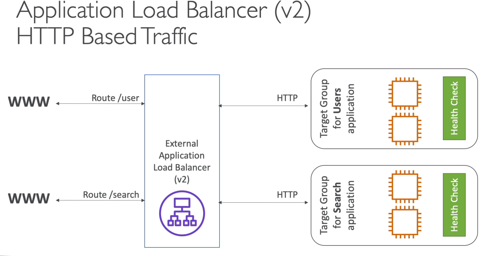
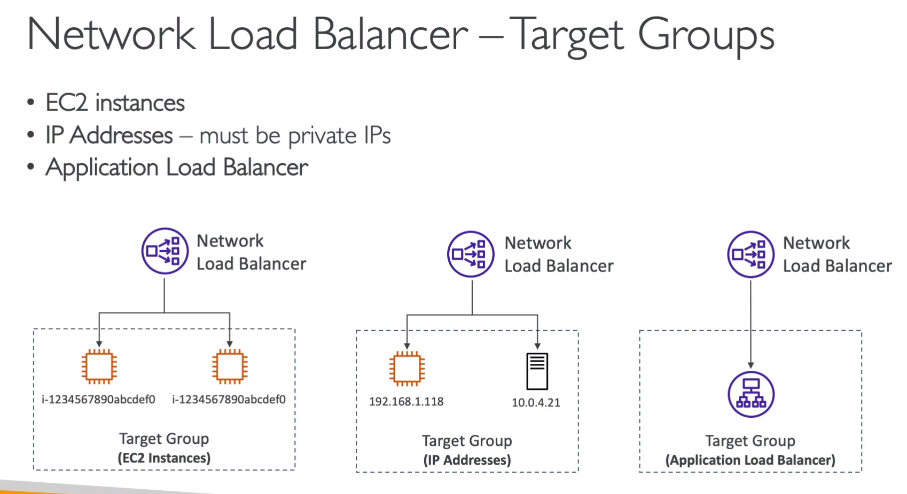
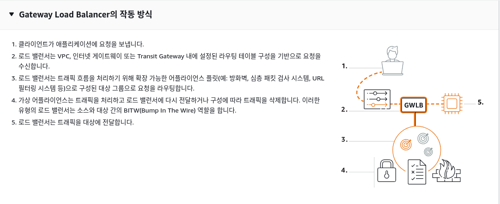
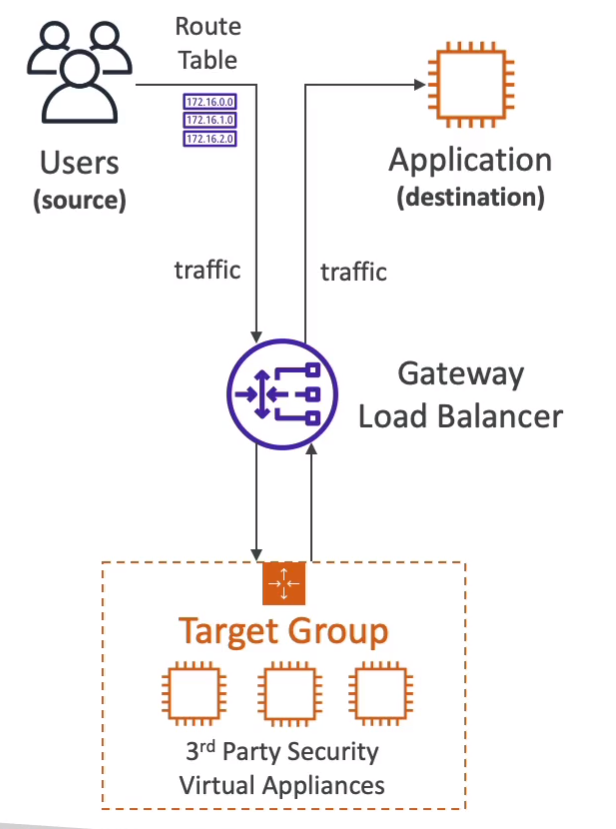
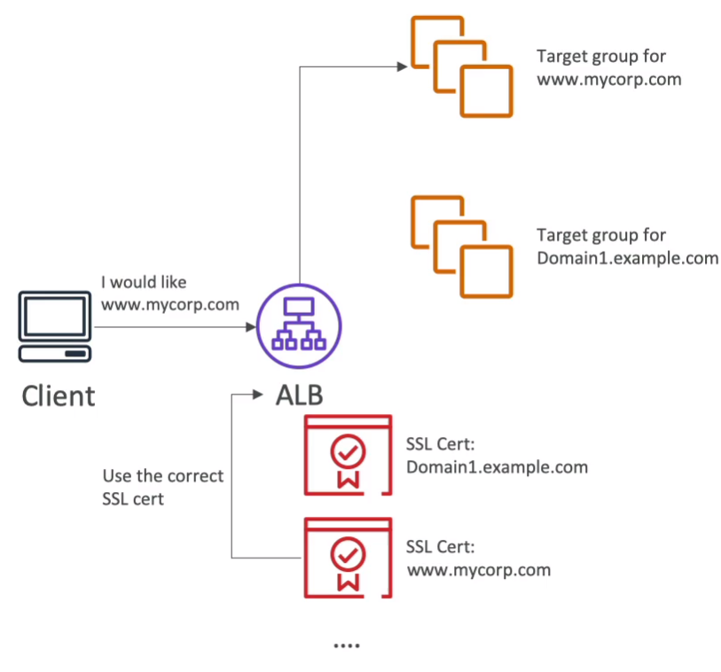
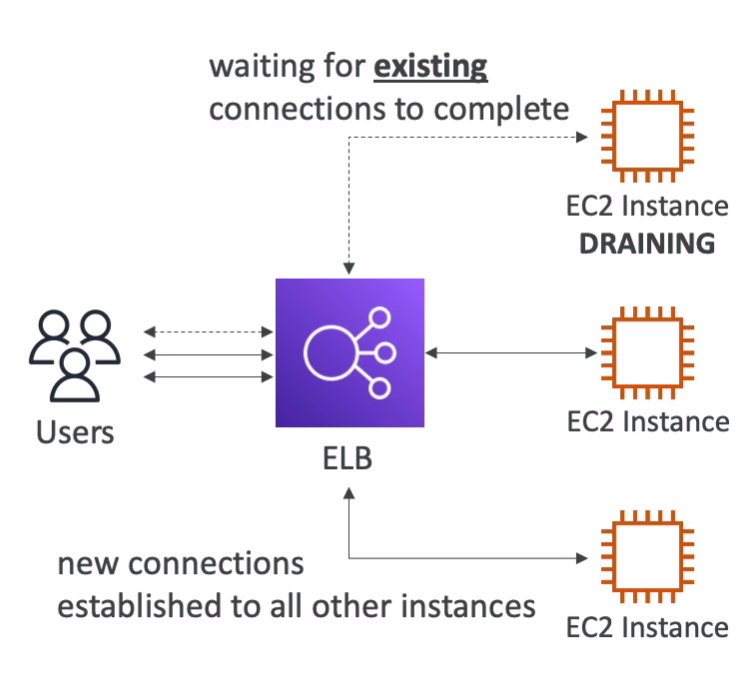

## ELB


### 용어 정리

<br>

- `확장성`과 `고가용성`은 서로 다른 말임

```
확장 
수직 -> 장비 스케일업
수평 -> 같은 장비 여러개 복사 = 엘라스틱 - 탄력성

수직 확장을 -> 스케일 업 / 스케일 다운
수평 확장을 -> 스케일 아웃 / 스케일 인
```


<br>
<br>

- 수직 확장은 분산되지 않은 환경에서 많이 쓰임 -> 하지만 수직 확장에는 `하드웨어의 한계가` 잇음

- 수평 확장은 `무한`임, 하지만 `분산 시스템이여야 가능함`


- `고가용성(high availability)`은 AWS의 가용 영역 최소 두군데서 실행하는것을 의미함, 하나의 가용성이 죽으면 다른 하나가 살아있다 -> 이걸 가용성이 높다라고 표현함 

- `탄력성(flexibility)`: 오토 스케일링을 의미함, 수신하는 로드에 따라 시스템이 자동으로 확장/축소 하는것, 이에따라 사용자는 수요하는 서버의 숫자와 일치시키고 적절한 금액을 지불하는것 이게 탄력성의 핵심 개념임


<br>
<br>

---------------------------
## ELB - Elastic Load Balancing


<br>

- ec2인스턴스들에게 트래픽을 전달, 로드밸런서는 여러 `다운스트림` 인스턴스에 트래픽을 분산
- 연결 가능한 서비스는 매우 많음 (ec2, ecs, 오토스케일링 그룹, `ACM`,`클라우드 와치`, 라우트 53, WAF, `글로벌 악세레이터` 등)
- ELB는 `관리형` 로드 밸런서이므로 따로 서버를 프로비저닝 할 필요 없다.
  - AWS가 관리하며, 어떤 경우에도 작동할 것을 보장해줌
  - 만약 EC2 인스턴스에 로드밸서를 운영할 수있지만, 유지보수, 통합이 어렵다
- 로드밸런서는 다운 스트림에 대해, `상태확인`을 수행한다
- 클라우드 내에서, 개인 트래픽과 사설 IP 트래픽과, 공용 IP 트래픽을 분리 할 수 있다

<br>
<br>


`다운스트림` : 컴퓨터 네트워킹에서 사용되는 용어로, 데이터 흐름에서 현재 위치로부터 데이터의 흐름이 더 이상 아래로 전달되지 않는 방향을 가리킵니다. "업스트림"은 데이터의 흐름이 현재 위치로부터 더 이상 위로 전달되지 않는 방향을 가리킵니다.

<br>
<br>

보안 -> 설명 보충이거나 삭제


-------------------------------------------------------
## ELB - classic load balancer (CLB)


- 2009년에 만들어짐
- HTTP,HTTPS,TCP,SSL 지원
- `시험에서도 안나온다고 했음`
- AWS에서 공식적으로 사용을 `권장하지 않음`


--------------------------
## ELB - Application load balancer (ALB)


- 레이어 7 (HTTP/S) 와 websocket 지원
- 리다이렉트 지원 (HTTP -> HTTPS 전환)
  - 경로 라우팅 지원 
    - `path` 기반 예시) ex.com/user -> ex.com/posts 로 라우팅
    - `호스트네임` 기반 예시) ex.tt.com -> other.tt.com 로 라우팅
    - `쿼리 문자열과 헤더` 기반 예시) ex.com/user?id=1234&order=false 를 읽고 다른곳으로 라우팅
- ALB에서는 `클라이언트의 실제 IP를 보지 못하고`, `X-Forwarded-For` 헤더를 통해 볼 수 있다.
  - `X-Forwarded-port`는 실제 클라이언트가 사용하는 포트, `X-Forwarded-proto`는 실제 클라이언트가 사용한 인터넷 프로토콜
  - 즉, 클라이언트에서 ALB가 정보를 받고, `ALB는 내부 private IP로 Ec2 인스턴스로 통신` => ALB의 외/내부 통신에 따라 주소를 달리 한다
- `마이크로 서비스나, 컨테이너 기반` 애플리케이션에 가장 좋은 로드 밸런서
  - port mapping(포트 맵핑) 기능이 잇어, 리다이렉션을 가능케 해줌
- 클래식 로드밸런서와 차이점
  - 클래식 로드밸런서는 애플리케이션당, CLB 1개 필요
  - ALB는 다수의 애플리케이션 처리 가능
- `탄력적 IP를 연결하는 것은 불가능`





ALB 타겟 그룹
- ALB는 아래의 타겟 그룹을 여러개 합쳐서 라우팅 가능 하다
- 헬스 체크는 타겟 그룹 레벨에서 이뤄짐
  - Ec2 인스턴스들이나, 오토스케일링 그룹
  - ECS 
  - `Lambda` 
  - IP 주소 (단, `private IP`임)


라우팅
- 패킷을 전송하기 위해 `최적의 경로를 선택`하고 패킷을 다음 라우터 또는 `목적지로 전송`하는 과정을 포함합니다.


-------------------------
## ALB 실습

1. 먼저 ec2 2개 띄움, 유저 데이터는 아래와 같이

```
#!/bin/bash
# Use this for your user data (script from top to bottom)
# install httpd (Linux 2 version)
yum update -y
yum install -y httpd
systemctl start httpd
systemctl enable httpd
echo "<h1>Hello World from $(hostname -f)</h1>" > /var/www/html/index.html

```

2. ec2 2개를 `대상그룹`으로 묶어줌


3. 로드밸런서 -> ALB 생성
- 대상 그룹 등록


4. 로드밸런서 보안
- 자. 지금까지 구현 한것은 ec2, ALB 2가지 보안그룹을 설정하였다.
- Ec2 보안그룹에서 http 접근을 제거하고, ALB 보안그룹을 통해 통신하는 방식으로 운영
- 아래 그림은, ec2 보안그룹에서 기존 http를 제거하고, source를 alb 보안그룹으로 바꿧음


5. ALB -> 리스너 -> 규칙을 통해 라우팅 가능


--------------------------------------------
## ELB - Network load balancer (NLB)

- 레이어 4에서 작동 (TCP, UDP 트래픽을 다룰수 있음)
- 매우 성능이 높다, 초당 수백만 건의 요청을 처리 할 수 있음
  - ALB 레이턴시 400ms라면, NLB는 100ms다
- `AZ당`, `하나의 고정 IP`를 가진다 (eip를 통해 할당도 가능)
- `1~3개의 ip로만` 액세스 할 수 있는 애플리케이션을 만들라는 문제가 나오면 NLB임
- 키워드는 `고성능, tcp udp, 정적 ip`
- NLB는 프리티어가 아님
- NLB는 `보안그룹이 없음`, 그래서 들어온 모든 트래픽은 ec2(타겟그룹)으로 곧장 감
  - 들어온 트래픽을 허용할지 말지는, `EC2 인스턴스 보안그룹이 결정함`


NLB 타겟그룹
- ec2, ip 주소 (`parivate ip만 가능`)
- 헬스 체크는 TCP,HTTP/S 프로토콜 지원함





ALB앞에 NLB 왜 붙여서 쓰냐?
- NLB에서 고정 ip주소를 얻고, ALB에서 HTTP 유형의 트래픽을 처리하는 아키텍쳐


ALB와는 다르게, 규칙을 적용할 수없네?

----------------------
## ELB GateWay Load Balancer (GWLB)

- 네트워크의 모든 트래픽 흐름을 처리하기 위해, `AWS 서드파티 어플라이언스 플릿`(aws 말고, 다른업체에서 만든 보안관련 처리들...)에 트래픽을 검사하고 -> 애플리케이션으로 보냄
- AWS 서드파티 어플라이언스 플릿 = GWLB
- GWLB는 `네트워크 트래픽을 분석`하는 것임
- 레이어 3(Network layer) - `ip 패킷단`에서 작동함
- `GENEVE 프로토콜을 사용함 (6081 포트)`

- GWLB 특징
  - `투명한? 네트워크 게이트웨이`
    - 모든 트래픽이, 단일 엔트리/출구를 통과하기 때문
  - 로드밸런서
    - GWLB를 통해 로드밸런싱 됨







GWLB 타겟그룹
- ec2, ip 주소 (`parivate ip만 가능`)


---------------------------
## ELB - Sticky sessions (session affinity) - 고정 세션, 세션 밀접성?

- 고정 세션은 ALB, CLB에서 설정할 수 있다. (쿠키를 이용해서)
  - 쿠키는 만료기간 이있고, 만료가 지나면 다른 인스턴스로 리디렉션 될 수 있다
- 고정 세션을 활성화 하면, 백엔드 EC2 부하에 불균형을 초래할 수 있음
- `ELB에서 설정 가능함` (기본 비활성)
- 이거 활성화 하면, 쿠키 유지 기간에 따라 클라이언트는 하나의 ec2 백엔드로 처리됨


쿠키 유형
- application-based  - 애플리케이션 기반의 쿠키 (2 가지)
- 애플리케이션 기반이라, `쿠키 만료 기간을 아무렇게나 지정할 수 있음`
  - custom cookie
    - 타겟그룹에서 만들어진 쿠키
    - 애플리케이션에서 필요한 모든 사용자 정의 속성을 포함 할 수 있음
    - 쿠키 이름은 각 타겟 그룹별, 개별적으로 지정함
    - `AWSALB, AWSALBAPP, AWSALBTG` 이런 이름은 사용하면 안됨 ( 이미 ELB에서 사용하는 이름임 )
  - application cookie
    - 로드밸런서에서 만들어짐
    - 이름은 `AWSALBAPP`
- duration-based - 기간 기반 쿠키
  - 로드밸런서에서 생성되는 쿠키
  - 이름은 AWSALB, ALB, AWSELB, CLB가 될 수 있음
  - `특정 기간을 기반으로 만료`되며, 그 그간이 로드밸런서 자체에서 생성되는 쿠키임


---------------------------


## ELB Cross-Zone Load Balancing (교차영역 밸런싱)

- 모든 AZ 컴퓨터에 고르게 밸런싱
- ALB는 기본적으로 이 기능 `활성화` 되어있음
  - `추가비용 X`
- NLB, GWLB는 기본적으로 `비활성화`
  - 활성화 하면, `비용이 지불됨`....
- CLB도 비활성화 상태
  - 활성화 해도 `추가비용 X`


-------------------------------------

## SSL / TLS

- SSL인증서는 클라이언트 - 서버(로드밸런서) 사이에서 트래픽이 이동하는 동안, 암호화 해줌
  - 이를 `전송 중 암호화 (in-flight)`라고 함
- SSL은 `보안 소켓 계층`(secure sockets layer)을 의미하고, 연결을 암호화 하는데 사용, TLS는 걍 SSL의 신버젼임 (대부분 TLS->SSL이라 부름)
- 퍼블릭 인증서는 인증 기관(certificate authorities)CA에서 발급함
- `인증서를 로드밸런서에 추가만 해주면 전송 중 암호화 됨`
- SSL 인증서는 만료날짜가 있음
- 인증서를 적용핼때는 반드시 `HTTPS 리스너`로 등록해야됨
- 다중 인증서 등록도 가능
- SNI(server name indication - 서버이름 지정)이라는 걸 써서 접속할 호스트의 이름을 알릴수있음


SNI(`server name indication `- 서버이름 지정)
- 여러개의 SSL 인증서를 하나의 웹서버에 로드해, 하나의 웹서버가 여러개의 웹사이트를 지원하게 해줌
- 신버젼 프로토콜이라, ALB NLB, cloudfront 에서만 작동 (CLB는 작동 안함)
- `로드밸런서에서 인증서 저장을 하고, 요청에따라 SSL을 상황에 맞게 연결해주는 서비스임`





- SSL 지원 항목
  - CLB
    - `SSL만 지원` 
    - CLB는 `하나의 SSL` 인증서 등록가능
  - ALB & NLB
    - `여러개 SSL 인증서 등록 가능 -> SNI를 사용한다는 뜻`


------------------------
## ELB Connection draining - 연결 드레이닝


- CLB에서는 `Connection draining`, ALB&NLB에서는`deregistration delay (등록 취소 지연)`이라고도 함

- 인스턴스가 `등록 취소`,혹은 `비정상`일떄, 인스턴스에, 어느정도 시간을 주어, 활성 `요청을 완료 할 수 있도록 하는 기능`
- `걍 ec2 끄고 싶을때, 기다려주는 기능`
- 1~ 3600초까지 설정 가능 (기본값 300초)




-----------------
## Auto scaling group - ASG (오토 스케일링 그룹)

- ASG의 목표는 `스케일 아웃과 스케일 인`임
- 인스턴스 속성 기반을 ASG를 생성하려면, Launch Template(시작 템플릿)을 작성해야됨
  - 템플릿 내용은, ec2 타입, AMI, ebs, 보안그룹, 유저데이터 등 설정 가능함
  - min/max/목표 size 설정
  - 스케일링 정책 정의 (없어도 됨)

- 클라우드 와치 경보와 통합 될 수 있음
- ELB에서 상태체크해서 `인스턴스 제거`할 수도 있음 (EKS에서는 단순 파드 재시작이지만, ELB에서는 `바로 종료 시켜 버림`)


### 스케일링 종류
- 메뉴얼 스케일링 - 단순 조정 : 수동으로 업데이트
- 다이나믹 스케일링 
  - `targetTracking` - 대상 추적스케일링
    - 예) 어떤 인스턴스 평균 CPU 사용율이 40% 넘어가면  
  - `Simple / step 스케일링 `
    - 클라우드 와치 트리거등 어떠한 `이벤트 기반`으로 스케일링 
    - 예) cpu 70% 넘으면 클라우드 와치 알람 -> 1개 올려, cpu 30% 이하면 클라우드 와치 알람 -> 한개 내려
    - 스케일의 `단계별 설정할 필요` 있음
  - sheduled action 스케일링
    - 시간에 따라 내가 조정 -> `시간대별 사용자들을 분석한뒤 전략을 내가 세워야함`
    - 예) 아침 6시에는 2대, 오후 5시에는 10대

  - predictive 스케일링
    -  머신러닝 예측 모델로 스케일링 진행 (`전략을 내가 세우진 안음`)


스케일링 지표 좋은 예
- CPU 사용률
- API 요청 수 (request-count-per-target)
- 평균 네트워 in/out 패킷량
- 커스텀 매트릭


스케일링 cooldown (쿨다운)
- 스케일링 작업이 끝날때마다 쿨다운
- 기본값 6분
- 오토스케일링 그룹이 1초마다 관찰을 할 순 없음
- 쿨다운 기간에는 아무일 안함


