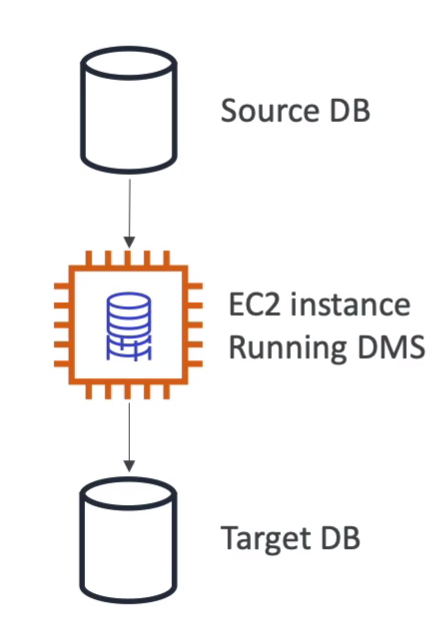

----------------------------
## RDS

<br>

제공되는 제품군은

```
postgres
mysql
mariadb
oracle
microsoft sql server
```

<br>
<br>

- `오로라는 aws에서 만든(독점) 데이터베이스 이다`

<br>
<br>

왜 관리형 서비스로 RDS를 써야되? ec2 쓰면 안됨?
- 자동적으로 os 패치 업데이트, 프로비저닝을 aws에서 해줌
- 백업,복구,모니터링도 aws에서 해줌
- 수평, 수직 스케일링도 가능
- 서비스에서 사용하는 RDS 스토리지는 EBS임 (`gp2 또는 io1` 유형의 볼륨을 가짐)
- EBS니까 당연, `RDS 스냅샷`도 만들 수 있음
- `하지만 ec2처럼 SSH로 인스턴스에 직접 접근을 할수가 없다!!!!!!!!!!!!`


RDS 스토리지 오토 스케일링
- RDS 오토스케일링이 감지해서 `스토리지를 확장해줌`
  - 예) 빈공간 10% 이하면 확장하도록 설정
- 무한대로 늘어나는걸 방지하기 위해, 최대 사이즈는 정해줘야함


<br>
<br>
<br>

-------------------------------
## RDS 읽기 복제본과 멀티 AZ

읽기 전용 복제본
- 읽기만 가능 (쓰기 X)
- `최대 15개` 까지 만들수 있음 (`다른 리전, AZ에도 생성 가능`) 
- 마스터 RDS (읽기/쓰기 가능한)와 읽기 복제본 사이에는 `비동기 복제`가 발생함 
- 읽기복사본을 -> `RDB DB로 승격 할 수도 있음`


읽기 복사 네트워크 트래픽 비용
- 다른 AZ 비동기 복사는 무료
- 다른 리전은 유료


멀티 AZ 운영
- `주로 재해 복구에 사용 (고가용성)`
- 마스터 DB, 스탠바이 DB로 구성 (스탠바이는 오직, `대기 목적만 수행, 읽고 쓰기 안됨`)
- 읽기 복제본과 다르게 `동기식 복사`를 통해 스탠바이 DB 구성
- one dns name을 갖기 때문에 마스터 DB가 죽어도 DNS는 안바뀜
- 장애 조치는 따로 필요없음, 마스터가 죽으면, 스탠바이가 승격됨
- 싱글 AZ -> 멀티 AZ `바꿀 수 있음`
- *`멀티 AZ 클러스터`*  와는 다른 개념임


--------------------
## RDS 커스텀


----------------------

## RDS 공동 책임 모델

<br>

AWS 책임
- 빠른 프로비저닝
- `오토 백업, 복구, 업그레이드, 운영 패치` 등 사용자 책임이 아니라, AWS 책임이 된다!!!!!!!!!!!!!!!!!!!!!!!!!!!!!!! 
- `모니터링, 알림 또한 aws` 책임이다
- 왜냐하면 `완전 관리형` 서비스 이기 때문이다

<br>
<br>

물론, ec2로 사용자가 직접 구성 할 수 있으나.... 복원 백업, 패치 등은 사용자 책임이 된다 = `AWS 완전관리형이 아님`

<br>

----------


## AWS Aurora - 오로라

<br>

- AWS에서 만든 데이터베이스 기술로, 오픈소스 기술이 아님!!!
- RDS와 동작 방식은 똑같음
- 지원 기술은 `mysql,  postgresql` 두가지만 지원함
- 오로라는 기존(위)의 성능보다 3~5배 향상된 퍼포먼스를 제공함
- 또한 스토리지는 자동적으로 확장함 (10기가 단위로)
- 하지만!!!! RDS보다 20%비쌈....... 그리고 프리티어가 아님...
 

<br>
<br>


--------------------
## RDS 배포 옵션

<br>
<br>

`읽기 복제 전략` <br>

- 메인 하나, 읽기 복제본 하나또는 여러개~
- 하지만 쓰기 권한은 메인 1개만이되므로, 메인 DB만 쓰기 가능

<br>
<br>

`멀티az 전략` <br>
- 메인 DB 1개만 읽고 쓸수 있고, 여분으로 다른 az에 똑같은 db를 구성한다.
- failover(장애 조치)가 있을때 다른지역의 DB를 사용한다

<br>
<br>


`멀리 리전 전략`
- 서울 DB가 메인이면, 도쿄에 DB를 복제한다, 쓰기는 메인인 서울 DB에서 진행된다
- `왜 멀티리전 씀?` 한 리전에 문제가 발생했을때 대비, 읽기 엑세스 시간을 도쿄에서 줄일수 있다


<br>
<br>

----------------------------
## AWS Elasticache - 엘라스틱 캐시


- `레디스`를 예로 들수있고, 인메모리 데이터 베이스라, 짧은 지연시간 = 높은 성능을 자랑한다
- 문제에 인메모리 관련 내용 나오면, 무조건 엘라스틱 캐시임
- 이또한 관리형 디비임 공동책임 모델은 위에 같음

<br>
<br>
<br>

---------------------

## AWS Dynamodb

<br>

- `완전 관리형, 고가용성, NO SQL`
- `기본적으로 3개의 가용영역에 걸쳐 복제본을 두고 운영됨
분산된 서버리스 데이터 베이스임`

- 즉, RDB나 엘라스틱 캐시처럼 서버를 프로비저닝할 필요가 없다.
- 초당 수백만 건의 요청 조단위가 넘는행을 신속하고 한결같은 성능을 보장함
- 검색 지연 시간이 한자릿수 밀리초임

- 시험 문제는 `저지연시간, 서버리스 디비`로 나오면 무조건 다이나모 디비임
- 보안,인증 관리가 IAM과 통합되어 있고, 오토 스케일링 기능을 갖추고 있음

- `s3처럼 infrequent access (IA)` 테이블 클래스를 통해 비용 절감을 할 수 있음


<br>
<br>

`다이나모디비 악세레이터 DAX`
- 다이나모 디비의 캐시 메모리 버젼
- 엘라스틱 캐시와는 달리 다이나모 DB전용 캐시
- 성능이 열배는 향상됨
- 보안, 확장성,가용성도 모두 높음


<br>
<br>

`다이나모디비 글로벌 테이블`
- 글로벌로 복제본을 떠 접근이 가능하다
- (액티브 - 액티브 복제임) -> 다른 지역이라도 실시간 복제!!!!!!


<br>
<br>

------------------------------
## AWS Redshift - 레드 쉬프트

- `postgresql`를 기반으로 하는 디비, 그러나 `OLTP`에서는 사용하지 않음, OLTP는 RDS에서 사용하는것이 나음

- 레드시프트는 OLAP online analytical processing 실시간 분석 처리에 쓰임

- 따라서 시험문제에 데이터 베이스가 `웨어하우징`되어야 한다거나, `분석`이 필요하다면 무조건 레드쉬프트임
- 레드시프트는 `상시가 아니라 한시간마다 데이터를 로드`한다.

- 데이터도 페타바이트까지 확장할 수 있다.
- 데이터는 컬럼으로 저장되고 (`행 기반 저장이 아님`)
대규모 병렬 쿼리, massively parallel query execution (mpp엔진),을 사용해 연산이 엄청 빠름

- 프로비저닝한 인스턴스에 대해 비용청구
- 쿼리를 수행하기 위해 `SQL` 인터페이스 제공
- 퀵사이트나 테블로 등 BI 즉 비지니스 인텔리전스 도구와 통합되될 수 있음

<br>
<br>

----------------------------------
## AWS EMR(elastic mapreduce)
- EMR은 `실제 디비가 아니라` AWS에서 빅데이터를 작업하고자 할때, 사용하는 `하둡 클러스터`를 이용해 방대한 양의 데이터를 마운트해서 분석함

- 즉 EMR은 하둡클러스터를 구성하고(ec2로) 빅테이터 관점에서 데이터를 분석할 수 있도록 지원하는 하둡 클러스터? 정도라고 생각

- ec2라 오토스케일링이 가능하고, 스팟 인스턴스도 쓸수잇음

- 사용 케이스는 빅데이터 처리, 머신러닝, 웹 인덱싱에 사용 할 수 있음

`하둡 클러스터` : 많은양의 데이터를 분산 저장하는 클러스터
스파크나 Hbase,flink,presto 등 다양한 도구들이 하둡 클러스터를 이용해서 작업 하는거임

<br>
<br>

-------------------------------------
## Amazon Athena - 아테나

- `서버리스 쿼리 서비스`
- s3에 저장된 객체 분석을 수행
- 아테나는 BI,분석,보고,로그 분석 등에 쓰일수도 있음
- 스캔된 데이터는 테라바이트당 5딸라

<br>
<br>

------------------------------
## AWS Quicksight - 퀵사이트
- 서버리스 머신러닝 방식의 비즈니스 인텔리전스 서비스로 대화형 대시보드를 생성
- RDS 오로라
- `그라파나와` 비슷함

<br>
<br>

------------------------------
## AWS Document DB

- 몽고 DB랑 똑같다 ( NO SQL 디비임)
- 걍 오로라는 RDB, 다큐먼트 DB는 no-sql 디비라고 생각하면 될듯
- 오로라 디비랑 배포원리도 같음 10기가씩 증가 64테라바이트까지
- `완전관리형이고` `3az 복제본을 둠`

<br>
<br>

-----------

## AWS Neptune

- 넵튠은 `완전 관리형` 그래프 디비
- 3개의 az에 최대 15개의 읽기 전용 복제본을 가질수잇음
- 지식 그래프를 저장할때 뛰어남 ( 위키디피아 데이터베이스를 예로 들수 있는데, 위키피디아 문서는 모두 상호 연결 되어 있기 때문이다!!!)
- 사기탐지, 추천엔진, 소셜네트워크와 같은  고도로 연결된 데이터셋을 다루는 애플리케이션에 적합


<br>
<br>

-------------------------------------
## AWS QLDB - quantum ledger database 

- ledger란 금융 거래를 기록한 장부
- 금융쪽 거래를 기록하는 데이터 베이스
- `완전 관리형이고, 3개의 az에 걸쳐 데이터 복제본을 가짐`
-  `디비 변경이 불가능한 시스템` -> 데이터 베이스를 작성하고 나면, 그후 삭제하거나 수정이 불가능
- QLDB에서는 탈 중앙화 개념을 찾아 볼 수가 없음

<br>
<br>

----------------------------------------------
## AWS managed blockchain

- QLDB랑 비슷하지만 QLDB는 AWS에서 관리하고 중앙 처리식이지만, 
블록체인은 아님

- AWS내에서 확장가능한 블록체인 네트워크를 생성할수있음


-----------------------------
## AWS DMS - database migration service

- 소스 DB에 DMS(ec2 인스턴스)가 데이터를 추출해, 타겟 DB에 입력하는 서비스

- 동종 디비간  오라클 -> 오라클
- 타겟 다른것들 mssql -> 오로라
  
<br>
<br>
<br>



-------------------------------
## AWS glue - 글루

- 관리형 추출, 변환 및 로드 서비스 (ETL) 서비스


