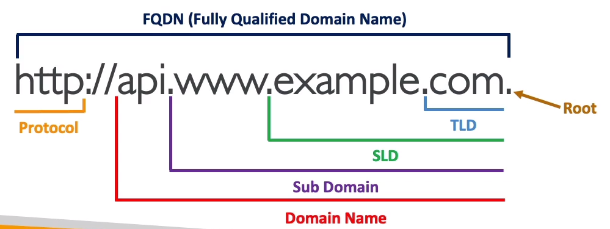

## DNS 용어

- `domain registar` - 도메인 등록자
  - aws, 가비아 등
- `DNS 레코드`
- `Zone File` 
  - 모든 DNS 레코드를 포함하는 파일
- `Name Server`
  - DNS 쿼리를 실제로 해결하는 서버
- `FQDN` (fully qualified domain name) - 전체 도메인 네임
  - `Top Level Domain (TLD)` - 최상위 도메인
    - com, kr, org 등등
  - `Second Level Domain (SLD)` - 2차 도메인
    - amazon.com , google.com 등

ns-252.awsdns-31.com 및 3개의 서버가 -> 스테판.com을 응답해 줄거임

Records - 레코드
- 레코드 안에 정보
  - Domain/subdomain Name -> example.com
  - Record Type -> A or AAAA
  - value -> 123.456.789.123
  - routing policy(라우팅 정책) -> 쿼리에 어떻게 응답을 해줄까? 하는 정책
  - TTL

레코드 타입
- A -> 호스트네임을 IPv4로 맵핑
  - example.com을 1.2.3.4로 연결
- AAAA -> 호스트네임을 IPv6로 맵핑
  - example.com을 qweko2:2312q:ewqijid~~~블라블라 (ipv6형식)으로 맵핑
- CNAME -> 호스트네임을 또다른 호스트 네임으로 연결
  - 타겟이 되는 도메인 네임은 꼭 A나 AAAA 레코드를 가지고 있어야 함
- NS -> 호스팅존의 네임 서버 (DNS 쿼리를 실행할 수 있는 서버임)
  - 트래픽이 도메인으로 라우팅 되는 방식을 제어함

TTL ( time to live ) 
- DNS 레코드의 유효 기간을 나타내는 값 -> `클라이언트 캐시에 설정된 시간 만큼 주소 저장임`

- 예를 들어, TTL 값이 3600이라면 해당 레코드가 캐시된 후 3600초(1시간) 동안 유효합니다. - TTL 값이 0으로 설정되면 캐시된 레코드를 즉시 폐기하고 매번 새로운 DNS 질의를 수행하여 최신 정보를 가져옵니다.

- TTL은 네트워크 트래픽을 줄이고 DNS 서버 부하를 완화하는 데 도움을 줍니다. 
- DNS 질의가 발생할 때 클라이언트는 로컬 DNS 캐시에서 해당 레코드를 찾으며, TTL 값이 지나지 않았다면 저장된 레코드를 사용하여 추가적인 DNS 질의를 하지 않고도 도메인 이름을 해석할 수 있습니다. 

- 높은 TTL 값은 캐싱 시간을 늘리고 네트워크 트래픽을 줄이지만, 변경 사항이 적용되기까지 오래 걸릴 수 있습니다. 낮은 TTL 값은 변경 사항을 빠르게 전파하지만 DNS 서버 부하가 증가할 수 있습니다.

- dig 명령어로 TTL 시간 확인 가능

routing policy
DNS 레코드에서 "routing policy"는 트래픽을 처리하는 방식 또는 규칙을 의미합니다. 이는 일반적으로 트래픽 로드 밸런싱, 지역 기반 라우팅, 성능 최적화 등과 관련된 기능을 지원하기 위해 사용됩니다. "routing policy"는 일부 DNS 레코드 유형에만 적용되며, 다음과 같은 레코드 유형에서 사용될 수 있습니다.

- A 레코드와 AAAA 레코드: "routing policy"는 여러 개의 IP 주소로 구성된 레코드에서 트래픽을 분산시키기 위해 사용될 수 있습니다. 예를 들어, "Round Robin" 라우팅 정책은 각 질의마다 IP 주소 목록에서 다음 IP 주소로 순서대로 트래픽을 배분합니다.

CNAME 레코드: "routing policy"는 CNAME 레코드를 통해 도메인 이름을 다른 도메인 이름으로 매핑할 때 사용될 수 있습니다. 예를 들어, CNAME 레코드의 값이 여러 개인 경우 트래픽을 여러 도메인으로 분산시킬 수 있습니다.

MX 레코드: "routing policy"는 이메일을 처리하는 메일 서버로 트래픽을 전달하는 데 사용될 수 있습니다. MX 레코드에서는 각 메일 서버에 대한 우선순위를 설정하여 트래픽을 적절하게 분배할 수 있습니다.

DNS-based Service Discovery (SRV) 레코드: "routing policy"는 SRV 레코드를 통해 특정 서비스의 인스턴스를 찾을 때 사용됩니다. SRV 레코드에서는 각 서비스 인스턴스에 대한 가중치, 우선순위, 포트 번호 등을 설정하여 트래픽을 조절할 수 있습니다.

DNS 레코드에서 "value"는 해당 레코드 유형에 따라 다른 의미를 갖습니다. 일반적으로 "value"는 도메인 이름과 관련된 정보를 나타내는 데이터를 가리킵니다. 몇 가지 예를 살펴보겠습니다.

A 레코드: "value"는 도메인 이름을 해당하는 IPv4 주소로 매핑하는 IP 주소를 의미합니다. 예를 들어, A 레코드의 "value"는 "example.com" 도메인 이름을 IPv4 주소 192.0.2.10에 매핑하는 값일 수 있습니다.

AAAA 레코드: "value"는 도메인 이름을 해당하는 IPv6 주소로 매핑하는 IPv6 주소를 나타냅니다. 예를 들어, AAAA 레코드의 "value"는 "example.com" 도메인 이름을 IPv6 주소 2001:0db8:85a3:0000:0000:8a2e:0370:7334에 매핑하는 값일 수 있습니다.

CNAME 레코드: "value"는 도메인 이름을 다른 도메인 이름으로 매핑하는 별칭 도메인 이름을 나타냅니다. 예를 들어, CNAME 레코드의 "value"는 "www.example.com"을 "example.com"으로 매핑하는 값일 수 있습니다.

MX 레코드: "value"는 도메인 이름과 관련된 이메일 서버의 우선순위 및 호스트 이름을 포함한 정보를 나타냅니다. 예를 들어, MX 레코드의 "value"는 "example.com" 도메인의 이메일을 처리하기 위한 메일 서버의 정보일 수 있습니다.

TXT 레코드: "value"는 도메인 이름과 관련된 텍스트 정보를 포함합니다. 주로 SPF(Sender Policy Framework) 또는 DKIM(DomainKeys Identified Mail)과 같은 이메일 인증을 위한 텍스트 데이터를 나타냅니다.

DNS 레코드의 유형마다 "value"의 의미와 형식이 다름

--------------------------

## AWS Route 53

- `고가용성, scalable (확장성), 완전 관리형` DNS 서비스
- Service-Level Agreement (SLA) `100%`를 제공하는 유일한 서비스 -> `고장안남`
- 반드시 알아야함 - 지원하는 레코드 타입 `A, AAAA, CNAME, NS`
  - 그외에도 CAA / DS / MX NAPTR / PTR / SOA / TXT / SPE / SRV 타입이 있음

- 왜 라우트 53일까? -> ㅋㅋ DNS는 전통적으로 53포트를 씀

------------------------

## Route 53 - Hosted Zone
- 레코드의 컨테이너 이다.
- 도메인과 서브도메인으로 가는 트래픽의 라우팅 방식을 정의
- AWS는 2가지 타입의 호스팅존이 있음
  - public hosted zone
    - mrjaehong.com 이라는 도메인 네임을 구입했다면 퍼블릭 호스팅 존을 만들 수 있음
    - temp.mrjaehong.com으로
  
  - private hosted zone
    - VPC에서 내부용으로 사용하는 도메인 네임
    - 외부에서 접근 불가, mrjaehong.internal 과같이 마음대로 구성해도 됨
- 어떤 타입을 쓰던지 0.50달러/월

-------------------------------------------------

dig와 nslookup을 통해 DNS 경로 추적 가능

