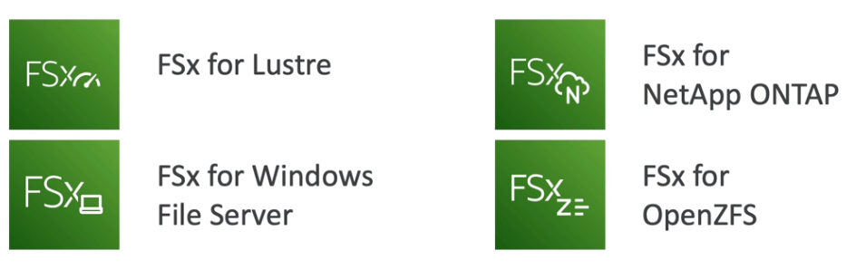
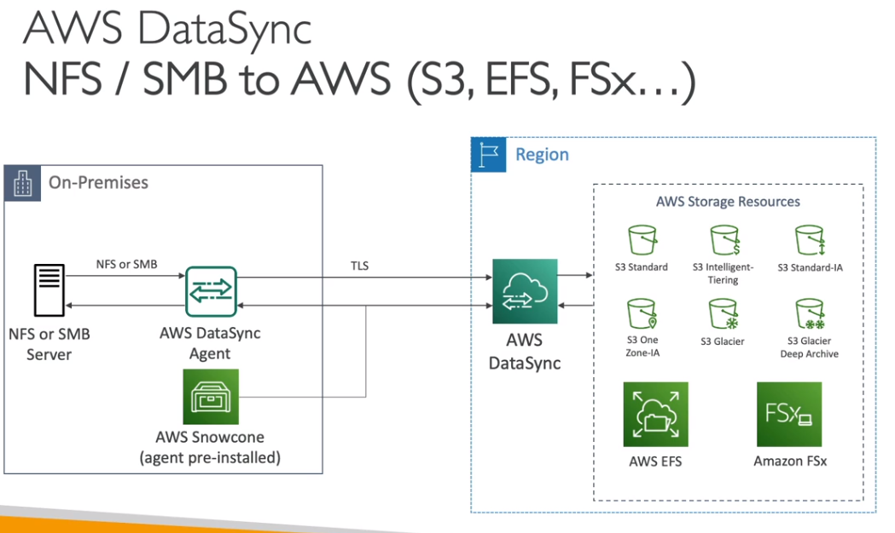
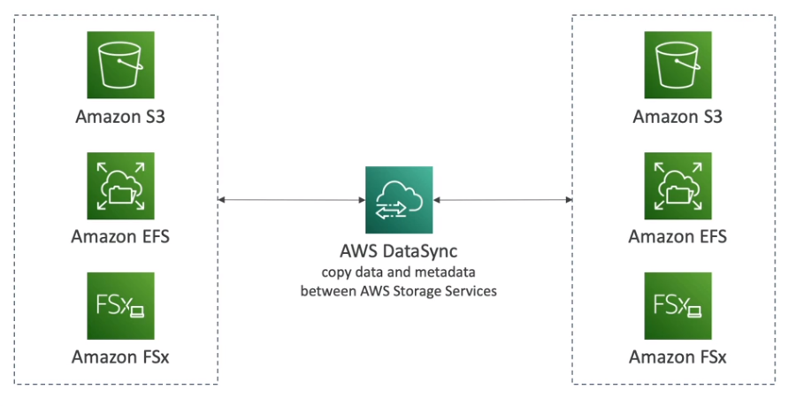

## AWS SNOW family

 
 

높은 수준의 보안장비이며 `에지 데이터나, 기업의 데이터 마이그래이션`할때 쓰는 포타블 장비

 
 

`에지 데이터` :  인터넷이 안되는 장비에서 수집한 데이터
바다위의 배, 존나 깊은 채굴장을 엣지 로케이션이라고 하고, 거기서 생성된 데이터를 `에지 데이터`라고 한다

 
 

`기업 데이터 마이그래이션`
- 스노우콘, 스노우볼 에지, 스노우 모빌(트럭)

 

`에지 컴퓨팅 데이터`
- 스노우콘, 스노우볼 에지

 
 

스노우 패밀리 왜씀?  

- 기업의 대용량 데이터를 클라우드로 이전하거나 할때 네트워크로는 엄청 오래 걸림.....
- `네트워크의 연결 안정성, 대역폭, 기업의 높은 네트워크 비용`등이 걸림
- 대규모 데이터를 클라우드로 이전하고 마이그래이션해서, 재해 복구나 백업 용도로 쓰기 위함

 
 
 
 

`스노우 콘 (작은 베어본 PC 정도 2.1키로그람임)`
- 총 8테라 저장 가능
- 공간이 협소한 환경에서 사용
- 데이터를 옮기면, 장비를 aws에 택배를 붙이거나 AWS datasync를 통해 네트워크에 데이터를 재전송 가능
- 그러니까 걍 꼽기만하면 자동으로 데이터가 aws로 전송됨!!!
- 마이그레이션 최대 크기는 24테라 바이트
- 데이터 에이전트는 미리 설치 되어 있슴 -> 이를 통해 위에 처럼 aws로 자동 전송
- `AWS DataSync를 사용해` 재전송 할 수도 있음
  

 
 
 

`스노우볼 에지 (커다란 서류 가방처럼 생김)`
2가지 종류가 잇음
 

- `스토리지 최적화 장비` :  80테라바이트이며 s3 오브젝트 스토리지를 연동할 수 있다, 또한 스노우 콘처럼 스토리지 클러스터링도 가능함
- `컴퓨팅 최적화 장비` : 똑같고, 42테라 바이트임 
- 마이그레이션 최대 크기는 `1페타 바이트`
- 스토리지 클러스터링이 있어, 총 15개 디바이스를 결합해서 사용할 수 도 있음
- 에지 디바이스들을 연결해, 스노우볼에지로 데이터 쏘면 -> aws 자동 업로드... 그래서 배같은 곳에서는 장기간 대여도 가능 (1~3년동안 저렴한 비용으로 )

 
 
 

`스노우 모빌 (트럭)`
- 한 대에 100 PB 페타바이트 저장 가능 
- 클러스터링 하면, 엑사바이트.... 100만 테라바이트 저장 가능
- gps 연동,쿨링등 존나 쩜

 
 
 

`스노우볼 패밀리 신청`
- aws콘솔에서 장비 배송 신청
- 스노우볼 장비에 aws 스노우볼 클라이언트 / aws opshub 를 내 서버에 설치
- 스노우볼 장비와 내 서버를 연결해서 데이터 옮김
- 다되면 장비를 다시 aws에 배송
- 그럼 s3 버킷에 데이터가 로드 됨
- 스노우볼 장비에 데이터는 무조건 깨긋하게 완전 삭제됨

 
 

`저장 데이터` 
- 스노우콘 = 최대 24테라 바이트

 

- 스노우 에지 - 대충 42 ~ 80 테라 바이트
- 스노우 에지 클러스트링 - 최대 1 페타바이트 

 

- 스노우 모빌 = 최대 100PB 페타바이트
- 스노우 모빌 클러스트링 = 최대 1 엑사바이트 

- 모든 스노우 장치들은 내부 `EC2인스턴스나 & 람다 함수를 실행 할 수 있다 (AWS IoT greengrass)`

 
 
 

-------------------------------------------------

## AWS FsX
- AWS에서 `타사의` 고성능 파일 시스템을 얻는 `완전 관리형` 서비스
- 윈도우 파일서버, 리눅스 클러스터 서버 -> HPC나 기업에서 사용하기 적당함
- 이거 왜씀? -> EFS나 EBS는 AWS 인스턴스 대상이지만, `Fsx는 내 컴퓨터에서도 접근 가능`하기 때문임

종류는 아래 그림과 같음

FSx window
- `SMB` 프로토콜과, window NTFS 지원
- `MS AD`를 지원함, ACL로 `사용자 할당량`도 지정 가능
- `리눅스 Ec2 인스턴스에서도 마운트 가능`
- 초당 수십만 IOPS, `수백 PB`까지 확장 가능
- 옵션
  - SSD
  - HDD
- AWS `다이렉트 커넥트나, site to site VPN`으로 액세스 가능
- 고가용성 지원, S3에 백업 지원

FSx lustre
- lustre는 원래 `분산파일 시스템임` (원래 이름은 Linux cluster임)
- 높은성능, HPC에 적합 (동영상 처리, 금융 모델링, 전자 설계 자동화 등)
- 옵션
  - SSD
  - HDD
- `S3와 원활한 통합` 가능
  - s3데이터를 -> FSX로, FSX데이터 -> S3로 `자유롭게 이동 가능함`
- AWS `다이렉트 커넥트나, site to site VPN`으로 액세스 가능

FSx 배포 옵션
- 스크래치 파일 시스템 (임시저장소)
  - 영구 파일 시스템보다 성능을 6배 올릴 수 있다.
  - 데이터 복제는 하지 않는다 ( 비용 절감 )
  - 단기적인 워크로드에 적합

- 영구 파일 시스템
  - `같은 AZ`에서만 데이터 복제 이루어짐

FSx netApp ONTAP
- NFS, SMB, ISCSI 프로토콜과 호환 가능
- `NAS`에서 실행중인 워크로드를 AWS로 옮길 수 있음
- 다양한 운영체제 지원함
  - 리눅스
  - MacOS
  - VMware cloud on AWS
  - 윈도우
  - 아마존 Ec2,ECS,EKS
  - 아마존 워크스페이스 & appstream 2.0
- 스토리지는 자동으로 축소 및 확장됨
- `복제 및 스냅샷` 기능도 지원
- `중복데이터 제거 있음`
- 지정시간 복제기능 탑재 (지정된 시간으로 복제)

FsX OpenZFS
- AWS `완전 관리형`
- NFS의 다양한 버젼 지원
- 다양한 운영체제 지원함
  - 리눅스
  - MacOS
  - VMware cloud on AWS
  - 윈도우
  - 아마존 Ec2,ECS,EKS
  - 아마존 워크스페이스 & appstream 2.0
- 스냅샷, 압축 지원 
- 중복데이터 제거 `없음`
- 지정시간 복제기능 탑재 (지정된 시간으로 복제)

-----------------

## AWS storage gateway - 스토리지 게이트 웨이

 

- 어떤 데이터는 온프라 미스에, 어떤데이터는 클라우드에 저장하고 싶을때 사용 -> `하이브리드 클라우드 스토리지` 서비스
- 회사 `데이터 센터에 무조건 게이트웨이를 실행`할 가상 서버가 있어야함

   

`무슨 역활?` 
온프라미스와 클라우드 데이터를 연결해 준다
- s3는 자체적인 객체,키, EFS나 EBS는 스토리지 블록 등 각 저장 데이터 형태가 다름 = `저장 방식이 다름`
- EBS는 블록타입
- EFS나 FSx는 파일 타입
- S3나 글리셔는 오브젝트 타입

  

- `종류 4가지`
  - S3 file 게이트 웨이
    - `데이터를 S3에 저장후 NFS/SMB 등으로 파일에 엑세스 하기 위함`
    - 글리셔 클래스는 바로 적용 안됨
    - NFS, SMB 프로토콜 사용
    - 사용된 데이터는 게이트웨이의 `캐시로 저장됨`
      - 최근에 사용한 파일만이, 파일 게이트웨이에 존재함
    - 버킷에 접근하기 위해, 게이트웨이에 `IAM 역할`을 생성해야됨
    - MS AD를 통해 인증해야됨

    

- Fsx file 게이트웨이
  - 윈도우 서버의 네이티브 엑세스 제공
  - 홈 디렉터리로 사용도 가능

    

- volume 게이트웨이
  - 데이터를 비동기적으로 `EBS 스냅샷` 형식으로 S3에 저장 (`대부분 온프라미스 볼륨의 백업 목적`)
  - ISCSI프로토콜 사용
  - 컴퓨터 볼륨을 통째로 복사
  - 일종의 온프라미스 애플리케이션 백업
  - 생성 옵션은 2가지
    - `Cashed Volume `- 캐시 볼륨
      - 자주 사용되는 데이터만 로컬에 두고 모두 AWS에 백업
    - `Stored volume `- 스토리지 볼륨
      - 모든 데이터를 로컬에 저장하고, 비동기적으로 AWS에 백업

    

- Tape 게이트웨이
  - 가상테이프 라이브러리 (virtual tape library - VTL)사용
  - 테잎을 기록하는 방식과, 글리셔는 동일한 프로토콜&방법을 쓰는것이다
  - 테잎 시스템을 가지고 있는 기업이, 클라우드로 이전하고 싶을떄 사용

    

Hardware appliance (게이트웨이 장비 주문)
- 온프레미스에 게이트웨이 서버가 없을 경우, 미니 서버가 될 하드웨어 어플라이언스를 설치한다.
- 물리적으로 설치를 해야함

    

iSCSI는 
- "Internet Small Computer System Interface"의 약자로, 컴퓨터 네트워크를 통해 `스토리지 장치에 접근`하기 위한 프로토콜입니다.

  

AWS DataSync Vs 스토리지 게이트 웨이

|| AWS DataSync | Storage GateWay |
|------|---|---|
|목적|AWS or 온프레미스에서 `데이터를 이동`하기 위한 서비스|하이브리드 환경에서 `저장 서비스를 연동`하기 위함|
|전송 필터|파일 포함/제외 시킬 파일 지정 가능|X|
|전송 대상|온프레미스 -> AWS, AWS -> AWS| 온프레미스 -> AWS|
|실패시 재전송|O|X|
|최대 쓰루풋|10Gb/sec|500Mb/sec|
|데이터 엑세스|X|O|
|S3 글리셔/DA 전송|지원|X(라이프사이클 정책으로 간접적으로는 가능함)|

- Fsx는 완전 관리형
- FSx는 모든 파일이 AWS에 저장되기 때문에 `대기 시간이 짧은 액세스를 제공하지 않습니다`. 즉, 인터넷을 통해 액세스할 수 있습니다. AWS Storage Gateway는 개발 오버헤드 없이 `로컬 캐싱을 지원`하므로 지연 시간이 짧은 애플리케이션에 적합합니다.
    

----------------------------------------------
## AWS Transfer Family - 전송 전용 제품들

- 기본적으로 `완전 관리형`이며, 고가용성, 안정성을 제공함
- s3나 EFS는 AWS api나 aws SDK 사용해야됨
- 오직 `FPT` 프로토콜만 사용해서 파일을 이동할 수 있음
- MS AD,LDAP, OKta 등 인증 서비스와 연동 가능

제품군
- AWS Transfer for FTP (노암호화)
- AWS Transfer for FTPS (암호화)
- AWS Transfer for SFTP (암호화)

----------------------------------

## AWS datasync

- 이걸 통해 온프레미스에서 AWS로 많은양의 데이터를 이동가능
- 데이터 싱크 `에이전트`로 AWS로 전송
  - 에이전트 하나당, 10Gb / 초 사용가능
- `한 AWS 서비스`에서 `다른 AWS 서비스`로 데이터를 옮길 수 도 있음
- AWS 저장 가능 스토리지
  - S3 모든 클래스 (글리셔 포함)
  - EFS
  - FSx (윈도우,리눅스클러스터,넷앱,오픈ZFS)
- `파일권한`과 `메타데이터 저장` 기능 있슴
  - 파일을 다른곳으로 옮길때, 파일의 `메타데이터를 보존` 할 수 있음

- `동기화는 지속적이지 않고, 일정에 따라 움직임`
- NFS 또는 SMB 프로토콜 사용

 
 

----------------------------------------------------------

AWS에서 제공하는 FsX와 Storage Gateway는 모두 데이터 스토리지 관련 서비스입니다. 그러나 각각은 다른 목적과 사용 사례를 가지고 있습니다.

Amazon FSx:
Amazon FSx는 완전 관리형 파일 시스템 서비스입니다. 주로 파일 공유를 위한 고성능 및 확장 가능한 스토리지를 제공하는 데 사용됩니다. FSx는 다음과 같은 특징을 가지고 있습니다:

파일 시스템 유형: FSx는 Windows File Server 및 Lustre 두 가지 유형의 파일 시스템을 지원합니다.
완전 관리형: FSx는 AWS에서 자동으로 배포, 구성, 관리 및 유지 보수되므로 사용자는 인프라 관리에 대해 걱정할 필요가 없습니다.
고성능: FSx는 높은 처리량과 낮은 지연 시간을 제공하여 대량의 데이터 처리에 적합합니다.
확장 가능성: 필요에 따라 FSx는 데이터 용량을 확장할 수 있으며, 여러 사용자가 동시에 파일을 공유할 수 있습니다.
AWS Storage Gateway:
AWS Storage Gateway는 온프레미스 환경과 클라우드 간의 데이터 통합을 위한 하이브리드 클라우드 스토리지 서비스입니다. 주요 목적은 온프레미스 애플리케이션 및 시스템에서 AWS 클라우드 스토리지로의 데이터 이동 및 복제를 용이하게 하는 것입니다. Storage Gateway의 주요 특징은 다음과 같습니다:

데이터 게이트웨이: Storage Gateway는 온프레미스에서 실행되는 가상 머신(VM)으로서, 로컬 애플라이언스로 데이터를 캐싱하고 클라우드로 데이터를 전송합니다.
스토리지 프로토콜: Storage Gateway는 파일, 볼륨 또는 테이프와 같은 다양한 스토리지 프로토콜을 지원하여 기존의 애플리케이션과의 호환성을 보장합니다.
데이터 복제: Storage Gateway는 클라우드로 데이터를 비동기적으로 복제하여 데이터의 내구성과 가용성을 보장합니다.
데이터 보호: 데이터를 암호화하여 보호하고, 스냅샷 및 복구 기능을 제공하여 데이터의 안정성을 강화합니다.
요약하면, Amazon FSx는 완전 관리형 파일 시스템 서비스로 `파일 공유 및 데이터 처리에 적합하며`, Storage Gateway는 `온프레미스 및 클라우드 간의 데이터 이동과 통합`을 위한 하이브리드 스토리지 서비스입니다.

AWS에서 제공하는 Fsx와 Storage Gateway는 둘 다 데이터 스토리지와 관련된 서비스이지만, 다음과 같은 차이점이 있습니다:

기능 및 사용 사례:

Amazon FSx: Amazon FSx는 완전 관리형 파일 시스템 서비스로, 고성능의 공유 파일 스토리지를 제공합니다. 주로 대규모 데이터 공유, 미디어 처리, 사무용 애플리케이션, 데이터 분석 등에 사용됩니다. 주요 사용 사례로는 Windows 파일 서버, Lustre 파일 시스템, Amazon FSx for NetApp ONTAP 등이 있습니다.
AWS Storage Gateway: AWS Storage Gateway는 하이브리드 클라우드 스토리지 연결을 제공하는 서비스입니다. 로컬 데이터 센터 또는 온프레미스 인프라에 있는 데이터를 AWS 클라우드로 연결하고, 백업, 아카이브, 데이터 마이그레이션 등을 수행할 수 있습니다. 주요 사용 사례로는 파일 게이트웨이, 볼륨 게이트웨이, 테이프 게이트웨이 등이 있습니다.
프로토콜:

Amazon FSx: Amazon FSx는 주로 SMB (Server Message Block) 프로토콜을 사용하여 Windows 기반의 파일 공유를 지원합니다. 또한 Lustre 파일 시스템을 위한 네트워크 파일 시스템(NFS)을 제공하기도 합니다.
AWS Storage Gateway: AWS Storage Gateway는 다양한 프로토콜을 지원하며, 파일 게이트웨이의 경우 NFS 및 SMB를 사용할 수 있고, 볼륨 게이트웨이의 경우 iSCSI 프로토콜을 사용합니다.
배포 및 관리:

Amazon FSx: Amazon FSx는 완전히 관리되는 서비스이므로 파일 시스템을 프로비저닝하고 관리하는 작업은 AWS에 의해 처리됩니다. 사용자는 파일 시스템에 대한 액세스 및 구성을 관리합니다.
AWS Storage Gateway: AWS Storage Gateway는 로컬 환경과 AWS 클라우드 간의 연결을 제공하기 위해 가상 애플라이언스로 구현됩니다. 사용자는 게이트웨이를 로컬 인프라에 설치하고 관리해야 합니다.
비용:

Amazon FSx: Amazon FSx는 파일 시스템의 크기, 사용량, 지리적 위치 등에 따라 비용이 청구됩니다. 파일 시스템 유형에 따라 다른 가격 모델이 적용될 수 있습니다.

