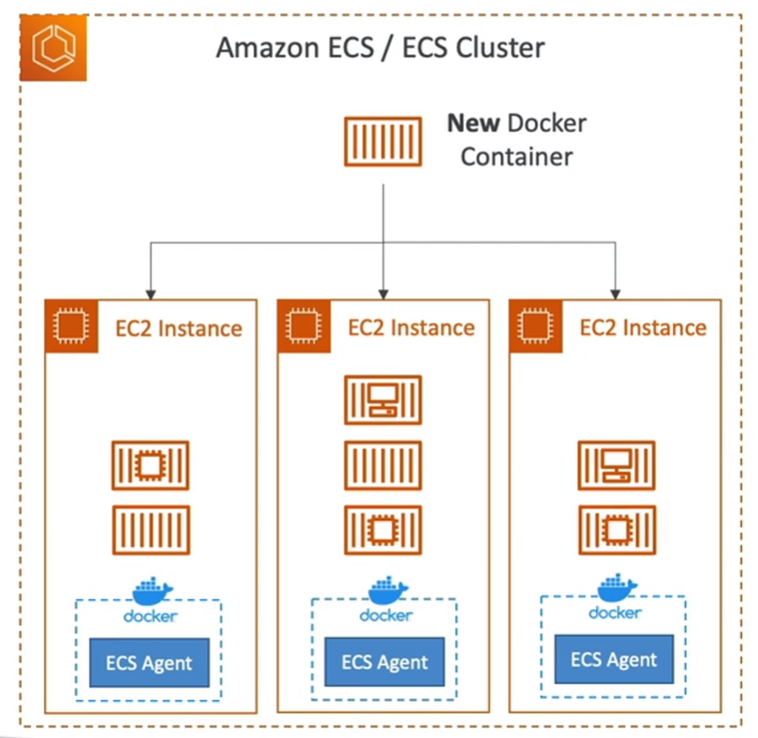

## AWS ECS

  

- NLB,ALB 등 로드밸런서 연동해서 씀

EC2 시작 타입
- ec2 기반에서 컨테이너서비스 하는거임
- 내가 사용할 Ec2를 미리 프로비저닝 해야됨
- Ec2에 `ECS 에이전트를 설치해야됨` 

  

fargate 시작 타입
- 자원 프로비저닝 X
- `서버리스`임

  

-----

## ECS IAM Role
- EC2타입으로 ECS를 구성하려면, `EC2 Instance Profile` IAM 역할을 생성 해줘야한다
  - ec2 인스턴스가, SSM, ECR ECS 등에 접근용도
- `ECS Task 역할`은 다른것임
  - 컨테이너에 역할을 부여하는 개념

  

ECS 데이터 볼륨 (EFS)
- 주로 `EFS` 씀
- EFS + 파게이트 = 서버리스 
- `S3는 마운트 될수 없음`

  

ECS Task
- 쿠버네티스 yaml deploy처럼 컨테이너를 배포하기 위한 기능
- 애플리케이션 타입이 Service = 계속 실행, Task = 실행완료 후 종료
- ECS 작업의 작업 정의(Task Definition)에서 `taskRoleArn` 필드를 사용하여 해당 작업이 `사용할 IAM 역할을 지정`할 수 있습니다. 이렇게 함으로써 해당 작업은 지정된 IAM 역할의 권한으로 AWS 리소스에 접근하고 서비스를 사용할 수 있게 됩니다.
- 예를 들어, ECS 작업에서 Amazon S3 버킷에 파일을 읽거나 쓰기 위해서는 IAM 역할에 S3 버킷에 대한 액세스 권한을 부여해야 합니다. 이렇게 할당된 `IAM 역할의 ARN`을 `taskRoleArn`으로 작업 정의에서 지정하여 해당 ECS 작업이 S3 버킷과 상호작용할 수 있게 됩니다.

  

ECS 오토 스케일링
- ECS 오토스케일링 != Ec2 오토스케일링임
  - 컨테이너를 늘리는거지, ECS에 사용되는 ec2 인스턴스를 늘리는게 아님
    - 예) 엔진엑스 컨테이너 100개 생성하면, Ec2 1개 프로비저닝에서 서비스될수 없다
- 그래서 이런거 신경쓰기 싫으면, 파게이트 써야함
- ECS cluster capacity provider (용량 공급자) = 카펜터 

  

ECS 서비스는 다음과 같은 `메트릭`을 제공한다. `Auto Scaling과 연동 가능함`
- ECSServiceAverageCPUUtilization 
  - 서비스의 `평균 CPU` 사용률입니다.
- ECSServiceAverageMemoryUtilization 
  - 서비스의` 평균 메모리` 사용률입니다.
- ALBRequestCountPerTarget 
  - Application Load Balancer 대상 그룹의 대상당 `완료된 요청 수`입니다.

   

------------------------

## AWS FarGate

- Fargate 작업에는 시나리오의 스토리지 요구 사항을 충족하는 최소 `20GiB의 무료 임시 스토리지가 제공`됩니다.
- 자원(Ec2 인스턴스)을 프로비저닝 할 필요는 없지만, 자원양은 설정해줘야함

    

-------------------------------------
## AWS App Runner

- `완전관리형`, 규모에 따라, 웹 애플리케이션 API 배포를 도움
- 컨테이너 & 소스 코드만 있어도 됨
- `쉬운 ECS 시스템` - `컨테이너 기반의 beanstalk` 느낌
- `신속한 프로덕션 배포`가 필요할때 사용
- 파게이트로 실행됨

--------------------------
## Amazon EKS Anywhere

- Kubernetes(K8s)를 `사용하여 온프레미스 데이터 센터 또는 로컬 인프라에서 Amazon Elastic Kubernetes Service (Amazon EKS) 클러스터를 배포하고 운영하기 위한 서비스입니다.`

- Amazon EKS Anywhere를 사용하면 사용자는 자체 데이터 센터나 로컬 인프라에서 Kubernetes 환경을 손쉽게 구축하고 관리할 수 있습니다. 이를 통해 클라우드와 온프레미스 환경 간에 애플리케이션을 더욱 쉽게 이동시킬 수 있고, 기존 자원을 활용하여 `하이브리드 클라우드 환경을 구축할 수 있습니다.`

