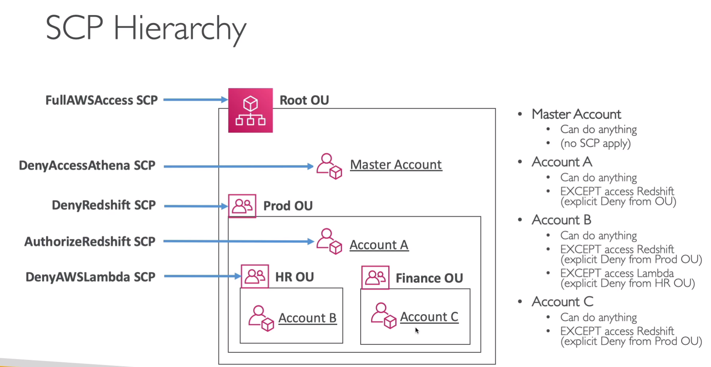
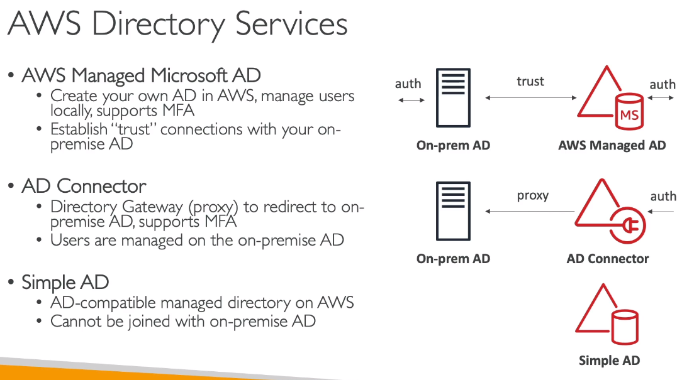

## AWS organization

- `글로벌 서비스`
- 조직에서 생성한 계정을 `멤버 계정`이라고 부름
- 조직을 떠날때 조건은, 가입한 AWS 계정이 `독립 실행형`이여야 한다 ( API로 만든 계정 말고, 카드 인증까지 다 끝난 계정, 즉 조직에 탈퇴해도 요금 청구에 아무런 탈이 없는 계정만 마음대로 탈퇴 가능 )
- AWS 계정을 `API로 생성 할 수 있음` (드롭 박스처럼, 한 회사에서 마스터계정을 만들고, 회사원들이 가입해서 쓰는 방식)
- SCP (서비스 컨트롤 폴리시) 서비스 컨트롤 정책으로 , 계정마다 권한을 제한도 할 수 있음
- 계정을 통합 관리하면, 통합 과금이 되는데 이점은 
  - 모든 계정에 대한 비용을 마스터 계정으로 지불하기 때문에.... 한번만 계산하면 됨
  - 결합된 사용량, 만약 S3 다합쳐서 5테라 바이트 넘어가면 요금 할인 들어감 (사용량 많으면 디스카운트 해줌)
  - 예약형 인스턴스 공유가 가능함
- 조직 단위, OU(organizational unit)라는 개념이 있음
  - 멤버 계정은 `한 조직(OU)에만 소속됨`

- CloudTrail의 모든 로그를 `중앙 S3계정에 모을 수 있음`

 
 
  

`SCP - service control policies (콘솔에서 활성화 시켜야됨)`
- 계정에 적용되는 `IAM 정책 개념`, 계정내 할 수 있는 `일을 제한`
- SCP는 마스터 계정에 영향을 줄 수 없음 (마스터에 denyAccess아테나를 해도 적용안됨, 이미 루트에서 풀 권한 상속받았으므로)
- 마스터 혹은 루트 계정은 FullAWSaccess scp 권한이 있음
- scp는 `계정에만 적용`할 수 있음
- scp는 서비스 `역할에는 적용되지 않음`
- scp는 기본적으로, `아무것도 허용하지 않음 = IAM 처럼`
  - 계정별, 구체적인 허용 항목을 정해줘야 함

- A 계정은 `Redshift 허용 안됨` -> 이미 prod OU에서 제한
  

 
 
  

---------------------------------------------------
## IAM 

  

- IAM 데이터베이스 인증은 `MySQL` 및 `PostgreSQL에서` 작동
- 
  

- 컨디션은 조건문 같은것임
- 아래 예시는 `Notinipaddress`이므로,
  - 192.0.2.0/24, 203.0.113.0/24 `대역아니면 AWS 리소스 모두 거절`

    

- 아래 예시는 문자열비교(stringequals)이므로
  - `유럽-central-1,유럽-west-1 에서 요청된 ec2,rds,다이나모DB 요청은 모두 거절`

    

- 아래 예시는 사용자 계정의 부서가 `Data`만 허용 + Ec2리소스 태그가 dataanalytics이면 ec2를 종료하고, 시작할 수 있는 권한

    

- `aws:PrincipalOrgID`(OU임)라는 컨디션을 통해, 리소스 정책 적용 

    

--------------------------------
## IAM Role Vs Resource based Policies
(IAM 역할 Vs 리소스 기반 정책)

- 리소스에 접근하려면 2가지 방법이 있다.
  - 리소스에 `정책을 추가`
  - 리소스에 엑세스 할 수 있는 `역할을 생성`

- 정책,역활의 차이는 다음과 같다
  - 그림 위 케이스는 IAM역할이 S3버킷에 액세스
  - 그림 아래는 S3 버킷 정책이 사용자 계정에 대해 액세스를 허용
- 그래서 뭐가 다른거임?
  - 역할을 상속 받으면, `사용자의 기존 권한을 모두 포기하고`, `해당 역할에 할당된 권한을 상속` -> IAM 역할 외에 아무것도 못함
  - 사용자 기반 접근은 `권한 포기 X`

    

- SNS, SQS, Lambda에는 주로 `리소스 기반 정책`을 사용하는것이 좋다

    

-----------------------------------------------

## IAM 정책 평가 로직

  

- IAM permission boundaries - 권한 경계 (https://docs.aws.amazon.com/IAM/latest/UserGuide/access_policies_boundaries.html?icmpid=docs_iam_console)
  - IAM 개체에 최대 권한을 정의하는 고급 기능
  - 권한 경계(IAM permission boundaries)는 `유저와 역할에만 적용`되고, `Groups는 적용 안됨`
  - 예) temp라는 IAM유저가 있고, `AdministratorAccess` 권한을 받음 (슈퍼 유저), 하지만 `IAM permission boundaries`로 `AmazonS3FullAccess`를 설정하면, `S3 리소스에만 작업 가능`
  - 즉, SCP, permission boundaries, IAM-based의 `교집합 정책만 허용`

    

- 아래와 같이 로직으로 리소스에 대한 접근 여부를 판단

1. Deny 항목 검사
2. SCP 허용 검사
3. 리소스 기반 정책 검사 (리소스기반 정책 있는것들만... S3,SQS,SNS)
4. IAM 유저 정책 검사 (자격 증명)
5. IAM permission 바운더리 검사
6. 세션 정책 검사 (STS라 건너띔~)

   

- 아래 예시는를 적용한 IAM 유저는 `sqs:deletequeue`를 실행 할 수 있나? -> 할 수 없음, 로직은 Deny부터 검사하기 때문에 allow 해줘도 소용 없음
  

    

-----------------------------------------
## AWS cognito

  

- 모바일 / 웹에서 클라이언트들에게(AWS 외부에서) 인증 또는 자격 증명을 부여함
- 하위 서비스 (`2가지`)
  - cognito `user polls`
    - 앱 사용자에게 `가입 기능 제공`
    - `API 게이트웨이, 로드밸런서와 통합 가능`
    - 일종의 서버리스 `사용자 정보 데이터 베이스`
      - 클라이언트 이름, 이메일, 비번 조합으로 로그인 정의
      - 패스워드 재설정, 이메일 및 전번 검증, MFA 설정 가능
      - 이걸로 `페북,구글,SAML 연계` 가능
  
  - cognito `identity polls` (federated identity)
    - 앱 등록 사용자에게, `임시 AWS 자격 증명 제공`
    - AWS 리소스에 `직접 엑세스` 할 수 있도록 해줌
    - user polls과 통합해서 사용가능
    - 임시 자격증명은, 사전에 `코그니토 사용자 풀 서비스`에 사전 정의 되있어야함
    - 클라이언트가 코그니토에 토큰을 보내면, 코그니토는 임시자격 증명과 교환해줌
  

    

----------------------------------------------------
## AWS IAM identity center (single-sign-on)

  

- SSO 후속서비스
- `한번만 로그인 하면`, 다른 서비스 이용 가능 (여러 AWS계정)
- Ec2 window 인스턴스에 SSO 로그인 제공
- window active directory 연동
- Identity Center에서 `권한 설정 가능`

    

- `마스터 계정에서`, 센터를 통해 특정 OU 권한을 연결/상속 받을 수 있다

    

https://docs.aws.amazon.com/ko_kr/IAM/latest/UserGuide/id_roles_providers_saml.html

 

https://docs.aws.amazon.com/ko_kr/IAM/latest/UserGuide/id_roles_providers_create_saml.html

 

https://docs.aws.amazon.com/ko_kr/IAM/latest/UserGuide/id_roles_providers_enable-console-saml.html

    

-----------------------------------------------
## AWS directory service

  

### AWS managed microsoft AD
- 로컬에서 사용자를 관리하고 멀티팩터 인증(MFA)지원, 온프레미스에 AD가 있다면, AWS와 연결 가능

-  `Microsoft AD FS(Active Directory Federation Service)를 사용하여 SAML 2.0 기반 페더레이션을 설정 가능` (SSO와 연동해서)

 
https://docs.aws.amazon.com/ko_kr/IAM/latest/UserGuide/id_roles_providers_enable-console-saml.html

   

AWS AD connector 
- aws에서 보낸 요청을 온프레미스 AD로 리디렉션 하는 프록시 (걍 중계기임)

 

AWS Simple AD 
- aws 관리형 디렉터리, 온프레미스 AD와는 결합 X
- `AWS에 존재함` (온프라미스와 연동 X)

    

- identity center와 연결해서 사용하려면 아래 그림과 같이 설정
  - AD 프록시는 `지연시간이 길어질 수 있음`

----------------------------------
## AWS control tower

  

- 다중 계정 AWS 환경을 쉽게 설정하고 제어할수있게 지원
- 클릭 몇번으로 AWS 다중계정, 그룹을 수동으로 생성 안해도 됨
- 자동적인 정책 설정
- 정책 위반시 탐지해서 `알람`
- `컨트롤 타워는 organization보다 상위에서 실행됨`
- 비용은 무료임

- 컨트롤 타워 guardrails
  - 모든 계정에 관한 거버넌스를 획득
  - 유형은 2가지
    - `preventive guardrails` (예방 가드레일)
      - `SCP를 사용해서 제한`
      - 예) 서울 리전에서만 작업 가능하게 SCP정책 적용
    - `detective guardrails` (탐지 가드레일)
      - AWS `config`를 사용, `모든 계정에 내가 설정한 config 배포`
      - 규정을 준수하지 않으면, SNS로 알림

---------------------------------
## IAM 기타

   

### `RDS > IAM DB 인증`을 사용하여 DB 인스턴스에 인증 가능

  
- Ec2 <-> RDS 통신 가능
- 설정하면, 네트워크 트래픽은 SSL을 사용해서 `암호화 됨`

### IAM 인증서 스토어
- `해당 리전에서 ACM을 사용할 수 없는 경우,` AWS CLI를 사용하여 타사 인증서를 IAM 인증서 스토어에 업로드하여 사용

