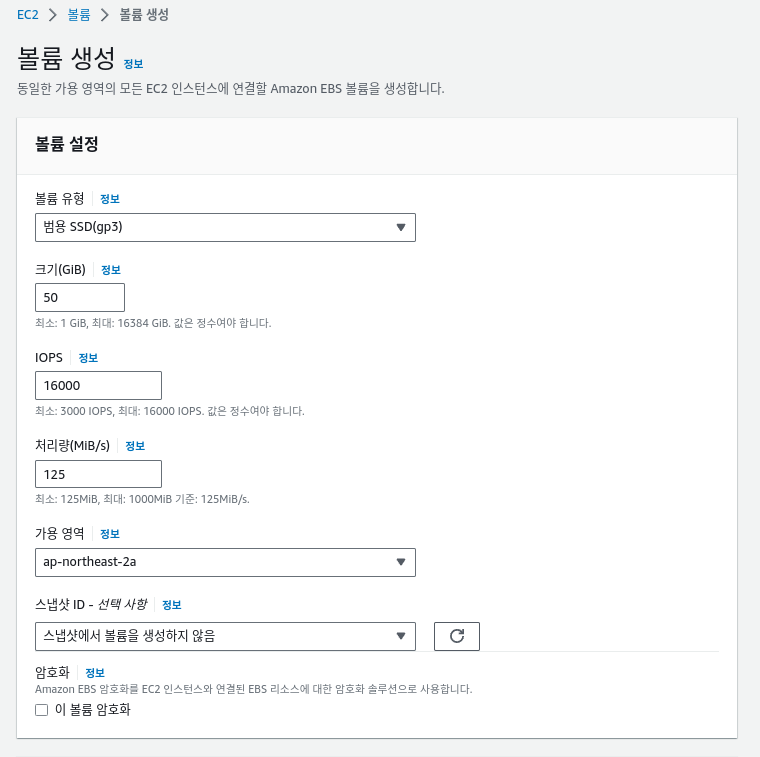
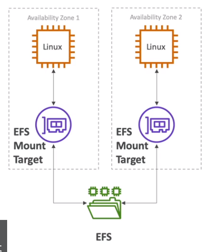
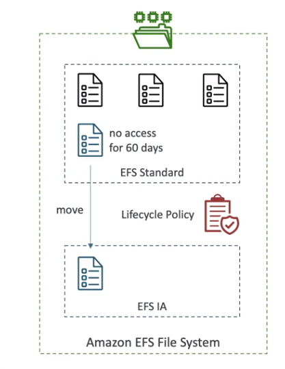

## EBS

- 인스턴스가 실행 중인 동안, 연결 가능한 네트워크 드라이브
  - EBS는 물리적 드라이버가 아니라, `네트워크 드라이버다`
- ec2 인스턴스가 종료 되더라도, 데이터를 유지 가능 (옵션 설정)
- EBS는 ec2에 `일부 다중 연결이 가능`함  
- EBS는 AZ에 종속된다. (인스턴스에 붙여야되니까... 종속적임)
  - us-east-1a에서 생성된 EBS는 us-east-1b에는 있는 EC2와 연결 불가능
- 하지만 EBS 스냅샷을 사용하면 다른 AZ에 연결 가능함
- EBS는 네트워크 드라이버라, `ec2인스턴스에서 분리 될 수 있고, 다른 ec2에 연결 가능하다`
- 원하는 디스크, IOPS를 결정해야됨
  - 어짜피 용량은 나중에 늘릴 수 있음

   

------------

 

## EBS 스냅샷
- 원하는 시점의 EBS 백업 저장소
- EBS 스냅샷은, 꼭 필요는 없지만, 권장사항임
- 스냅샷은 `다른 리전` & AZ에 복사 할 수 있음
- `스냅샷은 점진적으로 저장되므로 저장된 변경된 블록에 대해서만 비용이 청구됩니다.`
- 스냅샷은 기본적으로, S3에 저장됨

  

EBS 스냅샷 아카이브
- EBS 스냅샷 아카이브는 S3와 S3 글래셔라고 생각하면됨
- 아카이브 저장소가 75% 쌈, 단 아카이브에서 복구하는데 24~72시간 걸림 (즉시 복원 X)

  

recycle bin (EBS 스냅샷 휴지통)
- `보존 규칙 생성`으로 `활성화` 해줘야함
- EBS 스냅샷을 영구 삭제하는 대신에, 휴지통에 넣을 수 있음
- 보관기간은 1일 ~ 1년으로 설정할 수 있음

  

`Fast snapshot restore (FSR)` - 빠른 스냅샷 복원
- 스냅샷이 아주 크고, 인스턴스를 빠르게 초기화 해야할 때 사용,
- 졸라 비쌈 

    

--------

## AMI 
- 아마존 머신 이미지 , ec2 시작시, os 부터 소프웨어까지 니 맘대로 설정 가능함
- 특정지역에서 구축한 이미지를, 다른 지역으로 복사해서 AWS 글로벌 인프라를 활용 할 수 있음
- 마켓 플레이스에서 검색도 가능

  

AMI는 ec2 인스턴스에서 어떻게 처리 되나?
- 먼저 ec2인스턴스를 원하는 대로 설정해 줌
- 인스턴스를 중지해, 데이터 무결성을 확보함
- 이 인스턴스를 바탕으로 AMI를 빌드함 (이 과정에서 EBS 스냅샷이 생성됨)
- 그럼 다음 AMI으로 인스턴스를 실행 할 수 있음

  

중요 사실
- `AMI는 특정 AWS 리전에 국한되며`, 각 AWS 리전에는 `고유한 AMI`가 있습니다. 다른 AWS 리전에서 AMI를 사용해 EC2 인스턴스를 실행하는 것은 불가능하지만, `대상 AWS 리전으로 AMI를 복사해 EC2 인스턴스를 생성하는 것은 가능합니다.`

  

-------------

## EBS-Instance store - 인스턴스 스토어

  

- 기존, EBS는 성능이 제한되어 있음 (읽기 속도,쓰기 속도)
- 특정 유형의 Ec2인스턴스에 해당하는 `물리적 서버에 연결된 하드웨어 디스크`를 가르킴
- 하지만 `ec2 인스턴스를 종료,정지하면 디스크에서 데이터 사라짐` (장기적인 데이터 보관소는 절대 아님!)
- `버퍼, 캐시, 비정형 데이터` 일때 사용하는 것이 좋음
- 물리적으로 연결되있으므로 장애 발생시, 데이터 손실 위험이 있음
- `i3시리즈`가 인스턴스 스토어를 사용함

- 인스턴스 목록이 구지.... 시험에는 안나옴

 

참고:
      
https://docs.aws.amazon.com/ko_kr/AWSEC2/latest/UserGuide/InstanceStorage.html

 
 

--------------------------------
## AWS EBS 볼륨 타입

  

- 총 6개의 유형이 있음
- 시험에는 `gp2와, IOPS 프로비저닝이 가장 많이 나옴`
- gp2/gp3
  - `범용 SSD`, 다양한 워크로드에 대해 `가격과 성능이 적절함`
  - 디스크 크기는 `1GB ~ 16TB`까지
  - gp2
    - IOPS의 최대 비율은 `3:1`입니다.
    - `최소 IOPS는 100`, `최대 IOPS는 16000`
      - 20GB를 프로비저닝 해도 (20GB*3ipos = 60 IOPS) 100 IOPS임
      - 1,000GB를 프로비저닝 하면, 3000 IOPS 달성
    - `프로비저닝 된 디스크 크기가 1000GB이하면, i/o 크레딧을 사용해서 3000 IOPS를 사용할 수 있음`
  - gp3
    - IOPS의 최대 비율 없음 -> 디스크 크기에 따라 증가하는것이 아니고, `IOPS를 내가 설정 할 수 있음`
    - `기본` 성능으로 `3000 IOPS`와 `125 MiB/s` 초당/처리량을 보여줌
      - 옵션에 따라, `16000 IOPS`와 `1000 MiB/s` 까지 증가 시킬수 있음 

    

- io1/io2 타입
  - 최소 `100 IOPS`, 최대 `64000 IOPS`로 프로비저닝 될 수 있음
    - `16000 IOPS`의 이상을 요하는 애플리케이션에 적합 
  - `EBS 멀티 연결 지원 볼륨임`
  - `Nitro 시스템에 구축된 인스턴스에서만 최대 64,000 IOPS`를 달성할 수 있습니다. (`m시리즈,C시리즈,D시리즈,G4 시리즈 등`)
  - 다른 인스턴스 패밀리에서는 `최대 32,000 IOPS` 성능을 얻을 수 있습니다.
  - io1
    - 프로비저닝 디스크 크기는 범위는 4GB ~ 16 TB
    - IOPS의 최대 비율은 `50:1`입니다.
    - 예) io1크기가 1,280GiB 이상인 볼륨(50 × 1,280GiB = 64,000 IOPS)

  - io2
    - 프로비저닝 디스크 크기는 범위는 4GB ~ 16 TB
    - IOPS의 최대 비율은 `500:1`입니다.
    - 예) io2크기가 128GiB 이상인 볼륨(500 × 128GiB = 64,000 IOPS)

  - io2 block Express 
    - 프로비저닝 디스크 크기는 범위는 4GB ~ `64`TB
    - IOPS의 최대 비율은 `1000:1`입니다.
    - 최대 IOPS는 크기가 256GiB 이상인 볼륨으로 프로비저닝될 수 있습니다(`1,000 IOPS x 256GiB = 256,000 IOPS`).

  - https://docs.aws.amazon.com/ko_kr/AWSEC2/latest/UserGuide/provisioned-iops.html

    

- st1 / sc1
  - 디스크 크기는 125Mib ~ 16TiB
  - `절대!!! ec2의 부트 볼륨이 될 수 없음`
  - st1
    - `HDD, 낮은 가격,` 잦은 접근과 잦은 처리량이 많은 워크로드에 쓰임 
    - 데이터 웨어하우징, 빅데이터, 로그처리에 적합
    - 초당 500Mib 처리량, 최대 IOPS 500
  - sc1
    - 낮은 빈도 데이터 처리...
    - `HDD, 가장 적은 비용` , 성능 구림
    - 초당 250Mib 처리량, 최대 IOPS 250

  

루트 EBS, 기타 EBS  
-` 루트 볼륨의 경우, ‘종료 시 삭제' 속성이 기본으로 활성화`되어 있기 때문에, 기본적으로 삭제되게 됩니다. `기타 EBS 볼륨 유형의 경우, ‘종료 시 삭제' 속성이 기본적으로 비활성화되어 있으므로 삭제되지 않습니다.`

    

-------------------------

## EBS multi-attach (EBS 다중 연결)

  

- `같은 AZ`에 존재하는 여러 Ec2인스턴스에 EBS 다중 연결, `io1/io2` 만 가능
- 각 인스턴스는 고성능, 볼륨에 대한 읽기 및 쓰기 `권한을 전부 갖는다` -> `동시에 읽고 쓸 수 있다`
- 다중연결의 제한은 `최대 16개 Ec2만` 연결 가능
- 반드시 OS의 `클러스터 인식 파일 시스템`을 사용해야됨 ( EX4,XFS,etc... 이런 일반적인 파일시스템은 안됨)
- 사용사례
  - 애플리케이션이 동시 쓰기 작업을 관리해야 될때

    

-----------------------
## EBS Encryption - EBS 암호화

  

- 기본적으로 EBS 암호화는 `비활성화`임,
- 먼저 EBS볼륨(+암호화)을 생성하면 다음과 같은 일이 일어난다
  - 저장 데이터가 볼륨 내부에 암호화
  - 인스턴스와 EBS 볼륨간의 전송 데이터 역시 암호화됨 (`요건 자동 암호화`)
  - 모든 스냅샷도 암호화
  - 스냅샷으로 생성한 EBS 볼륨도 암호화됨
- 이때, 암호화 및 복호화 매커니즘은 고객이 볼 수없음 -> 백그라운드에서 ec2와 ebs가 모두 핸들링함
- 암호화는 지연시간에 아주 적은 영향을 주긴함 (minimal impact on latency)
- EBS는 `AWS KMS에서 TLS 세션을 통해` KMS 키로 암호화된 볼륨 키를 가져오고 암호화된 키를 볼륨 메타데이터와 함께 저장

  

EBS 볼륨 암복호 예시
- 암호화 `비활성화된` EBS 볼륨 스냅샷 생성 (스냅샷 생성때도 암호화는 안됨)
- 만들어진 스냅샷을 복사 -> `스냅샷을 복사`할때 `암호화 활성`,복사할 리전, KMS키도 선택 
- 복사된 스냅샷을 이용해 `새 EBS`를 생성하면, 해당 EBS도 암호화 됨
- 암호화된 볼륨을 인스턴스 원본에 연결

    

-----------------------
## EFS - Elastic File System

  

- EFS는 `리눅스`만 사용할 수 있음 (POSIX 파일 시스템을 사용)
- 데이터는` 여러 AZ에 나누어 분산 저장`
- `디스크 사용량에 따라 비용 지불` (따로 용량을 프로비저닝 안해도됨)
- KMS를 사용해, `데이터 암호화`도 가능
- `온프레미스 리소스와 함께 사용할 수 있음`
- 다중 AZ이기 때문에 AZ 외부에 존재, EFS 드라이브를 통해 인스턴스와 연결
- 내부적으로 NFS 프로토콜 사용
  - 초당 1000개의 NFS 클라이언트가 접근 가능, 초당 10/GB 처리량을 보유

  

- EFS 모드
  - `performance mod` - 퍼포먼스 모드
    - `general purpose`(기본값) - `범용모드`
      - 웹서버,CMS 등..
    - `Max I/O` - `최대 I/O 모드`
      - 높은수준의 레이턴시, 처리량, 병렬 처리
      - 빅데이터, 미디어 프로세싱
  - `Throughput mod` - 처리량 모드
    - `bursting` (기본값)
      - 이것도 1TB=50Mib 처리량임, `용량이 클수록 처리량이 늘어남`
      - 1TB시, 초당 50Mib 데이터 전송속도, 최대 100Mib까지 버스트 가능
      - `낮은 Throughput일때 크레딧을 모아서, 높은 Throughput일때 사용`
        - EC2 T 타입과 비슷한 개념
    - `provisioned` - 프로비저닝 모드
      - 버스팅 모드와 다르게, `스토리지 크기에 상관없이 처리량`을 설정 가능
      - 예를 들어 용량 1TB에,  1GiB 처리량 설정 가능

   

`POSIX`
- 파일 시스템은 유닉스 및 리눅스 기반 운영 체제에서 일반적으로 사용되는 파일 시스템 형식입니다. 대표적으로 ext2, ext3, ext4, XFS, JFS 등이 POSIX 파일 시스템에 속합니다. 이러한 파일 시스템은 파일 및 디렉터리의 계층 구조를 지원하며, 파일의 접근, 쓰기, 읽기, 실행 등의 작업에 대한 표준 인터페이스를 제공합니다.
   

EFS의 스토리지 클래스
  - standard (기본)
    - 자주 접근하는 파일들 용
  - EFS-IA (infrequent access)
    - `자주 엑세스 안하는 파일 보관`
    - 라이프 사이클 정책으로 옮길 수 도 있음

  

EFS의 AZ durability (내구성)
- standard
  - 기본 멀티 AZ임
- one Zone EFS
  - 하나의 AZ에서 작동하므로, 기본적으로 `백업이 활성화` 됨
  - EFS-IA도 적용 가능 -> EFS One zone-IA
  - IA까지 쓰면, `스탠다드보다 90%정도` 쌈

    

----------------------------------

## EBS 공동 책임 모델

  

### AWS 책임
- EBS,EFS 하드웨어를 복제를 실행하거나, 작동하지 않으면 AWS 책임

  

### 고객 책임
- 데이터 손실되지 않게 백업,스냅샷 뜨는건 내책임
- 데이터 암호화도 내책임
- 드라이브에 설정하는 모든 데이터는 내책임
- 인스턴스 스토어 스토리지에 대한 이해 내책임

 
 

---------------------

## AWS FsX
- AWS에서 타사의 고성능 파일 시스템을 얻는 관리형 서비스
- 고성능 파일 시스템임!!!!!

- 윈도우 파일서버, 리눅스 클러스터 서버 -> HPC나 기업에서 사용하기 적당함
- 이거 왜씀? -> EFS나 EBS는 AWS 인스턴스 대상이지만, Fsx는 내컴퓨터에서도 접근 가능하기 때문임

