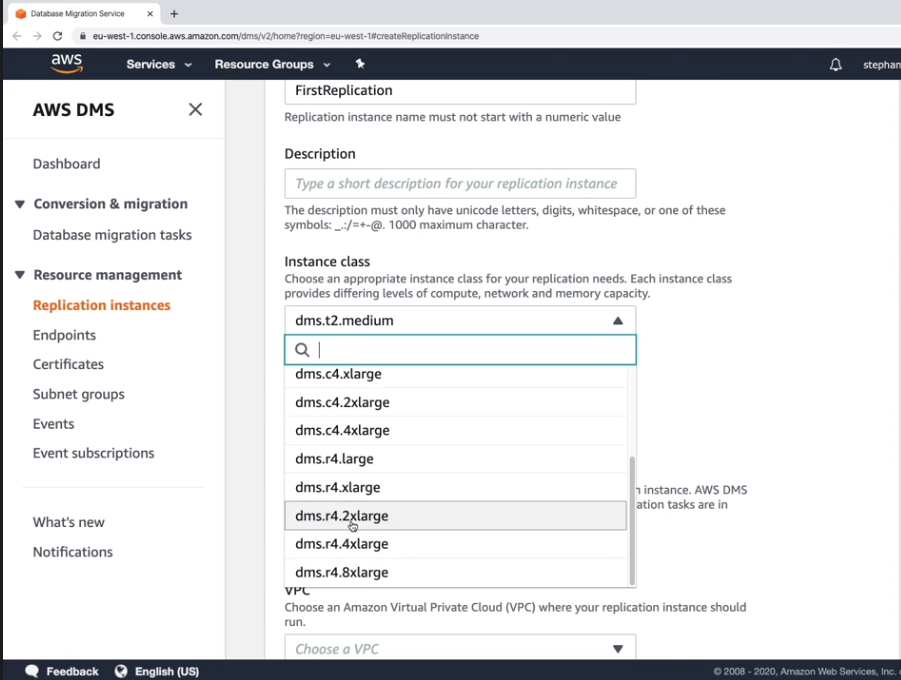
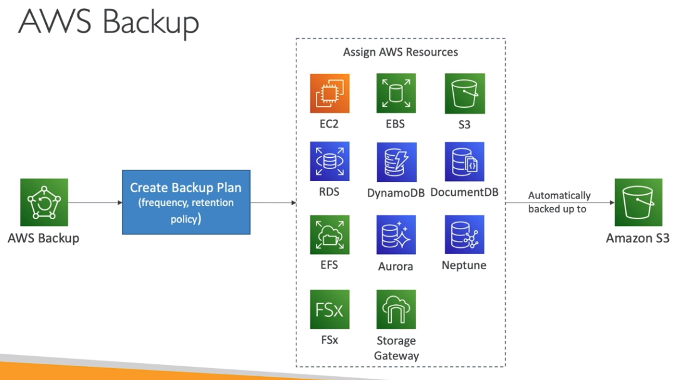
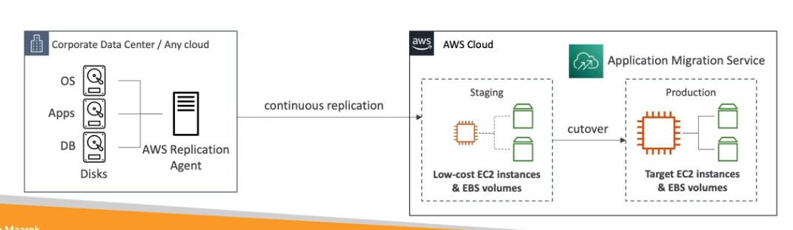
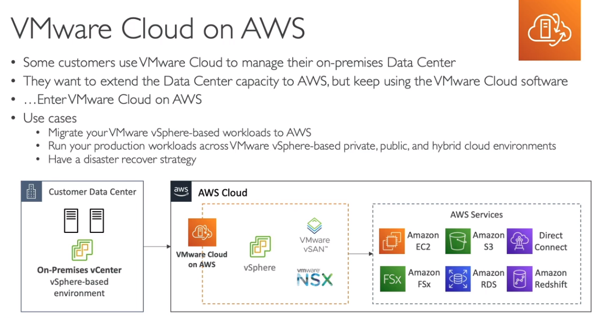

## AWS 재해복구

- `SAA는 재해복구 관련 문제 잘나옴`
- 재해란? `회사의 사업 지속이나 재정에 부정적인 영향을 미치는 이벤트`
- DR (disaster recovery)재해복구는 이러한 재해에 `대비`하고, 재해 발생시 `복구`하는 작업

- 재해복구 주요 키워드 (단어) `무조건 기억 할것!`
  - `RPO (recovery point objective) : 복구 시점 목표`
    - 백업(등)을 얼마만큼 자주 실행하냐에 따라서, `얼만큼의 데이터 손실을 허용할 수 있는지를`를 정하는것
  - `RTO (recovery time objective) : 복구 시간 목표`
    - 서비스 다운 타임, `기업이 비즈니스 운영 중단을 견딜 수 있는 시간을 측정한 것`

- 재해복구 전략 

  - 백업 및 복구
    - `RPO와 RTO가 높다`라고 표현함
    - `~시간` 복구 전략
    - 가장 쌈, `중간 인프라를 관리할 필요가 없음`
    - 

  - Pilot Light 파일럿 라이트
    - 서비스 축소 버전이 항상 클라우드에서 실행(다른리전)
    - `크리티컬 코어` -> `복사된 시스템`
    - 10분 복구 전략
    - 
    - 다른 리전에, `데이터 관련만 최신 상태로 유지`
    - 복제가 될 리전에는... 장애가 발생전, `어떤 요청도 처리 불가`
    - `재해가 발생하면, Ec2만 띄우면 됨`

  - Warm standby (또는 hot standby 등으로 부름)
    - `시스템 전체`를 실행하되, `최소 규모`로 작동
    - 재해가 발생하면
    - 
    - 재해가 발생하면, 오토스케일링만 실행되서, `파일럿 라이트 Ec2처음부터 띄우는것 보다는 빠름`

  - Multi site / Hot Site (멀티/핫 사이트)
    - 매우 비싸고, 프로덕션 인프라 스케일 X 2임 
    - `액티브 - 액티브` 형태임
    - 

--------------------------------------------------
## AWS DMS (Database Migraation Service)

- `DMS라는 서비스가 있음`

- 온프라미스 DB -> AWS 마이그레이션 서비스
- 동종 DB간 마이그레이션, 이기종 DB 마이그레션 지원
- `CDC를 사용한 지속(변경 데이터 캡쳐)적 데이터 복제 지원`
- DMS를 사용하려면,` EC2를 생성해서 DB 복제를 처리하도록` 해야됨

- 만약 이기종 DB라면? -> `SCT(schema conversion Tool)을 사용`해야됨
  - DMS가 `SCT를 실행` 하지는 않음
- 같은 DB라면 `SCT 안씀`

-------------------------------------
## RDS와 오로라 Mysql 마이그레이션

RDS Mysql -> 오로라 Mysql
- 옵션1 : 스냅샷 생성해서, 오로라DB 복원
  - 오로라를 `잠시 중단 해야됨` (스냅샷 복원이니까)
- 옵션2 : 읽기 복제본
  - `스냅샷보다 오래 걸림`,데이터 복제에 `네트워크 비용`이 클수도 있음

외부 Mysql -> 오로라 Mysql
- 옵션 1
  - percona Xtrabackup 기능을 사용해 S3에 백업 -> s3 -> 오로라 DB
  - `percona`
    - Percona에서 만든 백업 유틸리티로 MySQL에 사용되는 온라인 백업입니다. 
- 옵션 2
  - `mysqldump`파일 사용

- `DMS를 사용해서 지속적인 복제 가능`

- `PostgreSQL도 같음`

---------------------------------
## AWS를 통한 온프라미스 전략

- VM 내보내기,가져오기를 통해 `EC2에 적용` 가능함
- `AWS Miration Hub`을 이용해서 모든 마이그레이션 추적 가능
  - `AWS Server Migration Service (SMS)`
    - `온프레미스 서버들을 AWS로 증분 복제`할때 씀

-------------------------------------
## AWS Backup

- `완전 관리형 서비스`
- AWS 서비스간 백업을 관리하고, `자동화` 기능있음
- S3,RDS,EC2,EBS 등 다 지원함
- 리전간 백업 지원
- 다른 계정간 백업 지원
- 지정시간 복구(`PITR` - Point in time recovery) 5분 전 혹은 10분 전과 같이 사용자가 특정 날짜, 시간을 정해 원하는 시점으로 복원 가능
- 태그 기반 백업 정책도 가능
- 예약 백업 가능

- `볼트 잠금`도 지원
  - 백업 삭제 못함, 정책도 못바꿈
  - `루트 사용자도 백업을 삭제 못함`

--------------------------------------------
## AWS application Discovery Service & application Migration service (MGN)

  

- AWS application Discovery Service (AWS ADS)
  - AWS 마이그레이션 허브에서 제공함
  - 온프레미스 서버를 `스캔`하고, `설치 데이터 및 종속성 매핑에 대한 정보를 수집`

  - 두가지 방법으로 사용 가능
    - `agentless` Discovery
      - VM 구성, CPU와 메모리 디스크 사용량 같은 성능 기록에 대한 정보를 제공
    - `agent-based` Discovery
    - 시스템 정보, 실행중인 프로세스, 네트워크 정보 등, `더 많은 정보` 획득 가능

   

- AWS application Migration service (AWS AMS)
  - 온프라미스 -> AWS로 `이동하는 가장 간단한 방법`
  - 물리적,가상 또는 클라우드에 있는 다른 서버를 AWS 클라우드 네이티브로 실행할 수 있는 서비스
    - `Lift-and-shift` 솔루션이라고 함
  - 결국, 데이터 복제해서 마이그레이션 해줌

  

- `cut-over` : 한 순간에 기존 시스템을 새로운 시스템으로 완전히 바꾸는 전략이다
- `Lift-and-shift(리프트 앤 시프트)` : 기존 온프레미스(On-premise) 환경에서 운영되고 있는 애플리케이션 또는 인프라를 클라우드 환경으로 그대로 이동시키는 전략을 의미합니다. 

    

----------------------------------
## 대규모 데이터세트를 AWS로 전송

- 예) 200TB 데이터를 클라우드에 옮기려 한다. 회사 인터넷 대역폭은 100Mbps다 

- 1. Site-to-Site VPN 사용
  - 200TB * 1000 GB * 1000 MB * 8mb / 100mbps = 185일
- 2. 다이렉트 커넥트 사용
  - 설치에 1달 이상 걸림
  - 200TB * 1000GB * 8 Gb / 1Gbps = 18.5일
- 3. 스노우볼
  - 에지 2~3개 빌려야함
  - 전달 받는데 일주일 걸림

- 클라우드로 한번 데이터 옮기고, 데이터센터에서 지속적 복제를 하려면, DMS or DataSync로 하면 됨

------------------------------------------------------
## VMware Cloud On AWS

- 회사 데이터센터에서 `VMware Cloud로 관리`하는 경우가 많다
- VMware Cloud On AWS서비스를 이용하면, 똑같이 구성 가능하다
- 재해복구에도 클라우드와 연계해서 사용하면 좋음

