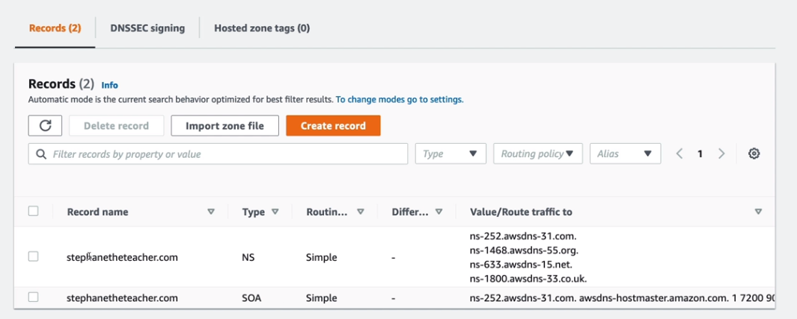
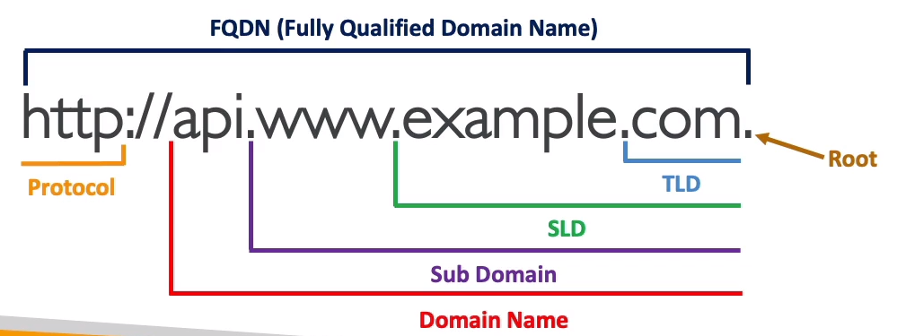
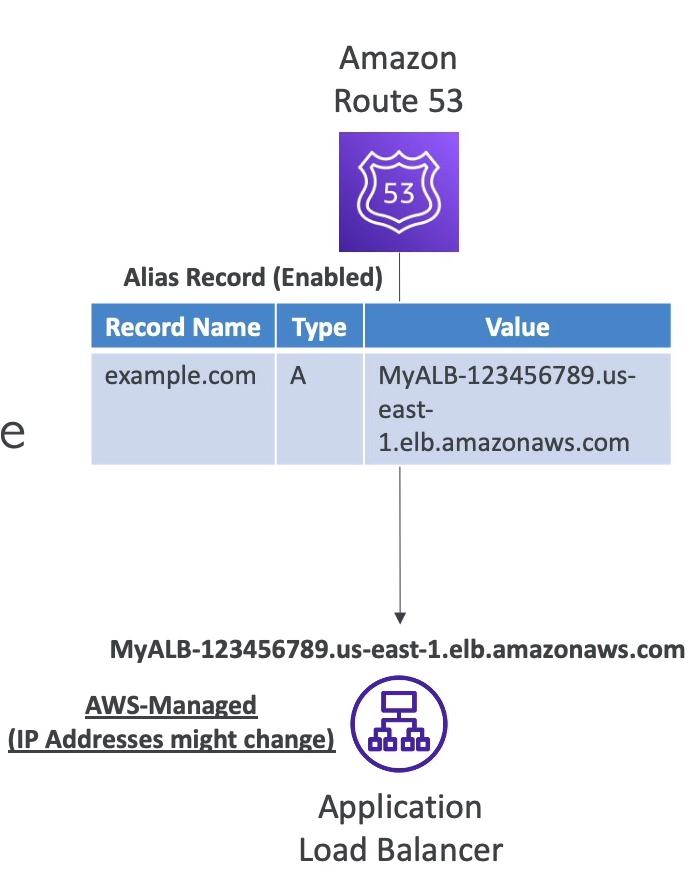

## DNS 용어

  

- `domain registar` - 도메인 등록자
  - aws, 가비아 등
- `DNS 레코드`
- `Zone File` 
  - 모든 DNS 레코드를 포함하는 파일
- `Name Server`
  - DNS 쿼리를 실제로 해결하는 서버
- `FQDN` (fully qualified domain name) - 전체 도메인 네임
  - `Top Level Domain (TLD)` - 최상위 도메인
    - com, kr, org 등등
  - `Second Level Domain (SLD)` - 2차 도메인
    - amazon.com , google.com 등

  

ns-252.awsdns-31.com 및 3개의 `도메인네임` 서버가 -> 스테판.com을 응답해 줄거임

   

Records - 레코드 정보
  - Domain/subdomain Name -> example.com
  - Record Type -> A or AAAA
    - `A` -> 호스트네임을 IPv4로 맵핑
      - example.com을 1.2.3.4로 연결
    - `AAAA` -> 호스트네임을 IPv6로 맵핑
      - example.com을 qweko2:2312q:ewqijid~~~블라블라 (ipv6형식)으로 맵핑
    - `CNAME` -> 호스트네임을 또다른 호스트 네임으로 연결
      - 타겟이 되는 도메인 네임은 꼭 A나 AAAA 레코드를 가지고 있어야 함
    - `NS` -> 호스팅존의 네임 서버 (DNS 쿼리를 실행할 수 있는 서버임)
      - 트래픽이 도메인으로 라우팅 되는 방식을 제어함 
    - MX
      - MX 레코드는 도메인의 이메일 서버 정보를 지정합니다. 이메일을 보낼 때, 메일 서버는 도메인의 MX 레코드를 참조하여 해당 도메인의 이메일 서버로 메일을 전달합니다.   

  - value -> 123.456.789.123
    - `A` 레코드: "value"는 도메인 이름을 해당하는 IPv4 주소로 매핑하는 IP 주소를 의미합니다. 예를 들어, A 레코드의 "value"는 "example.com" 도메인 이름을 IPv4 주소 192.0.2.10에 매핑하는 값일 수 있습니다.
    - `AAAA` 레코드: "value"는 도메인 이름을 해당하는 IPv6 주소로 매핑하는 IPv6 주소를 나타냅니다. 예를 들어, AAAA 레코드의 "value"는 "example.com" 도메인 이름을 IPv6 주소 2001:0db8:85a3:0000:0000:8a2e:0370:7334에 매핑하는 값일 수 있습니다.
    - `CNAME` 레코드: "value"는 도메인 이름을 다른 도메인 이름으로 매핑하는 별칭 도메인 이름을 나타냅니다. 예를 들어, CNAME 레코드의 "value"는 "www.example.com"을 "example.com"으로 매핑하는 값일 수 있습니다.
    - MX 레코드: "value"는 도메인 이름과 관련된 이메일 서버의 우선순위 및 호스트 이름을 포함한 정보를 나타냅니다. 예를 들어, MX 레코드의 "value"는 "example.com" 도메인의 이메일을 처리하기 위한 메일 서버의 정보일 수 있습니다.
    - TXT 레코드: "value"는 도메인 이름과 관련된 텍스트 정보를 포함합니다. 주로 SPF(Sender Policy Framework) 또는 DKIM(DomainKeys Identified Mail)과 같은 이메일 인증을 위한 텍스트 데이터를 나타냅니다.
    - NS 레코드 : 네임서버 역할을 할 CNAME 지정임,  예시값은 ns1.adji.com      

  - routing policy(라우팅 정책) -> 쿼리에 어떻게 응답을 해줄까? 하는 정책
    - routing policy는 트래픽을 처리하는 방식 또는 규칙을 의미합니다. 이는 일반적으로 `트래픽 로드 밸런싱, 지역 기반 라우팅, 성능 최적화 등`과 관련된 기능을 지원하기 위해 사용됩니다.   

  - TTL
    - DNS 레코드의 유효 기간을 나타내는 값 -> `클라이언트 캐시에 설정된 시간 만큼 주소 저장임`
    - 예를 들어, TTL 값이 3600이라면 해당 레코드가 캐시된 후 3600초(1시간) 동안 유효합니다. 
    - `높은 TTL 값`은 캐싱 시간을 늘리고 네트워크 트래픽을 줄이지만, `변경 사항이 적용되기까지 오래 걸릴 수 있습니다`. 낮은 TTL 값은 변경 사항을 빠르게 전파하지만 DNS 서버 부하가 증가할 수 있습니다.
    - dig 명령어로 TTL 시간 확인 가능

  

--------------------------

## AWS Route 53

  

- `고가용성, scalable (확장성), 완전 관리형` DNS 서비스
- Service-Level Agreement (SLA) `100%`를 제공하는 유일한 서비스 -> `고장안남`
- 반드시 알아야함 - 지원하는 레코드 타입 `A, AAAA, CNAME, NS`
  - 그외에도 CAA / DS / MX NAPTR / PTR / SOA / TXT / SPE / SRV 타입이 있음
- `타사 도메인`을 구입해도, `Route53에서 매니징 할 수 있음`

- 왜 라우트 53일까? -> ㅋㅋ DNS는 전통적으로 `53포트`를 씀

    

------------------------

## Route 53 - Hosted Zone
- 레코드의 컨테이너 이다.
- 도메인과 서브도메인으로 가는 트래픽의 라우팅 방식을 정의
- AWS는 2가지 타입의 호스팅존이 있음
  - public hosted zone
    - mrjaehong.com 이라는 도메인 네임을 구입했다면 퍼블릭 호스팅 존을 만들 수 있음
    - temp.mrjaehong.com으로   
  
  - private hosted zone
    - VPC에서 내부용으로 사용하는 도메인 네임
    - 외부에서 접근 불가, mrjaehong.internal 과같이 마음대로 구성해도 됨

  

- 어떤 타입을 쓰던지 0.50달러/월

- 리눅스 dnstools의 (dig와 nslookup을 통해 DNS 경로 추적 가능)

    

-------------------------------------------------

## CNAME vs Alias 

CNAME
- AWS 리소스중 ELB나 클라우드 프론트를  사용하면 다음과 같은 DNS를 얻을 수 있다. (abb137fe4ab374af0a3c175828f4ca1e-1320128165.ap-northeast-2.elb.amazonaws.com)

- 이 주소를 `temp.mrjaehong.com`으로 어떻게 이동 시킬까?
  - CNAME 사용
    - abb137fe4ab374af0a3c175828f4ca1e-1320128165.ap-northeast-2.elb.amazonaws.com => temp.mrjaehong.com으로 CNAME 레코드 등록 하면됨
    - CNAME은 루트 도메인 네임 즉,(mrjaehong.com)이 아닌 경우에만 가능 (`서브도메인만 가능`)   
  - Alias 사용 (Alias는 route 53에서만 설정 가능)
    - 별칭은 `root 도메인도 작동함`
    - `DNS 쿼리가 무료임`
    - 별칭은 대상의 자체적으로 `타겟 상태 확인 기능있음`
    - 별칭 레코드는 활성화 해서 `항상 A, AAAA 타입`으로 사용
    - 별칭 타겟은 `ELB, cloudfront, API gateway, beanstalk, s3 websites, vpc endpoint interface, global accelerator, 동일 호스트존의 Route 53 record`가 될 수 있음
    - `EC2의` DNS는 별칭 불가능!
    - 별칭을 사용하면, TTL은 설정 `불가능`, route53에 의해 자동으로 설정됨

    

----------------------------

## Route 53 - health checks 상태 확인

  

- route53에서 `헬스 체커`를 만들 수 있다.

  

- 헬스 체크 방법
  1. endpoint 모니터링
     - Endpoint 상태를 직적 체크,접근  (예 - ec2 ip의 url을 이용해서 체크 )
     - 200코드나 300코드 받아야 통과
     - 텍스트 기반 상태 확인일경우, 리턴값의 처음부터 `5120Bytes`까지 확인
       - (리턴값이 "성공"일경우 성공이라는 문자를 찾는것이 5120바이트라는것 )

  

  2. 계산된 상태 검사
     - `endpoint 상태를 모아서 조건문으로 처리`, 짜잘한거 모아서 하나의 상위 헬스체크로 만듬
     - 조건 연산은 `AND,OR,NOT` 지원
     - 하위 상태 확인 256개(`256의 엔드포인트 체크기`)까지 가능

  

  3. cloudwatch 경보 상태
     - VPC private 리소스 경보는 route 53에서 할 수 없음
     - `클라우드 와치 알람을 이용해, 헬스체크기와 연동함`

    

-----------------------
## Route 53 라우팅 정책

  

- 단어적으로 `DNS(route 53)`에서 쓰는 routing과 `로드밸런서`에서 쓰는 routing은 `전혀 다른 뜻`이다

- DNS(도메인 네임 서버) 관점에서의 라우팅
  - DNS는 트래픽을 라우팅 하지 않는다.
  - DNS는 트래픽이 `통과하지 않는다`
  - 단지 `DNS 쿼리를 클라이언트에게 결과를 반환해주는 것 뿐`이다.

      

- simple - 단순 정책
  - 단순하게 (걍 라운드 로빈인듯) 여러개중에 하나 뱉어줌
  - 단순 정책 + 별칭을 사용한다면, `오직 하나의 AWS 리소스`만 연결 가능
  - AWS 리소스 `상태확인(헬스체크) X`

  

- weighted - 가중치 정책
  - 가중치를 사용해, 각 요청의 비율을 조절 가능함
  - `DNS 레코드들`의 이름,타입은 모두 같아야함, 상태체크 가능
  - 사용 케이스
    - `서로 다른 지역들에 걸쳐 로드밸런싱`을 할떄
  - 가중치를 0으로 주면, 특정 리소스에 트래픽 보내기를 중단하는 효과임
    - `모든 레코드의 가중치가 0이면`, 다 `동일한 가중치`를 가짐

  

- latency-based - 지연 시간 기반 라우팅

  -  Amazon CloudFront와 함께 작동하여, 사용자에게 최소 지연 시간을 제공
  - 각 리전 또는 엣지 로케이션에 대한 지연 시간을 계산하고, 가장 낮은 지연 시간을 가진 리전으로 트래픽을 라우팅
  - 지연시간에 민감한 웹사이트, 애플리케이션에 사용
  - 레코드 작성할때, `value의 리전을 설정 해줘야함 (서울이나 기타)`

  

-  Geolocation Routing - 지리적 기반 라우팅

   - `DNS 쿼리가(사용자) 시작된 위치를 기반`으로 트래픽을 제공
   - `지연 시간 기반` 정책과는 `다름`
   - 사용자의 위치가 일치하는 위치가 없을 경우 `default`위치를 지정/생성 해야됨
   - 나라별 사이트 만들기용

  

- Failover (active-passive) - 장애 조치
  - 헬스체크기를 활용해 장애가 있는 지역에 DNS 쿼리 결과를 안줌

  

- Geoproximity routing - 지리 근접 라우팅
  - 지리적 위치 + 가중치 값으로, `특정 지역에 더 많은` 트래픽을 처리하게 위해

  

- IP Based - IP 기반 라우팅
  - 사용자의 IP 범위(CIDR)을 정의해서 라우팅함

  

- multi-value - 다중값 라우팅 정책

  - 트래픽을 다중 리소스로 라우팅할때 사용
  - 거의 모든 레코드에 대해 여러 값을 지정할 수 있지만 `다중값 응답 라우팅을 사용하면 각 리소스의 상태를 확인할 수도 있으므로` Route 53은 정상 리소스에 대한 값만 반환합니다. 
    - `단순 라우팅 정책이 상태확인을 안해주니까` -> 이게더 상위버젼이라고 생각하자
  - ELB와 유사하지만, `다름`
  - 상태 안좋은건 아에 안보여줌

- 위 스크린샷을 예로 들면, `www.example.com`이 DNS쿼리가 192~서버,198서버,203서버 `3개의 쿼리를 가져다` 줌으로써, 안전한 쿼리를 가짐

  

- active-active 장애 조치는 기본 또는 보조 리소스 없이 `항상 사용 가능한 모든 리소스를 사용한다는 점`을 기억하십시오.

