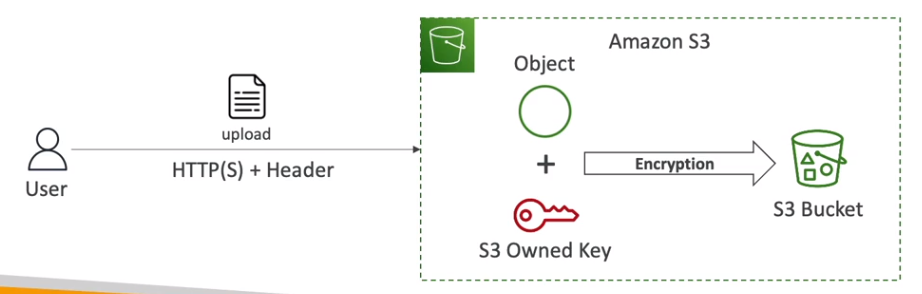
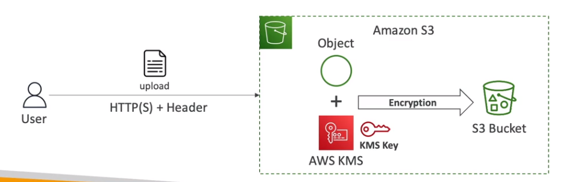
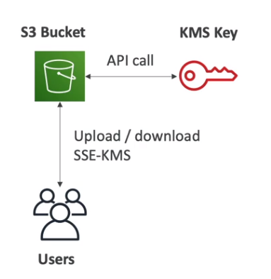
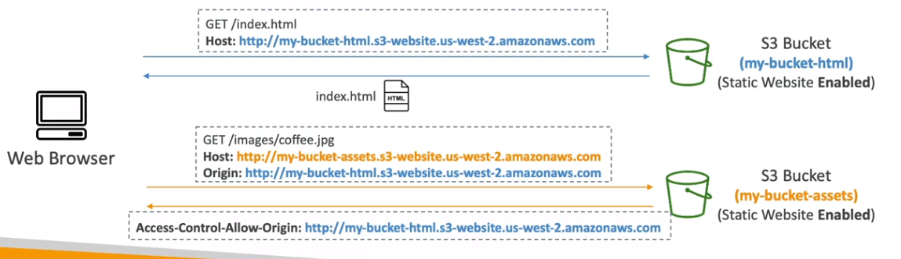

## AWS S3 - 객체 암호화

  

- S3 버켓에 업로드 기본값은 `암호화 비활성화` 이다

- 객체를 암호화 하는 방법은 4가지
  - 서버측 암호화 (SSE server-side encryption)
    - AWS s3-키매니져 (SSE-s3)를 사용
    - KMS 사용 (SSE-KMS)
    - 고객이 제공하는 키를 사용한 (SSE-C)
- 클라이언트 전송중 암호화 - client-side encryption 

  

SSE - S3
- AWS에서 처리, 관리 및 소유하는 키로 암호화
- 고객은 `이 키에 접근 못함`
- AES-256 보안 유형으로 암호화 진행됨
- 반드시 Header에 x-amz-server-side-encryption:`"AES256"` 으로 요청 해야됨
- S3 버킷에 저장하기전 S3 키와 암호화를 진행후, 버킷에 저장

  

SSE - KMS
- 고객이 KMS를 통해 생성한 키로 암호화
- `cloudTrail을 통해 사용량을 감시`할 수 있음
  - KMS는 클라우드 트레일로 키사용 추적이 가능함
- Header에 x-amz-server-side-encryption:`"aws:kms"`를 요청
- 버킷에서 `KMS키에 대한 엑세스 필요`
- `암호화 키의 순환 정책에 대한 제어권은 유지`하고 싶을떄 사용
- KMS 제약 상황
  - KMS에서 사용하기 떄문에, 업로드, 다운로드 할 때마다 `KMS를 콜` 해야됨 -> KMS 요금 나감
  - 리전에 따라, KMS call의 초당 5500 ~ 30,000개 요청 처리 밖에 안됨 (서비스 quotas로 용량 늘려야함)
  - 처리량이 매우 높은 S3에서는 스로틀링 오류 발생 할 수도 있음

    - 스로틀링 오류
      - 컴퓨터 시스템이나 장치에서 성능을 제한하는 기술적인 문제 

    

SSE - C
- AWS 외부에서 키가 관리됨
- 반드시 `HTTPS`를 사용해야하고, 요청을 전송할때마다, Header에 키정보를 포함해야됨
- SSE-C를 적용하려면, `콘솔에서는 불가능하고, AWS CLI,SDK,S3 REST API`를 사용해야 된다

  
  

client-side 암호화
- 클라이언트가 직접 암호화,복호화 해야됨

  
  

전송중 암호화
- S3 버킷에는 2가지 엔드포인트가 있다 ( HTTP , HTTPS)
  - HTTP는 당연히 전송중 암호화 X
  - HTTPS만 전송중 암호화됨
- AWS에서는 s3로 통신할떄 `HTTPS`가 권장사항이다
  - 또한 대부분 클라이언트에서 HTTPS엔드포인트가 `기본값`이다
- SSE-C 사용에 필수임

  
  

----------------------------------------

## AWS S3 - 기본 암호화

- s3 암호화를 강제 할 수 있는 한 가지는 `버킷 정책` 뿐이다
  - `헤더에 암호화 없는건 거부`
    - s3:x-amz-server-side-encryption": "AES256" 정책 추가하면 됨
- S3에 기본값으로 암호화 설정을 하면 더 편하긴 함
- SSE-S3에서 기본 제공 키 회전 기능을 고객이 `수동으로 수정할 수 없슴`

    

-------------------------------------
## AWS S3 - CORS ( cross-origin resource sharing )

  

- `허락된 주소로 S3 버킷 내용을 공유하는 기술`
- 오리진 = scheme(protocol) + host(domain) + port
  - 예를 들어 https://www.example.com
    - 프로토콜은 HTTPS
    - 도메인은 www.example.com
    - 포트는 80, 443

  

- CORS는 `웹 브라우저 기반` 보안 메커니즘
  - 뜻은, 메인 오리진을 방문하는 동안, `다른 오리진에 대한 요청을 허용하거나 거부`
  - 동일한 오리진
    - 예를 들어 http://www.example.com/app1 & http://www.example.com/app2 가있다면, 오리진이 같기 때문에 `동일 오리진에 있다고 볼 수 있다`
  - 다른 오리진
    - 예를 들어 http://www.example.com & http://temp.example.com는 다른 오리진임

  

- S3 버킷 CORS를 사용하려면 `CORS 헤더`를 `활성화` 해야한다
- 빠르게 사용하려면, `특정 오리진을 허용하거나 *를 붙여 모든 오리진을 허용`

    

-----------------------------------------
## AWS MFA delete

  

- S3 관리에서 함부로 파괴적인 작업을 할 수 없게 하기 위함
- MFA delete를 사용하려면, 먼저 `버저닝 활성화` 해야됨
- 버킷소유자, 즉 `루트 계정`만이 활성화/비활성화 할 수 있다

- S3에 MAF가 필요할때 (파괴적인 작업)
  - `객체를 영구 삭제`
  - `S3 버저닝 정책 중단`
- S3에 MFA 필요 없을때 (별로 파괴적이지 않음)
  - S3 버저닝 정책 실행
  - 삭제된 버젼을 나열

    

-------------------------------------------
## AWS per-signed URLs (미리 서명된 URL)

  

- 프라이빗한 S3 버킷에서 일부 파일을 `외부 유저에게` 엑세스 할 수 있는 URL(권한)부여
- `제한 시간 있음`
  - 콘솔에서 URL 생성하면 `최대 12시간`
  - AWS CLI는 `168시간`
- 파일 `업로드` / 다운로드 가능

Federated Users 뜻
- 증가하는 연합 사용자들(Federated Users)에게...

    

--------------------------------------------------
## AWS S3 잠금 정책 및 Glacier 볼트 잠금

    

- S3 객체 잠금을 하려면, 우선 S3버킷에 `버저닝 활성화`
- `보존기간(잠금기간)을 설정하고`, 객체를 보호 할 수 있는 기능
- S3 잠금 모드가 있음
  - `Compliance mode` (규정 준수 모드)
    - glacier 볼트 잠금과 유사함
    - 사용자를 포함한 `그 누구도 객체 버전을 덮어 쓰거나 삭제 할 수 없음`
    - `엄격한 규정 준수`에 사용
  - `Governance mod` (거버넌스 모드)
    - 대부분 사용자는 객체 버전을 덮어쓰거나 삭제 못함
    - `관리자, IAM으로 받은 특별 권한으로는 수정 가능 (삭제,보존기간 변경 등)`
    - 유연한 모드
  - `Lega Hold` (법적 보존)
    - 법적 보존모드를 설정하면, 모든 객체를 무기한으로 보호
    - `s3:PutObjectLegalHold` 권한을 가진 IAM은 이 정책을 해제할 수 있음
    - 유연한 모드긴함

  

|| Compliance mode | Governance mod | Lega Hold(법적 보존) |
|------|---|---|---|
|관리자 또는 특정 유저가 버킷 정책 수정 |불가|가능|가능|
|객체 잠금기한|설정에 따름|설정에 따름,수정될 수 있음|무기한|
|유연함 정도|엄격|유연|유연|

    

------------------------------------------
## AWS S3 Access Point 와 Object Lambda

  

- S3 Access Point - 엑세스 포인트
  - `버킷내, 특정 폴더별 유저가 엑세스 하기 위한 장치`
  - 엑세스포인트(AP)는 고유의 DNS를 가질 수 있음
  - AP를 만들고, 사용자나, 그룹에 정책 연결

  

- S3 Object Lambda
  - 사용자/그룹별 엑세스 포인트를 부르기전, 람다함수를 호출해서 S3 데이터 정제,수정 등을 할 수 있음

